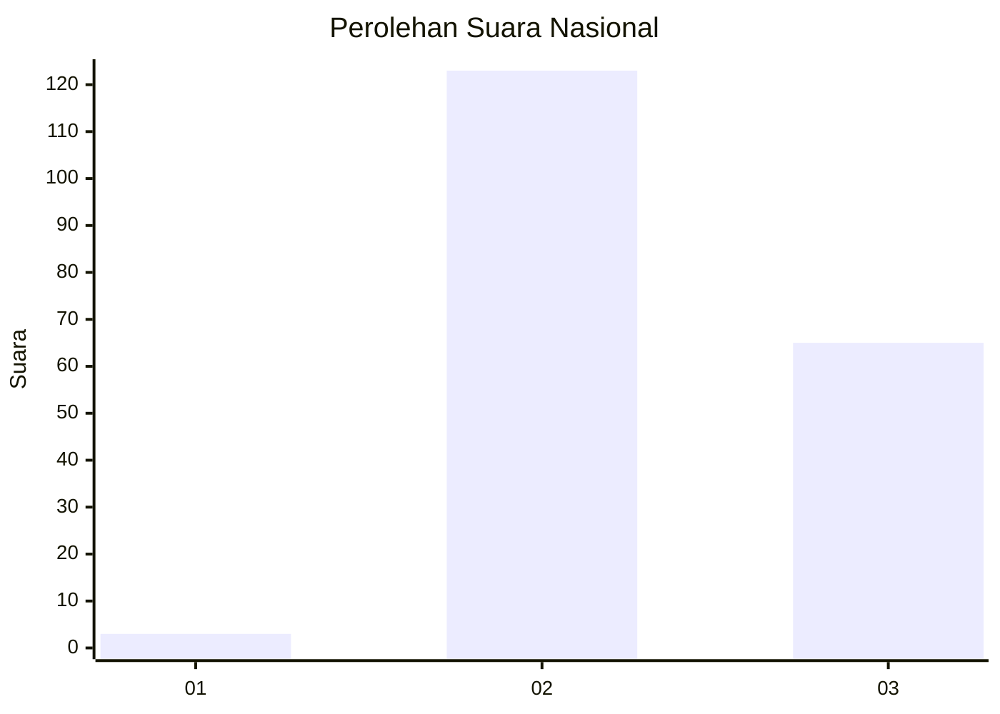
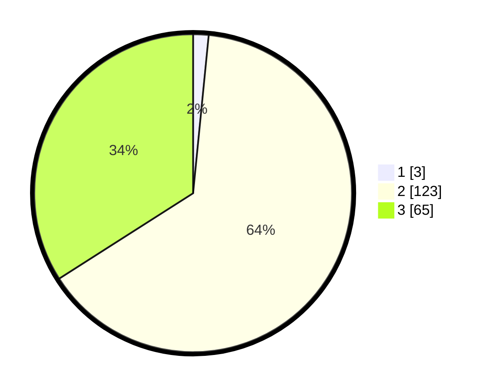

# Hasil

## Grafik

## Tabel

| No. | Nama Paslon    | Suara | Suara (raw) | Persentase |
|:--- |:-------------- | -----:| -----------:| ----------:|
| 1   | ANIES MUHAIMIN | 3     | [3][p-1]    | 1,57       |
| 2   | PRABOWO GIBRAN | 123   | [123][p-2]  | 64,40      |
| 3   | GANJAR MAHFUD  | 65    | [65][p-3]   | 34,03      |

[p-1]: https://github.com/gigit-pemilu/pemilu-2024/blob/main/pilpres/hitung-suara/sub/51-bali/sub/01-jembrana/sub/03-pekutatan/sub/2006-gumbrih/sub/007-tps/sub/paslon-1.txt
[p-2]: https://github.com/gigit-pemilu/pemilu-2024/blob/main/pilpres/hitung-suara/sub/51-bali/sub/01-jembrana/sub/03-pekutatan/sub/2006-gumbrih/sub/007-tps/sub/paslon-2.txt
[p-3]: https://github.com/gigit-pemilu/pemilu-2024/blob/main/pilpres/hitung-suara/sub/51-bali/sub/01-jembrana/sub/03-pekutatan/sub/2006-gumbrih/sub/007-tps/sub/paslon-3.txt

## Foto C Plano

https://sirekap-obj-formc.kpu.go.id/2573/pemilu/ppwp/51/01/03/20/06/5101032006007-20240214-131952--ce35a27f-1ec8-4a24-b23d-fe5402d9344a.jpg

https://sirekap-obj-formc.kpu.go.id/2573/pemilu/ppwp/51/01/03/20/06/5101032006007-20240214-132107--6c8a4690-ed87-4673-938d-42938ff116c0.jpg

## Metadata

| Key        | Value               |
| ---------- | ------------------- |
| Time Stamp | 2024-02-15 07:00:44 |

