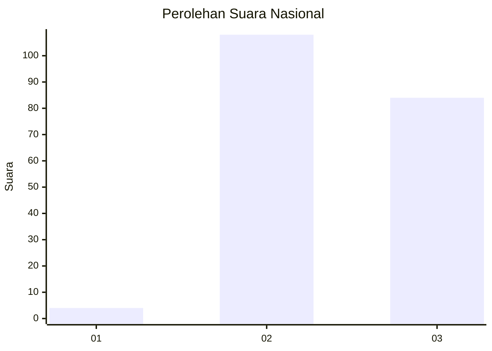
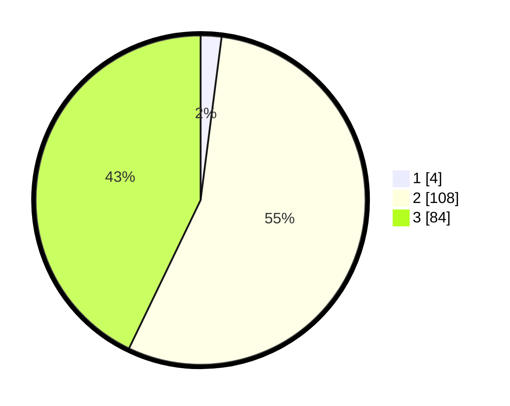

# Hasil

## Grafik

## Tabel

| No. | Nama Paslon    | Suara | Suara (raw) | Persentase |
|:--- |:-------------- | -----:| -----------:| ----------:|
| 1   | ANIES MUHAIMIN | 4     | [4][p-1]    | 2,04       |
| 2   | PRABOWO GIBRAN | 108   | [108][p-2]  | 55,10      |
| 3   | GANJAR MAHFUD  | 84    | [84][p-3]   | 42,86      |

[p-1]: https://github.com/gigit-pemilu/pemilu-2024/blob/main/pilpres/hitung-suara/sub/51-bali/sub/01-jembrana/sub/03-pekutatan/sub/2006-gumbrih/sub/009-tps/sub/paslon-1.txt
[p-2]: https://github.com/gigit-pemilu/pemilu-2024/blob/main/pilpres/hitung-suara/sub/51-bali/sub/01-jembrana/sub/03-pekutatan/sub/2006-gumbrih/sub/009-tps/sub/paslon-2.txt
[p-3]: https://github.com/gigit-pemilu/pemilu-2024/blob/main/pilpres/hitung-suara/sub/51-bali/sub/01-jembrana/sub/03-pekutatan/sub/2006-gumbrih/sub/009-tps/sub/paslon-3.txt

## Foto C Plano

https://sirekap-obj-formc.kpu.go.id/b77f/pemilu/ppwp/51/01/03/20/06/5101032006009-20240214-141823--88112e7b-a7f6-48d8-af23-63621ef4f994.jpg

https://sirekap-obj-formc.kpu.go.id/b77f/pemilu/ppwp/51/01/03/20/06/5101032006009-20240214-141851--5fbaf8d9-d9f1-4d06-abd0-2063430b55c1.jpg

https://sirekap-obj-formc.kpu.go.id/b77f/pemilu/ppwp/51/01/03/20/06/5101032006009-20240214-141859--1bf23eed-6754-417c-8454-cd35c48e91ad.jpg

## Metadata

| Key        | Value               |
| ---------- | ------------------- |
| Time Stamp | 2024-02-14 21:46:01 |

## DATA PEMILIH TETAP

Jumlah pemilih dalam DPT: **253**.
 * L: **114**.
 * P: **139**.

## DATA PENGGUNA HAK PILIH

Jumlah pengguna hak pilih dalam DPT: **197**.
 * L: **94**.
 * P: **103**.

Jumlah pengguna hak pilih dalam DPTb: **1**.
 * L: **0**.
 * P: **1**.

Jumlah pengguna hak pilih dalam DPK: **0**.
 * L: **0**.
 * P: **0**.

Jumlah pengguna hak pilih: **198**.
 * L: **94**.
 * P: **104**.

## JUMLAH SUARA SAH DAN TIDAK SAH

JUMLAH SELURUH SUARA SAH: **196**.

JUMLAH SUARA TIDAK SAH: **2**.

JUMLAH SELURUH SUARA SAH DAN SUARA TIDAK SAH: **198**.

