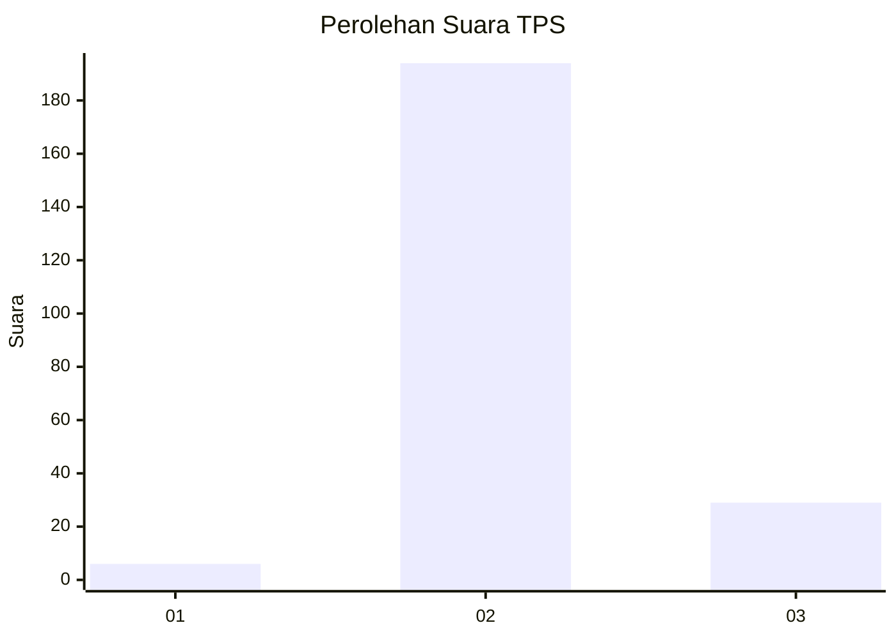
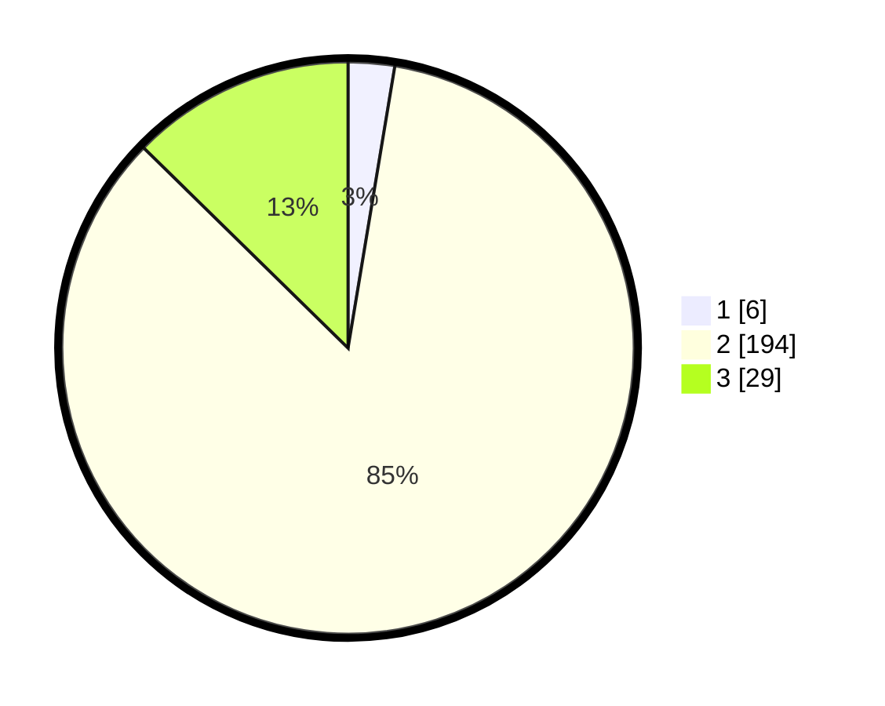

# Hasil

## Grafik

## Tabel

| No. | Nama Paslon    | Suara | Suara (raw) | Persentase |
|:--- |:-------------- | -----:| -----------:| ----------:|
| 1   | ANIES MUHAIMIN | 6     | [6][p-1]    | 2,62       |
| 2   | PRABOWO GIBRAN | 194   | [194][p-2]  | 84,72      |
| 3   | GANJAR MAHFUD  | 29    | [29][p-3]   | 12,66      |

[p-1]: https://github.com/gigit-pemilu/pemilu-2024-51-bali/blob/main/pilpres/hitung-suara/sub/51-bali/sub/01-jembrana/sub/03-pekutatan/sub/2008-pengeragoan/sub/008-tps/sub/paslon-1.txt
[p-2]: https://github.com/gigit-pemilu/pemilu-2024-51-bali/blob/main/pilpres/hitung-suara/sub/51-bali/sub/01-jembrana/sub/03-pekutatan/sub/2008-pengeragoan/sub/008-tps/sub/paslon-2.txt
[p-3]: https://github.com/gigit-pemilu/pemilu-2024-51-bali/blob/main/pilpres/hitung-suara/sub/51-bali/sub/01-jembrana/sub/03-pekutatan/sub/2008-pengeragoan/sub/008-tps/sub/paslon-3.txt

## Foto C Plano

https://sirekap-obj-formc.kpu.go.id/fdda/pemilu/ppwp/51/01/03/20/08/5101032008008-20240214-132700--6bc187f7-c5b9-4fe7-b98b-44d3259bb3c8.jpg

https://sirekap-obj-formc.kpu.go.id/fdda/pemilu/ppwp/51/01/03/20/08/5101032008008-20240214-132908--bea6cf73-407f-46a7-a90a-8f3a8b3f00a9.jpg

https://sirekap-obj-formc.kpu.go.id/fdda/pemilu/ppwp/51/01/03/20/08/5101032008008-20240214-132817--ee6ba6da-728a-415b-a379-e0710a68e2f2.jpg

## Metadata

| Key        | Value               |
| ---------- | ------------------- |
| Time Stamp | 2024-02-14 21:46:01 |

## DATA PEMILIH TETAP

Jumlah pemilih dalam DPT: **283**.
 * L: **134**.
 * P: **149**.

## DATA PENGGUNA HAK PILIH

Jumlah pengguna hak pilih dalam DPT: **232**.
 * L: **115**.
 * P: **117**.

Jumlah pengguna hak pilih dalam DPTb: **0**.
 * L: **0**.
 * P: **0**.

Jumlah pengguna hak pilih dalam DPK: **0**.
 * L: **0**.
 * P: **0**.

Jumlah pengguna hak pilih: **232**.
 * L: **115**.
 * P: **117**.

## JUMLAH SUARA SAH DAN TIDAK SAH

JUMLAH SELURUH SUARA SAH: **229**.

JUMLAH SUARA TIDAK SAH: **3**.

JUMLAH SELURUH SUARA SAH DAN SUARA TIDAK SAH: **232**.

