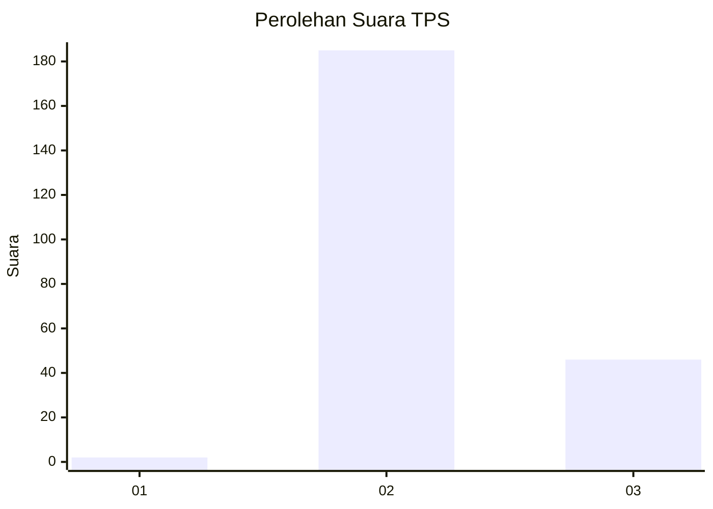
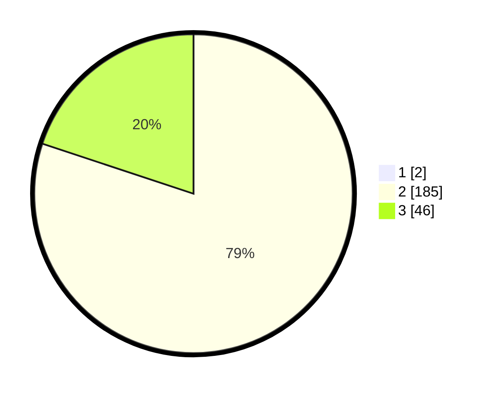

# Hasil

## Grafik

## Tabel

| No. | Nama Paslon    | Suara | Suara (raw) | Persentase |
|:--- |:-------------- | -----:| -----------:| ----------:|
| 1   | ANIES MUHAIMIN | 2     | [2][p-1]    | 0,86       |
| 2   | PRABOWO GIBRAN | 185   | [185][p-2]  | 79,40      |
| 3   | GANJAR MAHFUD  | 46    | [46][p-3]   | 19,74      |

[p-1]: https://github.com/gigit-pemilu/pemilu-2024-51-bali/blob/main/pilpres/hitung-suara/sub/51-bali/sub/01-jembrana/sub/03-pekutatan/sub/2008-pengeragoan/sub/009-tps/sub/paslon-1.txt
[p-2]: https://github.com/gigit-pemilu/pemilu-2024-51-bali/blob/main/pilpres/hitung-suara/sub/51-bali/sub/01-jembrana/sub/03-pekutatan/sub/2008-pengeragoan/sub/009-tps/sub/paslon-2.txt
[p-3]: https://github.com/gigit-pemilu/pemilu-2024-51-bali/blob/main/pilpres/hitung-suara/sub/51-bali/sub/01-jembrana/sub/03-pekutatan/sub/2008-pengeragoan/sub/009-tps/sub/paslon-3.txt

## Foto C Plano

https://sirekap-obj-formc.kpu.go.id/1ca0/pemilu/ppwp/51/01/03/20/08/5101032008009-20240214-223744--c2018cf1-3245-4867-8fdd-f845d75b2210.jpg

https://sirekap-obj-formc.kpu.go.id/1ca0/pemilu/ppwp/51/01/03/20/08/5101032008009-20240214-223749--461fed8e-7bbc-4d58-8be2-e932cb2947c2.jpg

https://sirekap-obj-formc.kpu.go.id/1ca0/pemilu/ppwp/51/01/03/20/08/5101032008009-20240214-223757--95f6a2ad-5307-4f28-9e98-7882a56fb943.jpg

## Metadata

| Key        | Value               |
| ---------- | ------------------- |
| Time Stamp | 2024-02-15 16:00:26 |

## DATA PEMILIH TETAP

Jumlah pemilih dalam DPT: **282**.
 * L: **135**.
 * P: **147**.

## DATA PENGGUNA HAK PILIH

Jumlah pengguna hak pilih dalam DPT: **237**.
 * L: **118**.
 * P: **119**.

Jumlah pengguna hak pilih dalam DPTb: **0**.
 * L: **0**.
 * P: **0**.

Jumlah pengguna hak pilih dalam DPK: **0**.
 * L: **0**.
 * P: **0**.

Jumlah pengguna hak pilih: **237**.
 * L: **118**.
 * P: **119**.

## JUMLAH SUARA SAH DAN TIDAK SAH

JUMLAH SELURUH SUARA SAH: **233**.

JUMLAH SUARA TIDAK SAH: **4**.

JUMLAH SELURUH SUARA SAH DAN SUARA TIDAK SAH: **237**.

