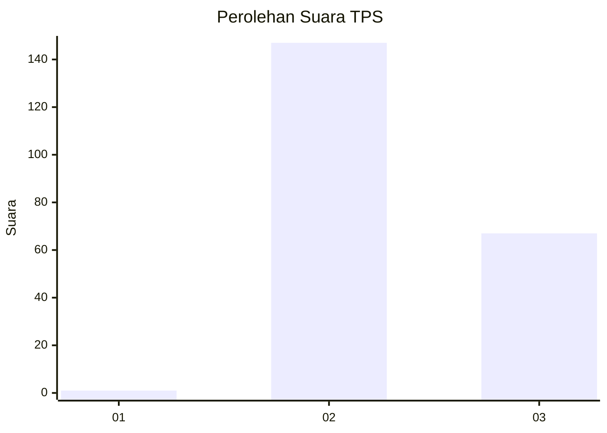
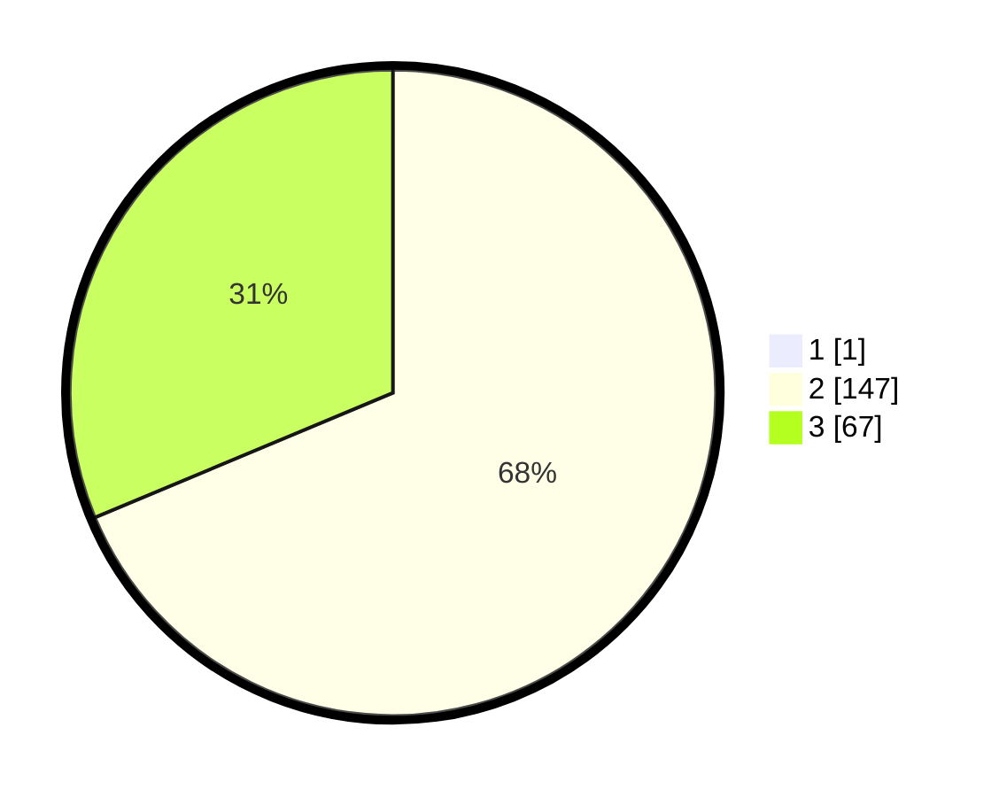

# Hasil

## Grafik

## Tabel

| No. | Nama Paslon    | Suara | Suara (raw) | Persentase |
|:--- |:-------------- | -----:| -----------:| ----------:|
| 1   | ANIES MUHAIMIN | 1     | [1][p-1]    | 0,47       |
| 2   | PRABOWO GIBRAN | 147   | [147][p-2]  | 68,37      |
| 3   | GANJAR MAHFUD  | 67    | [67][p-3]   | 31,16      |

[p-1]: https://github.com/gigit-pemilu/pemilu-2024-51-bali/blob/main/pilpres/hitung-suara/sub/51-bali/sub/01-jembrana/sub/03-pekutatan/sub/2008-pengeragoan/sub/011-tps/sub/paslon-1.txt
[p-2]: https://github.com/gigit-pemilu/pemilu-2024-51-bali/blob/main/pilpres/hitung-suara/sub/51-bali/sub/01-jembrana/sub/03-pekutatan/sub/2008-pengeragoan/sub/011-tps/sub/paslon-2.txt
[p-3]: https://github.com/gigit-pemilu/pemilu-2024-51-bali/blob/main/pilpres/hitung-suara/sub/51-bali/sub/01-jembrana/sub/03-pekutatan/sub/2008-pengeragoan/sub/011-tps/sub/paslon-3.txt

## Foto C Plano

https://sirekap-obj-formc.kpu.go.id/1794/pemilu/ppwp/51/01/03/20/08/5101032008011-20240214-132134--faabc780-eb37-418d-835c-916f3512fd1f.jpg

https://sirekap-obj-formc.kpu.go.id/1794/pemilu/ppwp/51/01/03/20/08/5101032008011-20240214-132045--ff5aa405-9a09-47cb-b01b-3c4c2fac726f.jpg

https://sirekap-obj-formc.kpu.go.id/1794/pemilu/ppwp/51/01/03/20/08/5101032008011-20240214-132226--fc4b77d2-535a-45fe-b5c9-04581adec024.jpg

## Metadata

| Key        | Value               |
| ---------- | ------------------- |
| Time Stamp | 2024-02-14 21:46:01 |

## DATA PEMILIH TETAP

Jumlah pemilih dalam DPT: **273**.
 * L: **144**.
 * P: **129**.

## DATA PENGGUNA HAK PILIH

Jumlah pengguna hak pilih dalam DPT: **222**.
 * L: **119**.
 * P: **103**.

Jumlah pengguna hak pilih dalam DPTb: **0**.
 * L: **0**.
 * P: **0**.

Jumlah pengguna hak pilih dalam DPK: **0**.
 * L: **0**.
 * P: **0**.

Jumlah pengguna hak pilih: **222**.
 * L: **119**.
 * P: **103**.

## JUMLAH SUARA SAH DAN TIDAK SAH

JUMLAH SELURUH SUARA SAH: **215**.

JUMLAH SUARA TIDAK SAH: **7**.

JUMLAH SELURUH SUARA SAH DAN SUARA TIDAK SAH: **222**.

