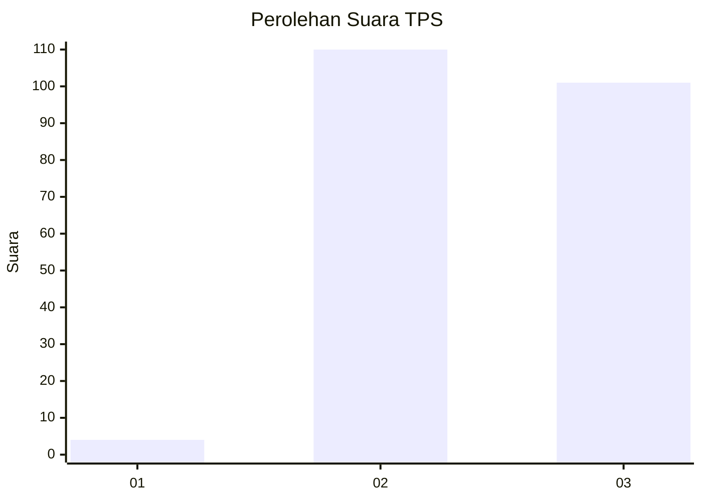
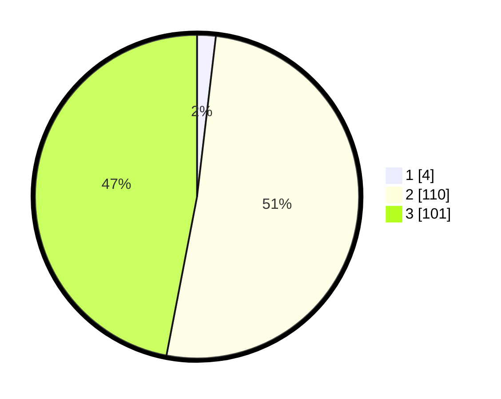

# Hasil

## Grafik

## Tabel

| No. | Nama Paslon    | Suara | Suara (raw) | Persentase |
|:--- |:-------------- | -----:| -----------:| ----------:|
| 1   | ANIES MUHAIMIN | 4     | [4][p-1]    | 1,86       |
| 2   | PRABOWO GIBRAN | 110   | [110][p-2]  | 51,16      |
| 3   | GANJAR MAHFUD  | 101   | [101][p-3]  | 46,98      |

[p-1]: https://github.com/gigit-pemilu/pemilu-2024-51-bali/blob/main/pilpres/hitung-suara/sub/51-bali/sub/01-jembrana/sub/04-melaya/sub/1001-gilimanuk/sub/001-tps/sub/paslon-1.txt
[p-2]: https://github.com/gigit-pemilu/pemilu-2024-51-bali/blob/main/pilpres/hitung-suara/sub/51-bali/sub/01-jembrana/sub/04-melaya/sub/1001-gilimanuk/sub/001-tps/sub/paslon-2.txt
[p-3]: https://github.com/gigit-pemilu/pemilu-2024-51-bali/blob/main/pilpres/hitung-suara/sub/51-bali/sub/01-jembrana/sub/04-melaya/sub/1001-gilimanuk/sub/001-tps/sub/paslon-3.txt

## Foto C Plano

https://sirekap-obj-formc.kpu.go.id/540e/pemilu/ppwp/51/01/04/10/01/5101041001001-20240214-200912--a37b371a-1e61-43d1-b13b-f66a49d3324e.jpg

https://sirekap-obj-formc.kpu.go.id/540e/pemilu/ppwp/51/01/04/10/01/5101041001001-20240214-200916--95c43e04-0a69-4128-8bc3-23b041024d3d.jpg

https://sirekap-obj-formc.kpu.go.id/540e/pemilu/ppwp/51/01/04/10/01/5101041001001-20240214-200919--647ce7b0-7f69-4dad-a558-c6a6d15f0a7f.jpg

## Metadata

| Key        | Value               |
| ---------- | ------------------- |
| Time Stamp | 2024-02-16 08:00:28 |

## DATA PEMILIH TETAP

Jumlah pemilih dalam DPT: **288**.
 * L: **134**.
 * P: **154**.

## DATA PENGGUNA HAK PILIH

Jumlah pengguna hak pilih dalam DPT: **216**.
 * L: **97**.
 * P: **119**.

Jumlah pengguna hak pilih dalam DPTb: **2**.
 * L: **2**.
 * P: **0**.

Jumlah pengguna hak pilih dalam DPK: **0**.
 * L: **0**.
 * P: **0**.

Jumlah pengguna hak pilih: **218**.
 * L: **99**.
 * P: **119**.

## JUMLAH SUARA SAH DAN TIDAK SAH

JUMLAH SELURUH SUARA SAH: **215**.

JUMLAH SUARA TIDAK SAH: **3**.

JUMLAH SELURUH SUARA SAH DAN SUARA TIDAK SAH: **218**.

