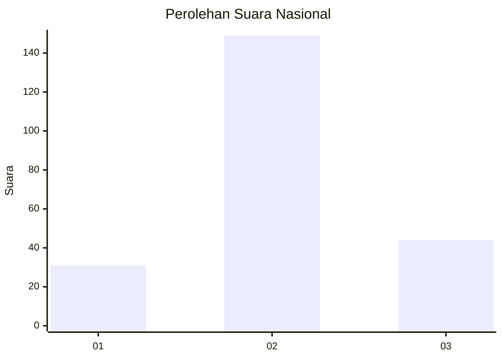
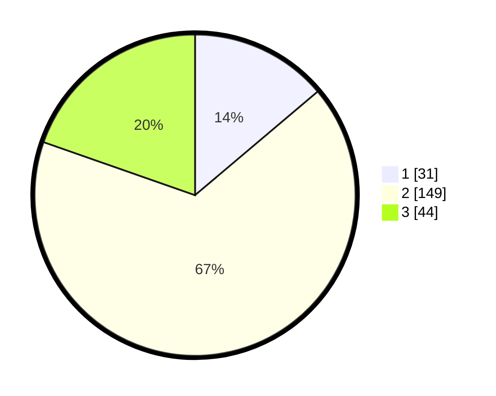

# Hasil

## Grafik

## Tabel

| No. | Nama Paslon    | Suara | Suara (raw) | Persentase |
|:--- |:-------------- | -----:| -----------:| ----------:|
| 1   | ANIES MUHAIMIN | 31    | [31][p-1]   | 13,84      |
| 2   | PRABOWO GIBRAN | 149   | [149][p-2]  | 66,52      |
| 3   | GANJAR MAHFUD  | 44    | [44][p-3]   | 19,64      |

[p-1]: https://github.com/gigit-pemilu/pemilu-2024/blob/main/pilpres/hitung-suara/sub/51-bali/sub/01-jembrana/sub/04-melaya/sub/1001-gilimanuk/sub/006-tps/sub/paslon-1.txt
[p-2]: https://github.com/gigit-pemilu/pemilu-2024/blob/main/pilpres/hitung-suara/sub/51-bali/sub/01-jembrana/sub/04-melaya/sub/1001-gilimanuk/sub/006-tps/sub/paslon-2.txt
[p-3]: https://github.com/gigit-pemilu/pemilu-2024/blob/main/pilpres/hitung-suara/sub/51-bali/sub/01-jembrana/sub/04-melaya/sub/1001-gilimanuk/sub/006-tps/sub/paslon-3.txt

## Foto C Plano

https://sirekap-obj-formc.kpu.go.id/1ccb/pemilu/ppwp/51/01/04/10/01/5101041001006-20240214-221056--9da9a4ba-5056-4525-b067-4e31bac7883d.jpg

https://sirekap-obj-formc.kpu.go.id/1ccb/pemilu/ppwp/51/01/04/10/01/5101041001006-20240214-200038--2df6a983-2816-40c7-b7c7-c619d1315580.jpg

https://sirekap-obj-formc.kpu.go.id/1ccb/pemilu/ppwp/51/01/04/10/01/5101041001006-20240214-200213--d01b525d-570a-40e9-98c8-256b21c65768.jpg

## Metadata

| Key        | Value               |
| ---------- | ------------------- |
| Time Stamp | 2024-02-15 15:00:29 |

## DATA PEMILIH TETAP

Jumlah pemilih dalam DPT: **291**.
 * L: **141**.
 * P: **150**.

## DATA PENGGUNA HAK PILIH

Jumlah pengguna hak pilih dalam DPT: **229**.
 * L: **108**.
 * P: **121**.

Jumlah pengguna hak pilih dalam DPTb: **0**.
 * L: **0**.
 * P: **0**.

Jumlah pengguna hak pilih dalam DPK: **0**.
 * L: **0**.
 * P: **0**.

Jumlah pengguna hak pilih: **229**.
 * L: **108**.
 * P: **121**.

## JUMLAH SUARA SAH DAN TIDAK SAH

JUMLAH SELURUH SUARA SAH: **224**.

JUMLAH SUARA TIDAK SAH: **5**.

JUMLAH SELURUH SUARA SAH DAN SUARA TIDAK SAH: **229**.

