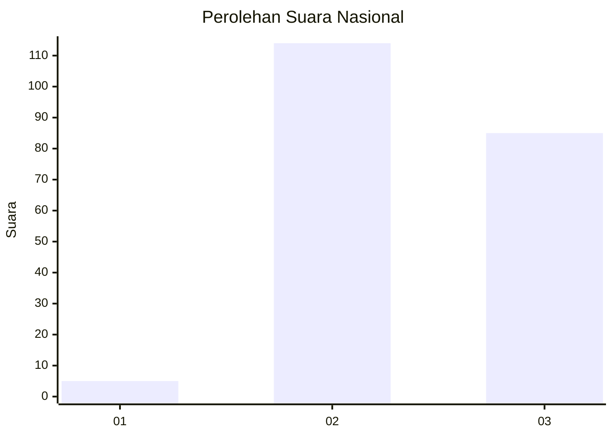
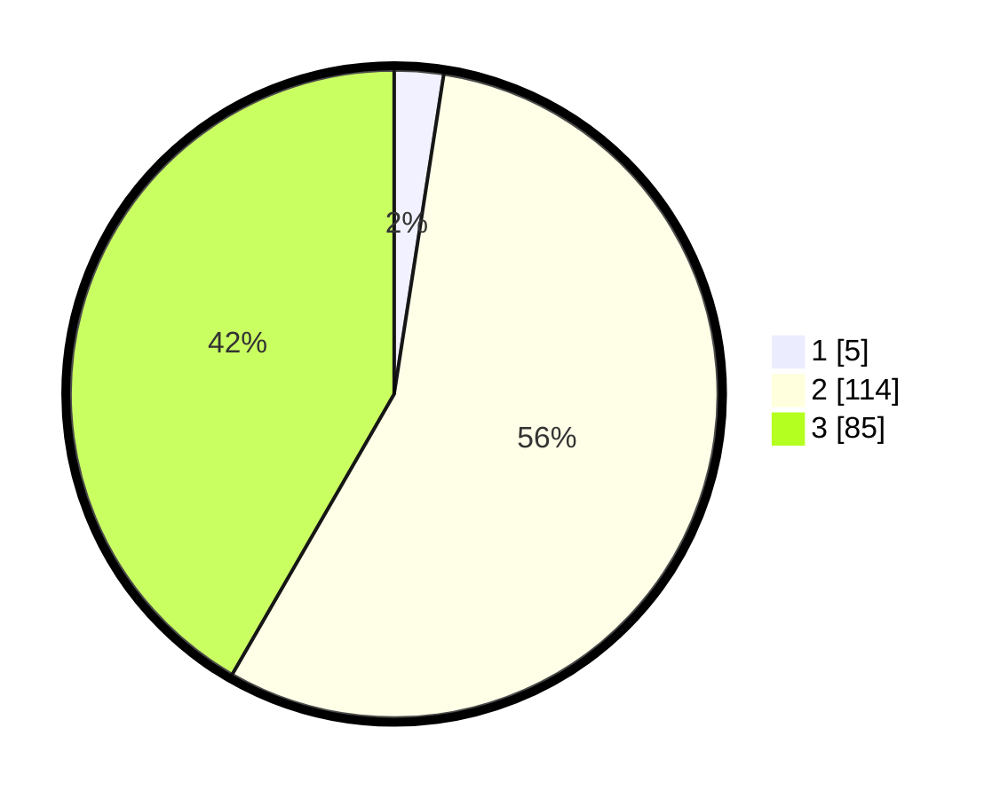

# Hasil

## Grafik

## Tabel

| No. | Nama Paslon    | Suara | Suara (raw) | Persentase |
|:--- |:-------------- | -----:| -----------:| ----------:|
| 1   | ANIES MUHAIMIN | 5     | [5][p-1]    | 2,45       |
| 2   | PRABOWO GIBRAN | 114   | [114][p-2]  | 55,88      |
| 3   | GANJAR MAHFUD  | 85    | [85][p-3]   | 41,67      |

[p-1]: https://github.com/gigit-pemilu/pemilu-2024/blob/main/pilpres/hitung-suara/sub/51-bali/sub/01-jembrana/sub/04-melaya/sub/1001-gilimanuk/sub/007-tps/sub/paslon-1.txt
[p-2]: https://github.com/gigit-pemilu/pemilu-2024/blob/main/pilpres/hitung-suara/sub/51-bali/sub/01-jembrana/sub/04-melaya/sub/1001-gilimanuk/sub/007-tps/sub/paslon-2.txt
[p-3]: https://github.com/gigit-pemilu/pemilu-2024/blob/main/pilpres/hitung-suara/sub/51-bali/sub/01-jembrana/sub/04-melaya/sub/1001-gilimanuk/sub/007-tps/sub/paslon-3.txt

## Foto C Plano

https://sirekap-obj-formc.kpu.go.id/e93c/pemilu/ppwp/51/01/04/10/01/5101041001007-20240214-222644--05676f62-07bc-4c05-8b91-d4eab93265a2.jpg

https://sirekap-obj-formc.kpu.go.id/e93c/pemilu/ppwp/51/01/04/10/01/5101041001007-20240214-223721--db0cc438-84f7-4e60-81b4-fcd3bffb1a4b.jpg

https://sirekap-obj-formc.kpu.go.id/e93c/pemilu/ppwp/51/01/04/10/01/5101041001007-20240214-224106--985cf288-3f5e-4685-9db0-83ac8f64a8fb.jpg

## Metadata

| Key        | Value               |
| ---------- | ------------------- |
| Time Stamp | 2024-02-15 16:00:26 |

## DATA PEMILIH TETAP

Jumlah pemilih dalam DPT: **282**.
 * L: **141**.
 * P: **141**.

## DATA PENGGUNA HAK PILIH

Jumlah pengguna hak pilih dalam DPT: **211**.
 * L: **104**.
 * P: **107**.

Jumlah pengguna hak pilih dalam DPTb: **0**.
 * L: **0**.
 * P: **0**.

Jumlah pengguna hak pilih dalam DPK: **2**.
 * L: **1**.
 * P: **1**.

Jumlah pengguna hak pilih: **213**.
 * L: **105**.
 * P: **108**.

## JUMLAH SUARA SAH DAN TIDAK SAH

JUMLAH SELURUH SUARA SAH: **204**.

JUMLAH SUARA TIDAK SAH: **9**.

JUMLAH SELURUH SUARA SAH DAN SUARA TIDAK SAH: **213**.

