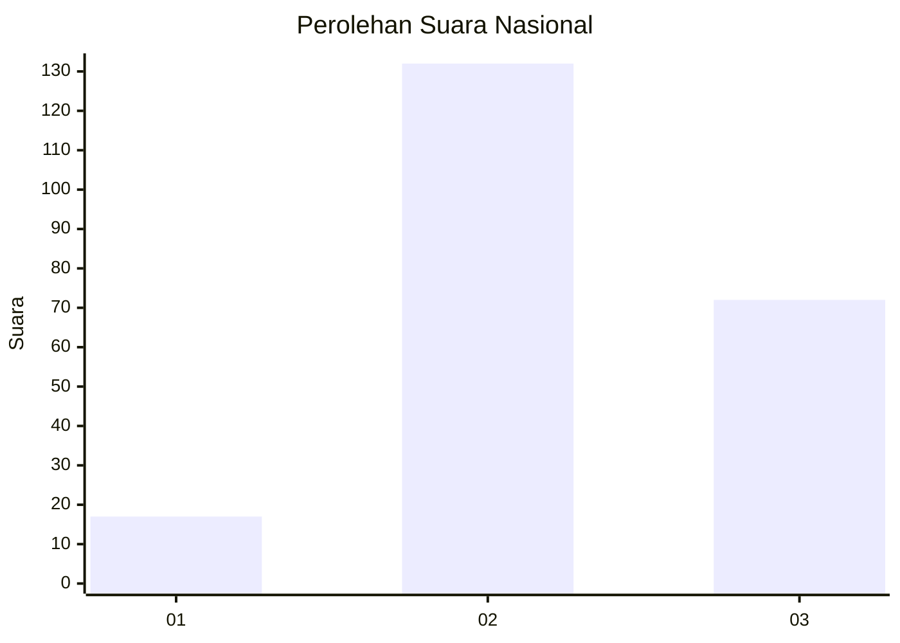
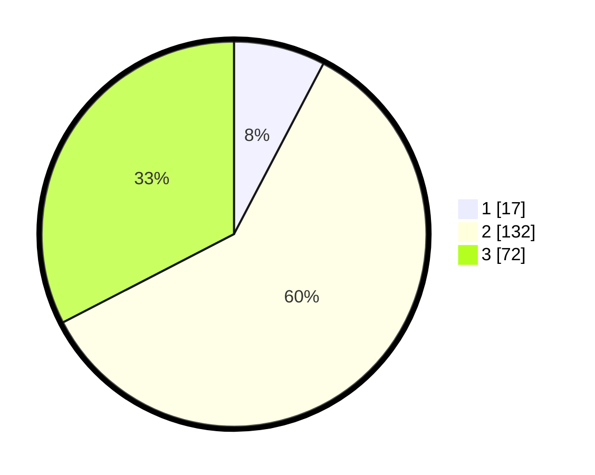

# Hasil

## Grafik

## Tabel

| No. | Nama Paslon    | Suara | Suara (raw) | Persentase |
|:--- |:-------------- | -----:| -----------:| ----------:|
| 1   | ANIES MUHAIMIN | 17    | [17][p-1]   | 7,69       |
| 2   | PRABOWO GIBRAN | 132   | [132][p-2]  | 59,73      |
| 3   | GANJAR MAHFUD  | 72    | [72][p-3]   | 32,58      |

[p-1]: https://github.com/gigit-pemilu/pemilu-2024/blob/main/pilpres/hitung-suara/sub/51-bali/sub/01-jembrana/sub/04-melaya/sub/1001-gilimanuk/sub/014-tps/sub/paslon-1.txt
[p-2]: https://github.com/gigit-pemilu/pemilu-2024/blob/main/pilpres/hitung-suara/sub/51-bali/sub/01-jembrana/sub/04-melaya/sub/1001-gilimanuk/sub/014-tps/sub/paslon-2.txt
[p-3]: https://github.com/gigit-pemilu/pemilu-2024/blob/main/pilpres/hitung-suara/sub/51-bali/sub/01-jembrana/sub/04-melaya/sub/1001-gilimanuk/sub/014-tps/sub/paslon-3.txt

## Foto C Plano

https://sirekap-obj-formc.kpu.go.id/6647/pemilu/ppwp/51/01/04/10/01/5101041001014-20240215-133836--a9797a6a-915d-4b84-a17a-bcdf959ad06c.jpg

https://sirekap-obj-formc.kpu.go.id/6647/pemilu/ppwp/51/01/04/10/01/5101041001014-20240215-133854--8f9235d4-76d8-455f-affc-811bb68ae5d4.jpg

https://sirekap-obj-formc.kpu.go.id/6647/pemilu/ppwp/51/01/04/10/01/5101041001014-20240215-133912--60020e2f-2b5e-4e3e-96ef-faea16e49416.jpg

## Metadata

| Key        | Value               |
| ---------- | ------------------- |
| Time Stamp | 2024-02-16 06:00:27 |

## DATA PEMILIH TETAP

Jumlah pemilih dalam DPT: **293**.
 * L: **139**.
 * P: **154**.

## DATA PENGGUNA HAK PILIH

Jumlah pengguna hak pilih dalam DPT: **216**.
 * L: **102**.
 * P: **114**.

Jumlah pengguna hak pilih dalam DPTb: **1**.
 * L: **1**.
 * P: **0**.

Jumlah pengguna hak pilih dalam DPK: **7**.
 * L: **2**.
 * P: **5**.

Jumlah pengguna hak pilih: **224**.
 * L: **105**.
 * P: **119**.

## JUMLAH SUARA SAH DAN TIDAK SAH

JUMLAH SELURUH SUARA SAH: **221**.

JUMLAH SUARA TIDAK SAH: **3**.

JUMLAH SELURUH SUARA SAH DAN SUARA TIDAK SAH: **224**.

