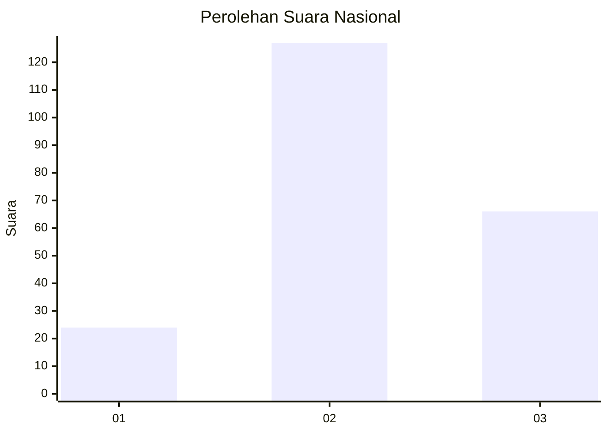
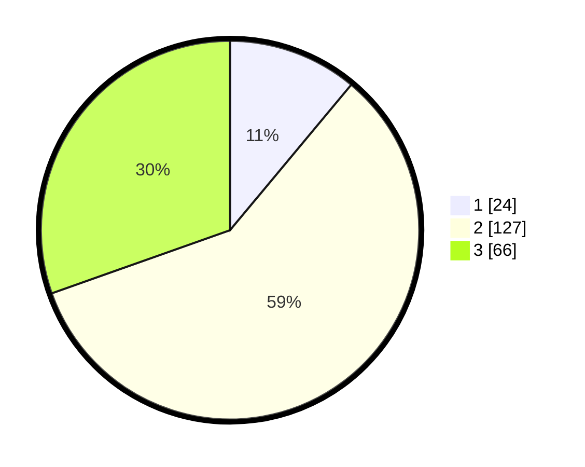

# Hasil

## Grafik

## Tabel

| No. | Nama Paslon    | Suara | Suara (raw) | Persentase |
|:--- |:-------------- | -----:| -----------:| ----------:|
| 1   | ANIES MUHAIMIN | 24    | [24][p-1]   | 11,06      |
| 2   | PRABOWO GIBRAN | 127   | [127][p-2]  | 58,53      |
| 3   | GANJAR MAHFUD  | 66    | [66][p-3]   | 30,41      |

[p-1]: https://github.com/gigit-pemilu/pemilu-2024/blob/main/pilpres/hitung-suara/sub/51-bali/sub/01-jembrana/sub/04-melaya/sub/1001-gilimanuk/sub/015-tps/sub/paslon-1.txt
[p-2]: https://github.com/gigit-pemilu/pemilu-2024/blob/main/pilpres/hitung-suara/sub/51-bali/sub/01-jembrana/sub/04-melaya/sub/1001-gilimanuk/sub/015-tps/sub/paslon-2.txt
[p-3]: https://github.com/gigit-pemilu/pemilu-2024/blob/main/pilpres/hitung-suara/sub/51-bali/sub/01-jembrana/sub/04-melaya/sub/1001-gilimanuk/sub/015-tps/sub/paslon-3.txt

## Foto C Plano

https://sirekap-obj-formc.kpu.go.id/1183/pemilu/ppwp/51/01/04/10/01/5101041001015-20240214-222011--841384dc-df05-48a5-a89e-7e40005ae085.jpg

https://sirekap-obj-formc.kpu.go.id/1183/pemilu/ppwp/51/01/04/10/01/5101041001015-20240214-222337--26f18bbd-c02c-4c08-b638-89490dede43f.jpg

https://sirekap-obj-formc.kpu.go.id/1183/pemilu/ppwp/51/01/04/10/01/5101041001015-20240214-222510--ec8c7030-fa7a-4b52-a945-7cc39b740989.jpg

## Metadata

| Key        | Value               |
| ---------- | ------------------- |
| Time Stamp | 2024-02-15 16:00:26 |

## DATA PEMILIH TETAP

Jumlah pemilih dalam DPT: **261**.
 * L: **133**.
 * P: **128**.

## DATA PENGGUNA HAK PILIH

Jumlah pengguna hak pilih dalam DPT: **209**.
 * L: **102**.
 * P: **107**.

Jumlah pengguna hak pilih dalam DPTb: **6**.
 * L: **6**.
 * P: **0**.

Jumlah pengguna hak pilih dalam DPK: **3**.
 * L: **2**.
 * P: **1**.

Jumlah pengguna hak pilih: **218**.
 * L: **110**.
 * P: **108**.

## JUMLAH SUARA SAH DAN TIDAK SAH

JUMLAH SELURUH SUARA SAH: **217**.

JUMLAH SUARA TIDAK SAH: **1**.

JUMLAH SELURUH SUARA SAH DAN SUARA TIDAK SAH: **218**.

