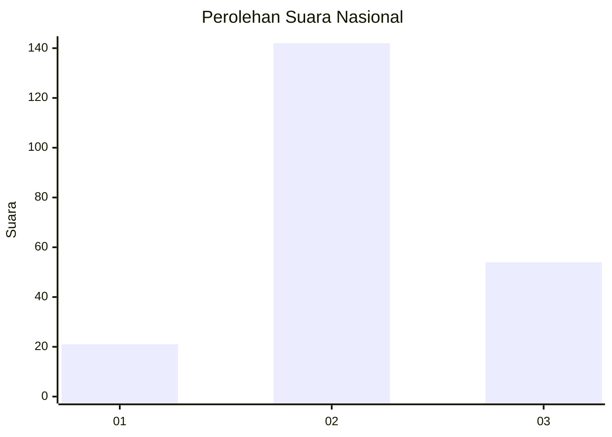
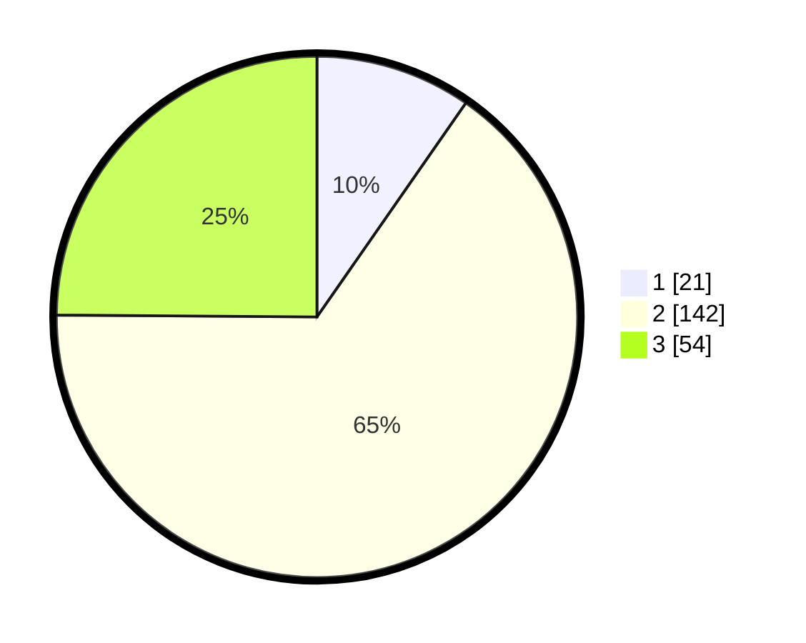

# Hasil

## Grafik

## Tabel

| No. | Nama Paslon    | Suara | Suara (raw) | Persentase |
|:--- |:-------------- | -----:| -----------:| ----------:|
| 1   | ANIES MUHAIMIN | 21    | [21][p-1]   | 9,68       |
| 2   | PRABOWO GIBRAN | 142   | [142][p-2]  | 65,44      |
| 3   | GANJAR MAHFUD  | 54    | [54][p-3]   | 24,88      |

[p-1]: https://github.com/gigit-pemilu/pemilu-2024/blob/main/pilpres/hitung-suara/sub/51-bali/sub/01-jembrana/sub/04-melaya/sub/1001-gilimanuk/sub/016-tps/sub/paslon-1.txt
[p-2]: https://github.com/gigit-pemilu/pemilu-2024/blob/main/pilpres/hitung-suara/sub/51-bali/sub/01-jembrana/sub/04-melaya/sub/1001-gilimanuk/sub/016-tps/sub/paslon-2.txt
[p-3]: https://github.com/gigit-pemilu/pemilu-2024/blob/main/pilpres/hitung-suara/sub/51-bali/sub/01-jembrana/sub/04-melaya/sub/1001-gilimanuk/sub/016-tps/sub/paslon-3.txt

## Foto C Plano

https://sirekap-obj-formc.kpu.go.id/2ef9/pemilu/ppwp/51/01/04/10/01/5101041001016-20240214-141531--bbd05623-39ab-48a2-925a-00ca8f4e8851.jpg

https://sirekap-obj-formc.kpu.go.id/2ef9/pemilu/ppwp/51/01/04/10/01/5101041001016-20240217-101913--107497f4-07df-4afb-9d44-c0060b2ebb0b.jpg

## Metadata

| Key        | Value               |
| ---------- | ------------------- |
| Time Stamp | 2024-02-17 10:30:03 |

