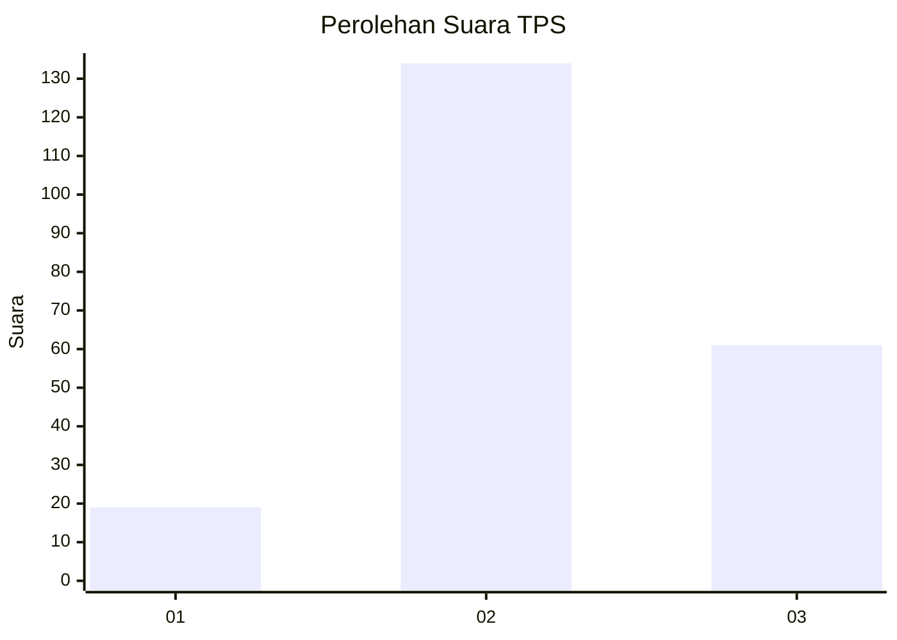
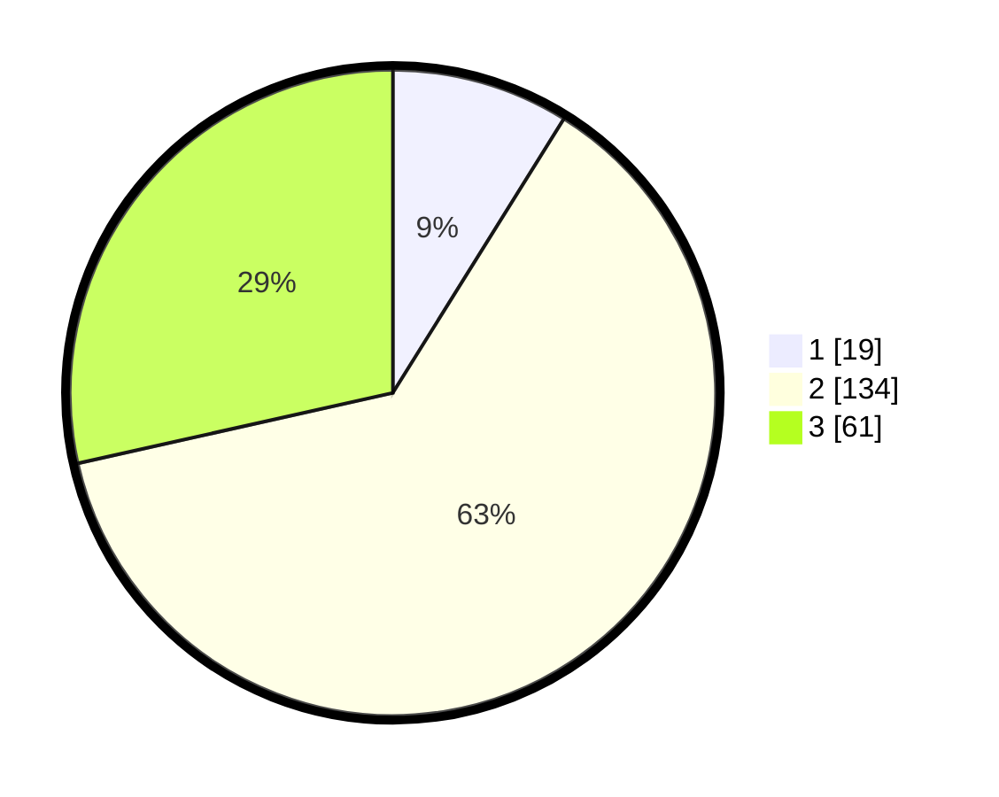

# Hasil

## Grafik

## Tabel

| No. | Nama Paslon    | Suara | Suara (raw) | Persentase |
|:--- |:-------------- | -----:| -----------:| ----------:|
| 1   | ANIES MUHAIMIN | 19    | [19][p-1]   | 8,88       |
| 2   | PRABOWO GIBRAN | 134   | [134][p-2]  | 62,62      |
| 3   | GANJAR MAHFUD  | 61    | [61][p-3]   | 28,50      |

[p-1]: https://github.com/gigit-pemilu/pemilu-2024-51-bali/blob/main/pilpres/hitung-suara/sub/51-bali/sub/01-jembrana/sub/04-melaya/sub/2002-melaya/sub/002-tps/sub/paslon-1.txt
[p-2]: https://github.com/gigit-pemilu/pemilu-2024-51-bali/blob/main/pilpres/hitung-suara/sub/51-bali/sub/01-jembrana/sub/04-melaya/sub/2002-melaya/sub/002-tps/sub/paslon-2.txt
[p-3]: https://github.com/gigit-pemilu/pemilu-2024-51-bali/blob/main/pilpres/hitung-suara/sub/51-bali/sub/01-jembrana/sub/04-melaya/sub/2002-melaya/sub/002-tps/sub/paslon-3.txt

## Foto C Plano

https://sirekap-obj-formc.kpu.go.id/0d80/pemilu/ppwp/51/01/04/20/02/5101042002002-20240215-010314--3ef879d4-dc5f-4172-a20c-915463f99132.jpg

https://sirekap-obj-formc.kpu.go.id/0d80/pemilu/ppwp/51/01/04/20/02/5101042002002-20240215-004953--bf8b545d-15fc-4288-9a05-1277f01a41cb.jpg

https://sirekap-obj-formc.kpu.go.id/0d80/pemilu/ppwp/51/01/04/20/02/5101042002002-20240215-005055--f11db543-4ef3-4d8b-bf2a-59e54129cad0.jpg

## Metadata

| Key        | Value               |
| ---------- | ------------------- |
| Time Stamp | 2024-02-15 15:00:29 |

## DATA PEMILIH TETAP

Jumlah pemilih dalam DPT: **280**.
 * L: **135**.
 * P: **145**.

## DATA PENGGUNA HAK PILIH

Jumlah pengguna hak pilih dalam DPT: **216**.
 * L: **104**.
 * P: **112**.

Jumlah pengguna hak pilih dalam DPTb: **0**.
 * L: **0**.
 * P: **0**.

Jumlah pengguna hak pilih dalam DPK: **1**.
 * L: **1**.
 * P: **0**.

Jumlah pengguna hak pilih: **217**.
 * L: **105**.
 * P: **112**.

## JUMLAH SUARA SAH DAN TIDAK SAH

JUMLAH SELURUH SUARA SAH: **214**.

JUMLAH SUARA TIDAK SAH: **3**.

JUMLAH SELURUH SUARA SAH DAN SUARA TIDAK SAH: **217**.

