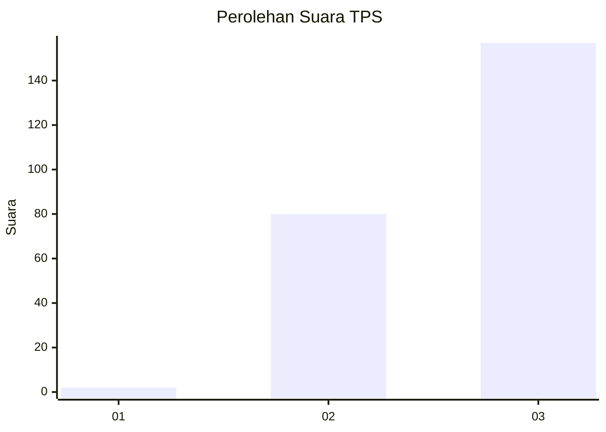
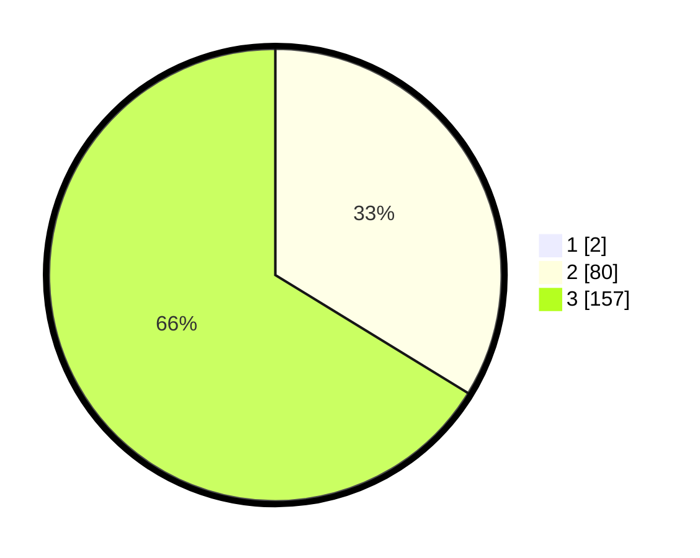

# Hasil

## Grafik

## Tabel

| No. | Nama Paslon    | Suara | Suara (raw) | Persentase |
|:--- |:-------------- | -----:| -----------:| ----------:|
| 1   | ANIES MUHAIMIN | 2     | [2][p-1]    | 0,84       |
| 2   | PRABOWO GIBRAN | 80    | [80][p-2]   | 33,47      |
| 3   | GANJAR MAHFUD  | 157   | [157][p-3]  | 65,69      |

[p-1]: https://github.com/gigit-pemilu/pemilu-2024-51-bali/blob/main/pilpres/hitung-suara/sub/51-bali/sub/01-jembrana/sub/04-melaya/sub/2002-melaya/sub/003-tps/sub/paslon-1.txt
[p-2]: https://github.com/gigit-pemilu/pemilu-2024-51-bali/blob/main/pilpres/hitung-suara/sub/51-bali/sub/01-jembrana/sub/04-melaya/sub/2002-melaya/sub/003-tps/sub/paslon-2.txt
[p-3]: https://github.com/gigit-pemilu/pemilu-2024-51-bali/blob/main/pilpres/hitung-suara/sub/51-bali/sub/01-jembrana/sub/04-melaya/sub/2002-melaya/sub/003-tps/sub/paslon-3.txt

## Foto C Plano

https://sirekap-obj-formc.kpu.go.id/9b90/pemilu/ppwp/51/01/04/20/02/5101042002003-20240216-143431--4b753853-23aa-4456-b677-42e30351af50.jpg

https://sirekap-obj-formc.kpu.go.id/9b90/pemilu/ppwp/51/01/04/20/02/5101042002003-20240216-143433--6eec16c3-d056-47cf-91ed-110201b1fa8f.jpg

https://sirekap-obj-formc.kpu.go.id/9b90/pemilu/ppwp/51/01/04/20/02/5101042002003-20240216-143432--acda969f-cf49-42ca-aef3-eee52ce2df02.jpg

## Metadata

| Key        | Value               |
| ---------- | ------------------- |
| Time Stamp | 2024-02-16 16:25:10 |

## DATA PEMILIH TETAP

Jumlah pemilih dalam DPT: **289**.
 * L: **142**.
 * P: **147**.

## DATA PENGGUNA HAK PILIH

Jumlah pengguna hak pilih dalam DPT: **241**.
 * L: **119**.
 * P: **122**.

Jumlah pengguna hak pilih dalam DPTb: **0**.
 * L: **0**.
 * P: **0**.

Jumlah pengguna hak pilih dalam DPK: **0**.
 * L: **0**.
 * P: **0**.

Jumlah pengguna hak pilih: **241**.
 * L: **119**.
 * P: **122**.

## JUMLAH SUARA SAH DAN TIDAK SAH

JUMLAH SELURUH SUARA SAH: **239**.

JUMLAH SUARA TIDAK SAH: **2**.

JUMLAH SELURUH SUARA SAH DAN SUARA TIDAK SAH: **241**.

