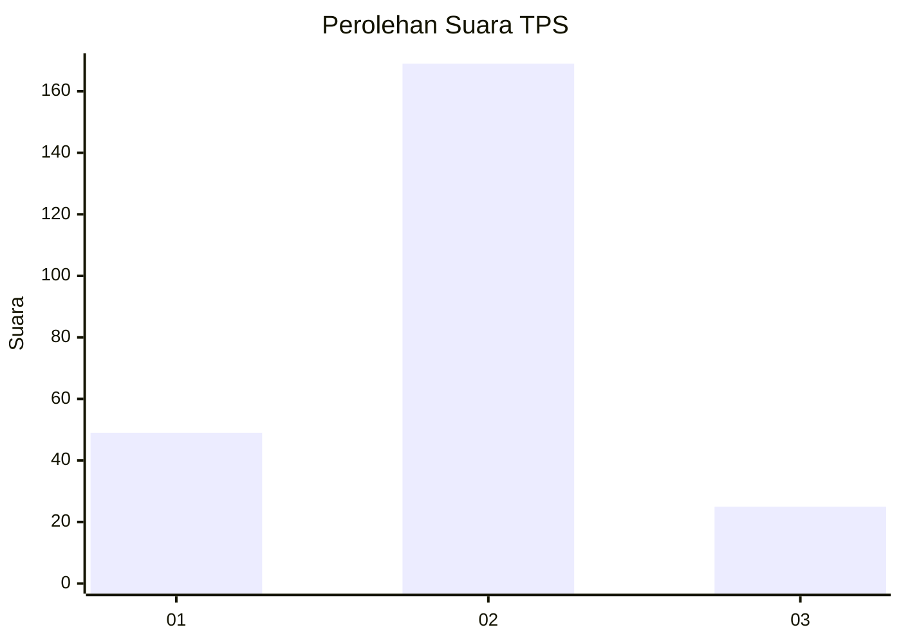
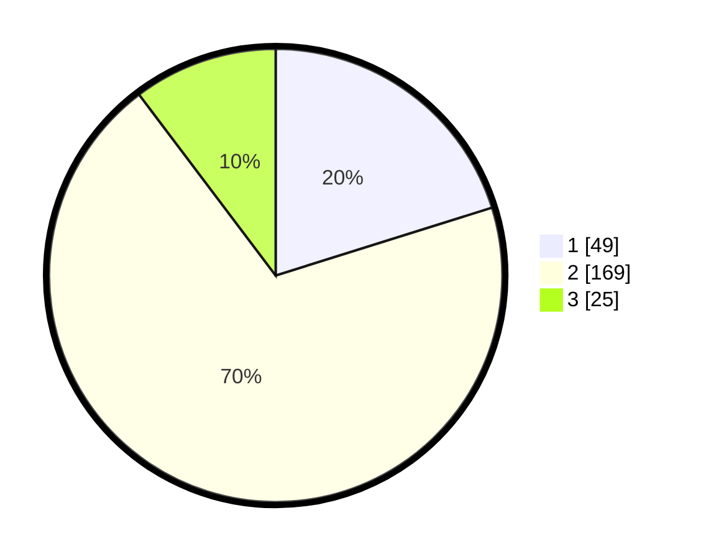

# Hasil

## Grafik

## Tabel

| No. | Nama Paslon    | Suara | Suara (raw) | Persentase |
|:--- |:-------------- | -----:| -----------:| ----------:|
| 1   | ANIES MUHAIMIN | 49    | [49][p-1]   | 20,16      |
| 2   | PRABOWO GIBRAN | 169   | [169][p-2]  | 69,55      |
| 3   | GANJAR MAHFUD  | 25    | [25][p-3]   | 10,29      |

[p-1]: https://github.com/gigit-pemilu/pemilu-2024-51-bali/blob/main/pilpres/hitung-suara/sub/51-bali/sub/01-jembrana/sub/04-melaya/sub/2002-melaya/sub/004-tps/sub/paslon-1.txt
[p-2]: https://github.com/gigit-pemilu/pemilu-2024-51-bali/blob/main/pilpres/hitung-suara/sub/51-bali/sub/01-jembrana/sub/04-melaya/sub/2002-melaya/sub/004-tps/sub/paslon-2.txt
[p-3]: https://github.com/gigit-pemilu/pemilu-2024-51-bali/blob/main/pilpres/hitung-suara/sub/51-bali/sub/01-jembrana/sub/04-melaya/sub/2002-melaya/sub/004-tps/sub/paslon-3.txt

## Foto C Plano

https://sirekap-obj-formc.kpu.go.id/c7f1/pemilu/ppwp/51/01/04/20/02/5101042002004-20240214-200947--ac284895-01d8-470f-8b0f-8340407e0832.jpg

https://sirekap-obj-formc.kpu.go.id/c7f1/pemilu/ppwp/51/01/04/20/02/5101042002004-20240214-201122--0651c0d6-4ef1-45b9-8c67-3512f7cb30aa.jpg

https://sirekap-obj-formc.kpu.go.id/c7f1/pemilu/ppwp/51/01/04/20/02/5101042002004-20240214-201214--9335036f-9719-41f3-a61f-64530a20a55d.jpg

## Metadata

| Key        | Value               |
| ---------- | ------------------- |
| Time Stamp | 2024-02-15 00:41:44 |

## DATA PEMILIH TETAP

Jumlah pemilih dalam DPT: **288**.
 * L: **144**.
 * P: **144**.

## DATA PENGGUNA HAK PILIH

Jumlah pengguna hak pilih dalam DPT: **242**.
 * L: **117**.
 * P: **125**.

Jumlah pengguna hak pilih dalam DPTb: **0**.
 * L: **0**.
 * P: **0**.

Jumlah pengguna hak pilih dalam DPK: **8**.
 * L: **5**.
 * P: **3**.

Jumlah pengguna hak pilih: **250**.
 * L: **122**.
 * P: **128**.

## JUMLAH SUARA SAH DAN TIDAK SAH

JUMLAH SELURUH SUARA SAH: **243**.

JUMLAH SUARA TIDAK SAH: **7**.

JUMLAH SELURUH SUARA SAH DAN SUARA TIDAK SAH: **250**.

