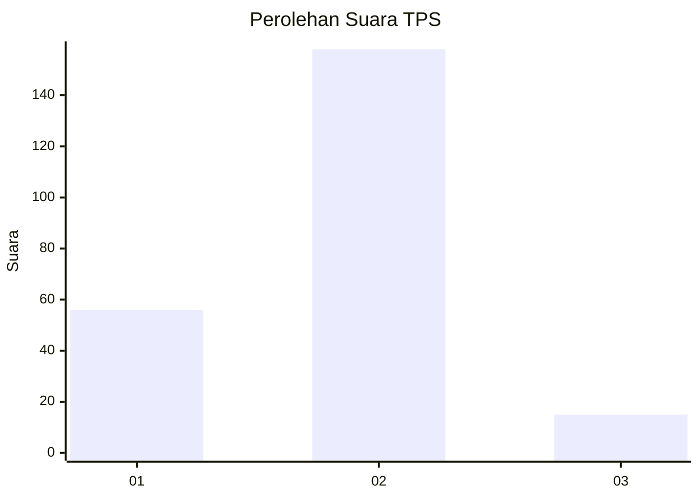

# Hasil

## Grafik

## Tabel

| No. | Nama Paslon    | Suara | Suara (raw) | Persentase |
|:--- |:-------------- | -----:| -----------:| ----------:|
| 1   | ANIES MUHAIMIN | 56    | [56][p-1]   | 24,45      |
| 2   | PRABOWO GIBRAN | 158   | [158][p-2]  | 69,00      |
| 3   | GANJAR MAHFUD  | 15    | [15][p-3]   | 6,55       |

[p-1]: https://github.com/gigit-pemilu/pemilu-2024-51-bali/blob/main/pilpres/hitung-suara/sub/51-bali/sub/01-jembrana/sub/04-melaya/sub/2002-melaya/sub/005-tps/sub/paslon-1.txt
[p-2]: https://github.com/gigit-pemilu/pemilu-2024-51-bali/blob/main/pilpres/hitung-suara/sub/51-bali/sub/01-jembrana/sub/04-melaya/sub/2002-melaya/sub/005-tps/sub/paslon-2.txt
[p-3]: https://github.com/gigit-pemilu/pemilu-2024-51-bali/blob/main/pilpres/hitung-suara/sub/51-bali/sub/01-jembrana/sub/04-melaya/sub/2002-melaya/sub/005-tps/sub/paslon-3.txt

## Foto C Plano

https://sirekap-obj-formc.kpu.go.id/49d7/pemilu/ppwp/51/01/04/20/02/5101042002005-20240214-194204--96d93639-cfdc-4c5b-a83f-a2e0c08301ce.jpg

https://sirekap-obj-formc.kpu.go.id/49d7/pemilu/ppwp/51/01/04/20/02/5101042002005-20240214-194244--7b3fae59-7fc8-4cad-acce-a0c854108256.jpg

https://sirekap-obj-formc.kpu.go.id/49d7/pemilu/ppwp/51/01/04/20/02/5101042002005-20240214-194305--bb3de374-0b33-44da-8906-5a7c1b2fa57d.jpg

## Metadata

| Key        | Value               |
| ---------- | ------------------- |
| Time Stamp | 2024-02-15 15:00:29 |

## DATA PEMILIH TETAP

Jumlah pemilih dalam DPT: **284**.
 * L: **135**.
 * P: **149**.

## DATA PENGGUNA HAK PILIH

Jumlah pengguna hak pilih dalam DPT: **240**.
 * L: **116**.
 * P: **124**.

Jumlah pengguna hak pilih dalam DPTb: **0**.
 * L: **0**.
 * P: **0**.

Jumlah pengguna hak pilih dalam DPK: **3**.
 * L: **3**.
 * P: **0**.

Jumlah pengguna hak pilih: **243**.
 * L: **119**.
 * P: **124**.

## JUMLAH SUARA SAH DAN TIDAK SAH

JUMLAH SELURUH SUARA SAH: **229**.

JUMLAH SUARA TIDAK SAH: **14**.

JUMLAH SELURUH SUARA SAH DAN SUARA TIDAK SAH: **243**.

