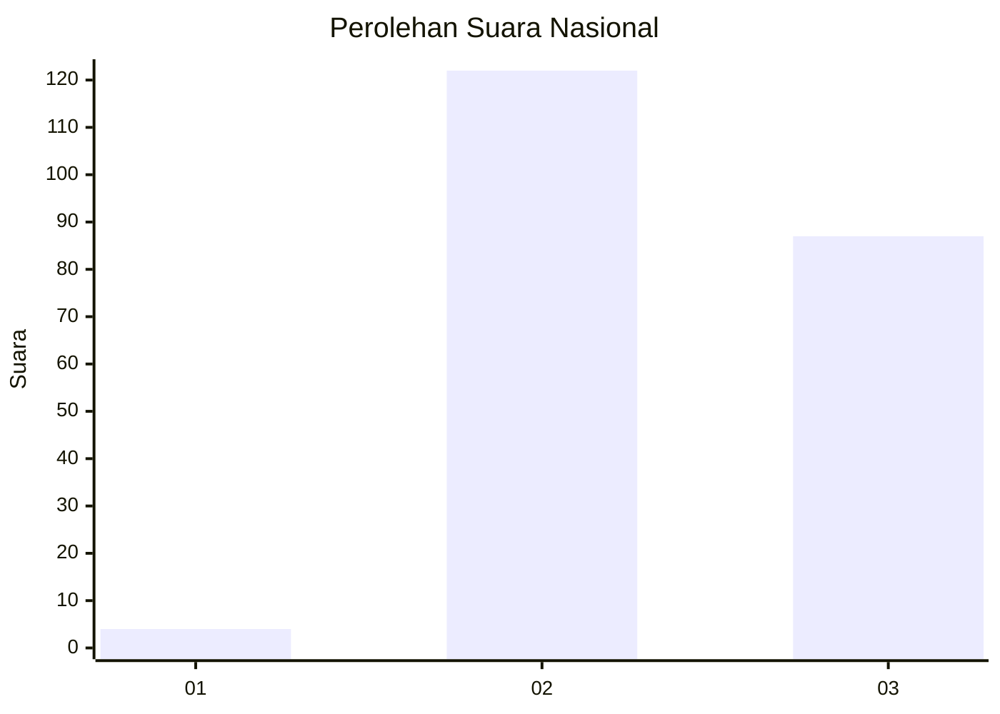
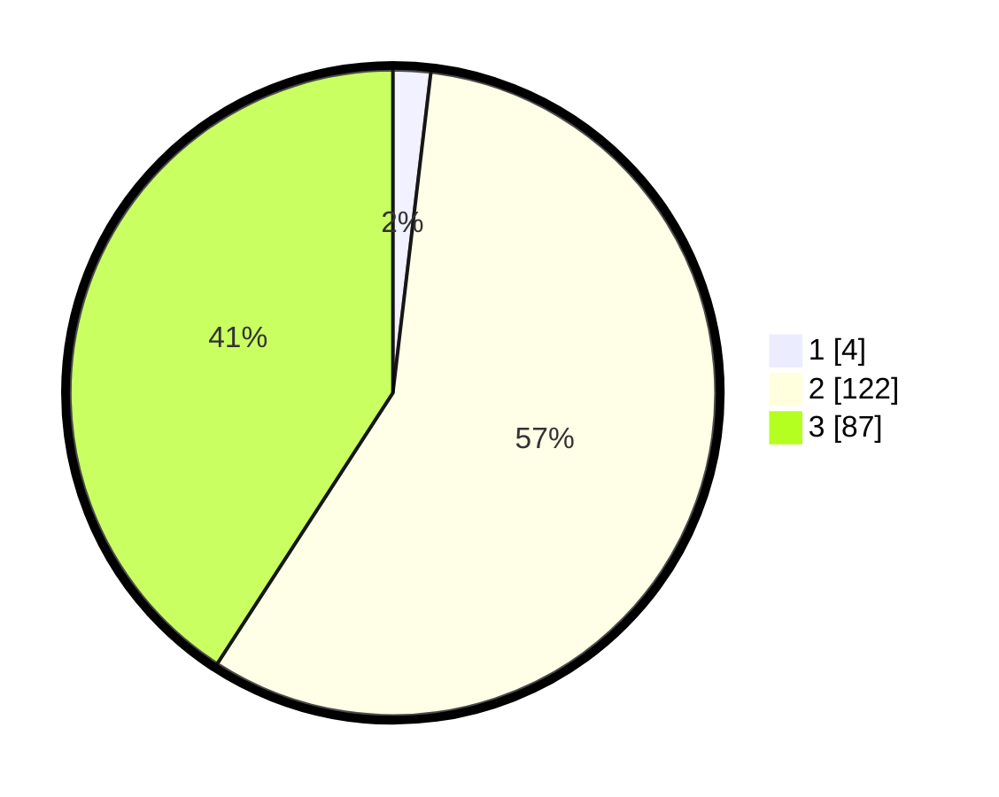

# Hasil

## Grafik

## Tabel

| No. | Nama Paslon    | Suara | Suara (raw) | Persentase |
|:--- |:-------------- | -----:| -----------:| ----------:|
| 1   | ANIES MUHAIMIN | 4     | [4][p-1]    | 1,88       |
| 2   | PRABOWO GIBRAN | 122   | [122][p-2]  | 57,28      |
| 3   | GANJAR MAHFUD  | 87    | [87][p-3]   | 40,85      |

[p-1]: https://github.com/gigit-pemilu/pemilu-2024/blob/main/pilpres/hitung-suara/sub/51-bali/sub/01-jembrana/sub/04-melaya/sub/2002-melaya/sub/007-tps/sub/paslon-1.txt
[p-2]: https://github.com/gigit-pemilu/pemilu-2024/blob/main/pilpres/hitung-suara/sub/51-bali/sub/01-jembrana/sub/04-melaya/sub/2002-melaya/sub/007-tps/sub/paslon-2.txt
[p-3]: https://github.com/gigit-pemilu/pemilu-2024/blob/main/pilpres/hitung-suara/sub/51-bali/sub/01-jembrana/sub/04-melaya/sub/2002-melaya/sub/007-tps/sub/paslon-3.txt

## Foto C Plano

https://sirekap-obj-formc.kpu.go.id/2db4/pemilu/ppwp/51/01/04/20/02/5101042002007-20240214-140929--143eed9c-b656-4ed8-99b3-d028c117e272.jpg

https://sirekap-obj-formc.kpu.go.id/2db4/pemilu/ppwp/51/01/04/20/02/5101042002007-20240214-141019--7f00e41f-da88-4731-a413-b1cf194e616f.jpg

https://sirekap-obj-formc.kpu.go.id/2db4/pemilu/ppwp/51/01/04/20/02/5101042002007-20240214-141049--40f4d84f-3652-4be6-9bb9-16f7367edbe3.jpg

## Metadata

| Key        | Value               |
| ---------- | ------------------- |
| Time Stamp | 2024-02-15 00:41:44 |

