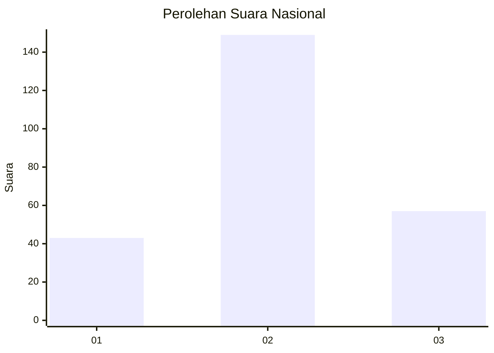
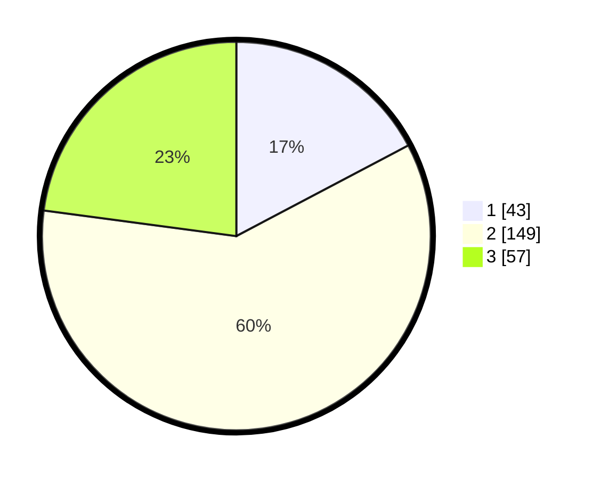

# Hasil

## Grafik

## Tabel

| No. | Nama Paslon    | Suara | Suara (raw) | Persentase |
|:--- |:-------------- | -----:| -----------:| ----------:|
| 1   | ANIES MUHAIMIN | 43    | [43][p-1]   | 17,27      |
| 2   | PRABOWO GIBRAN | 149   | [149][p-2]  | 59,84      |
| 3   | GANJAR MAHFUD  | 57    | [57][p-3]   | 22,89      |

[p-1]: https://github.com/gigit-pemilu/pemilu-2024/blob/main/pilpres/hitung-suara/sub/51-bali/sub/01-jembrana/sub/04-melaya/sub/2002-melaya/sub/009-tps/sub/paslon-1.txt
[p-2]: https://github.com/gigit-pemilu/pemilu-2024/blob/main/pilpres/hitung-suara/sub/51-bali/sub/01-jembrana/sub/04-melaya/sub/2002-melaya/sub/009-tps/sub/paslon-2.txt
[p-3]: https://github.com/gigit-pemilu/pemilu-2024/blob/main/pilpres/hitung-suara/sub/51-bali/sub/01-jembrana/sub/04-melaya/sub/2002-melaya/sub/009-tps/sub/paslon-3.txt

## Foto C Plano

https://sirekap-obj-formc.kpu.go.id/1d2f/pemilu/ppwp/51/01/04/20/02/5101042002009-20240214-141226--f70609b8-c829-4d03-8951-1ae18e76c86d.jpg

https://sirekap-obj-formc.kpu.go.id/1d2f/pemilu/ppwp/51/01/04/20/02/5101042002009-20240214-141505--85129267-39e3-4e62-b7b6-bce6758e1e04.jpg

https://sirekap-obj-formc.kpu.go.id/1d2f/pemilu/ppwp/51/01/04/20/02/5101042002009-20240214-141836--09198ab8-d2f9-4212-96df-9e080f37e450.jpg

## Metadata

| Key        | Value               |
| ---------- | ------------------- |
| Time Stamp | 2024-02-16 08:00:28 |

## DATA PEMILIH TETAP

Jumlah pemilih dalam DPT: **295**.
 * L: **140**.
 * P: **155**.

## DATA PENGGUNA HAK PILIH

Jumlah pengguna hak pilih dalam DPT: **251**.
 * L: **117**.
 * P: **134**.

Jumlah pengguna hak pilih dalam DPTb: **0**.
 * L: **0**.
 * P: **0**.

Jumlah pengguna hak pilih dalam DPK: **0**.
 * L: **0**.
 * P: **0**.

Jumlah pengguna hak pilih: **251**.
 * L: **117**.
 * P: **134**.

## JUMLAH SUARA SAH DAN TIDAK SAH

JUMLAH SELURUH SUARA SAH: **249**.

JUMLAH SUARA TIDAK SAH: **2**.

JUMLAH SELURUH SUARA SAH DAN SUARA TIDAK SAH: **251**.

