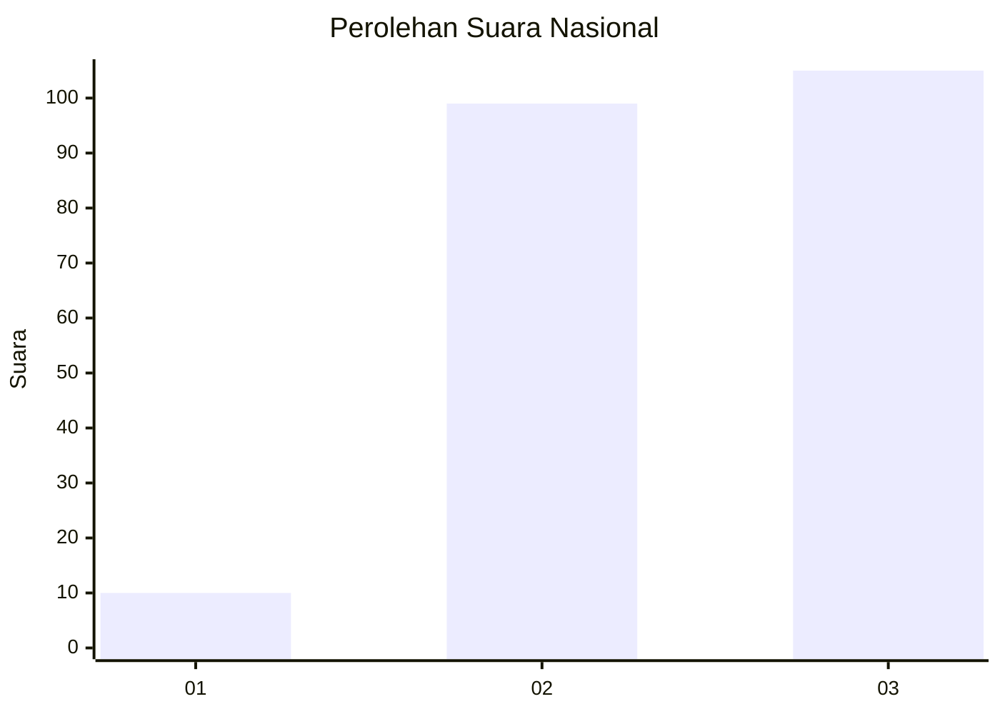
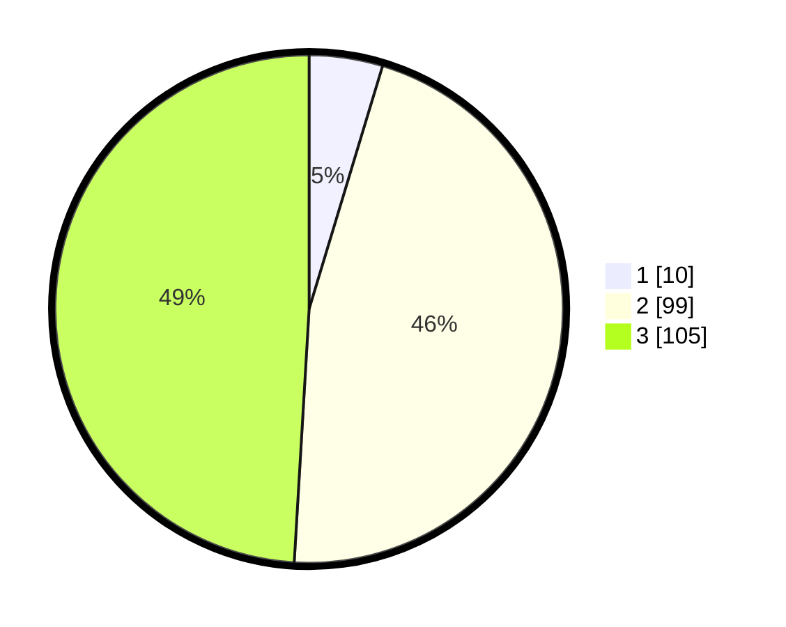

# Hasil

## Grafik

## Tabel

| No. | Nama Paslon    | Suara | Suara (raw) | Persentase |
|:--- |:-------------- | -----:| -----------:| ----------:|
| 1   | ANIES MUHAIMIN | 10    | [10][p-1]   | 4,67       |
| 2   | PRABOWO GIBRAN | 99    | [99][p-2]   | 46,26      |
| 3   | GANJAR MAHFUD  | 105   | [105][p-3]  | 49,07      |

[p-1]: https://github.com/gigit-pemilu/pemilu-2024/blob/main/pilpres/hitung-suara/sub/51-bali/sub/01-jembrana/sub/04-melaya/sub/2002-melaya/sub/010-tps/sub/paslon-1.txt
[p-2]: https://github.com/gigit-pemilu/pemilu-2024/blob/main/pilpres/hitung-suara/sub/51-bali/sub/01-jembrana/sub/04-melaya/sub/2002-melaya/sub/010-tps/sub/paslon-2.txt
[p-3]: https://github.com/gigit-pemilu/pemilu-2024/blob/main/pilpres/hitung-suara/sub/51-bali/sub/01-jembrana/sub/04-melaya/sub/2002-melaya/sub/010-tps/sub/paslon-3.txt

## Foto C Plano

https://sirekap-obj-formc.kpu.go.id/e40e/pemilu/ppwp/51/01/04/20/02/5101042002010-20240214-191855--c916726f-1fcf-491b-87b1-ba6a209402ff.jpg

https://sirekap-obj-formc.kpu.go.id/e40e/pemilu/ppwp/51/01/04/20/02/5101042002010-20240214-191904--b7036c56-4be4-4376-810f-94c0a650d7f6.jpg

https://sirekap-obj-formc.kpu.go.id/e40e/pemilu/ppwp/51/01/04/20/02/5101042002010-20240214-191912--1187e2aa-8eb9-4531-afa4-b675ee6c6272.jpg

## Metadata

| Key        | Value               |
| ---------- | ------------------- |
| Time Stamp | 2024-02-14 21:46:01 |

## DATA PEMILIH TETAP

Jumlah pemilih dalam DPT: **288**.
 * L: **142**.
 * P: **146**.

## DATA PENGGUNA HAK PILIH

Jumlah pengguna hak pilih dalam DPT: **222**.
 * L: **110**.
 * P: **112**.

Jumlah pengguna hak pilih dalam DPTb: **0**.
 * L: **0**.
 * P: **0**.

Jumlah pengguna hak pilih dalam DPK: **0**.
 * L: **0**.
 * P: **0**.

Jumlah pengguna hak pilih: **222**.
 * L: **110**.
 * P: **112**.

## JUMLAH SUARA SAH DAN TIDAK SAH

JUMLAH SELURUH SUARA SAH: **214**.

JUMLAH SUARA TIDAK SAH: **8**.

JUMLAH SELURUH SUARA SAH DAN SUARA TIDAK SAH: **222**.

