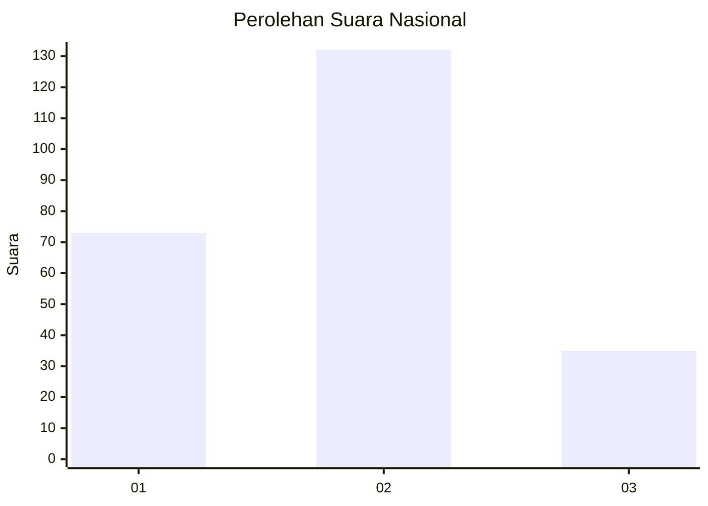
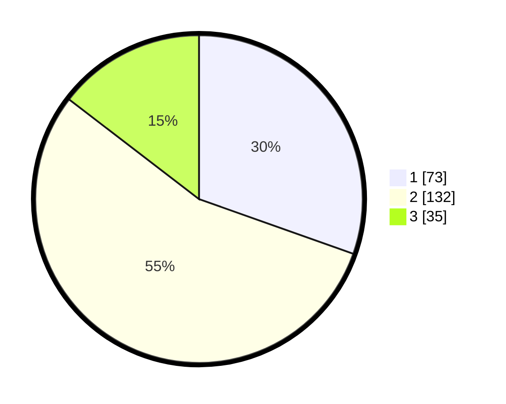

# Hasil

## Grafik

## Tabel

| No. | Nama Paslon    | Suara | Suara (raw) | Persentase |
|:--- |:-------------- | -----:| -----------:| ----------:|
| 1   | ANIES MUHAIMIN | 73    | [73][p-1]   | 30,42      |
| 2   | PRABOWO GIBRAN | 132   | [132][p-2]  | 55,00      |
| 3   | GANJAR MAHFUD  | 35    | [35][p-3]   | 14,58      |

[p-1]: https://github.com/gigit-pemilu/pemilu-2024/blob/main/pilpres/hitung-suara/sub/51-bali/sub/01-jembrana/sub/04-melaya/sub/2002-melaya/sub/013-tps/sub/paslon-1.txt
[p-2]: https://github.com/gigit-pemilu/pemilu-2024/blob/main/pilpres/hitung-suara/sub/51-bali/sub/01-jembrana/sub/04-melaya/sub/2002-melaya/sub/013-tps/sub/paslon-2.txt
[p-3]: https://github.com/gigit-pemilu/pemilu-2024/blob/main/pilpres/hitung-suara/sub/51-bali/sub/01-jembrana/sub/04-melaya/sub/2002-melaya/sub/013-tps/sub/paslon-3.txt

## Foto C Plano

https://sirekap-obj-formc.kpu.go.id/50e3/pemilu/ppwp/51/01/04/20/02/5101042002013-20240214-224219--533518d2-f6d5-43b7-bf94-8b98ea47f82b.jpg

https://sirekap-obj-formc.kpu.go.id/50e3/pemilu/ppwp/51/01/04/20/02/5101042002013-20240214-224405--2eb13a19-815a-4652-9a54-493bd7d066a5.jpg

https://sirekap-obj-formc.kpu.go.id/50e3/pemilu/ppwp/51/01/04/20/02/5101042002013-20240214-224424--36b0a296-e8fb-4476-a16c-f9f54470433e.jpg

## Metadata

| Key        | Value               |
| ---------- | ------------------- |
| Time Stamp | 2024-02-15 15:00:29 |

## DATA PEMILIH TETAP

Jumlah pemilih dalam DPT: **275**.
 * L: **140**.
 * P: **135**.

## DATA PENGGUNA HAK PILIH

Jumlah pengguna hak pilih dalam DPT: **238**.
 * L: **119**.
 * P: **119**.

Jumlah pengguna hak pilih dalam DPTb: **0**.
 * L: **0**.
 * P: **0**.

Jumlah pengguna hak pilih dalam DPK: **6**.
 * L: **3**.
 * P: **3**.

Jumlah pengguna hak pilih: **244**.
 * L: **122**.
 * P: **122**.

## JUMLAH SUARA SAH DAN TIDAK SAH

JUMLAH SELURUH SUARA SAH: **240**.

JUMLAH SUARA TIDAK SAH: **4**.

JUMLAH SELURUH SUARA SAH DAN SUARA TIDAK SAH: **244**.

