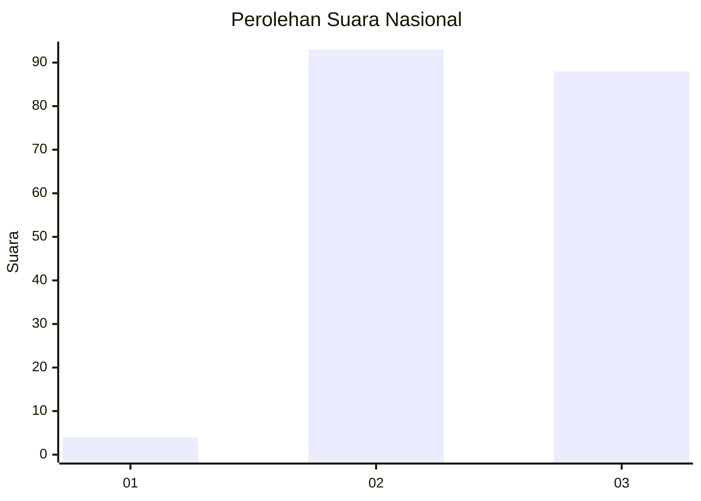
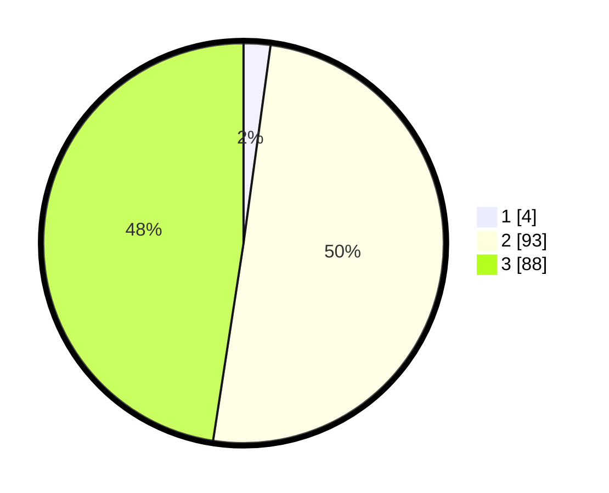

# Hasil

## Grafik

## Tabel

| No. | Nama Paslon    | Suara | Suara (raw) | Persentase |
|:--- |:-------------- | -----:| -----------:| ----------:|
| 1   | ANIES MUHAIMIN | 4     | [4][p-1]    | 2,16       |
| 2   | PRABOWO GIBRAN | 93    | [93][p-2]   | 50,27      |
| 3   | GANJAR MAHFUD  | 88    | [88][p-3]   | 47,57      |

[p-1]: https://github.com/gigit-pemilu/pemilu-2024/blob/main/pilpres/hitung-suara/sub/51-bali/sub/01-jembrana/sub/04-melaya/sub/2002-melaya/sub/014-tps/sub/paslon-1.txt
[p-2]: https://github.com/gigit-pemilu/pemilu-2024/blob/main/pilpres/hitung-suara/sub/51-bali/sub/01-jembrana/sub/04-melaya/sub/2002-melaya/sub/014-tps/sub/paslon-2.txt
[p-3]: https://github.com/gigit-pemilu/pemilu-2024/blob/main/pilpres/hitung-suara/sub/51-bali/sub/01-jembrana/sub/04-melaya/sub/2002-melaya/sub/014-tps/sub/paslon-3.txt

## Foto C Plano

https://sirekap-obj-formc.kpu.go.id/e106/pemilu/ppwp/51/01/04/20/02/5101042002014-20240216-070202--566e657e-89d9-4b6b-a60d-b5210b61b50d.jpg

https://sirekap-obj-formc.kpu.go.id/e106/pemilu/ppwp/51/01/04/20/02/5101042002014-20240216-070203--c5b660bd-2fd8-41e3-a876-02bf6932ea16.jpg

https://sirekap-obj-formc.kpu.go.id/e106/pemilu/ppwp/51/01/04/20/02/5101042002014-20240216-070203--69748bc7-348d-40d9-a2a1-c78eb7409355.jpg

## Metadata

| Key        | Value               |
| ---------- | ------------------- |
| Time Stamp | 2024-02-16 08:00:28 |

## DATA PEMILIH TETAP

Jumlah pemilih dalam DPT: **247**.
 * L: **118**.
 * P: **129**.

## DATA PENGGUNA HAK PILIH

Jumlah pengguna hak pilih dalam DPT: **181**.
 * L: **83**.
 * P: **98**.

Jumlah pengguna hak pilih dalam DPTb: **0**.
 * L: **0**.
 * P: **0**.

Jumlah pengguna hak pilih dalam DPK: **4**.
 * L: **1**.
 * P: **3**.

Jumlah pengguna hak pilih: **185**.
 * L: **84**.
 * P: **101**.

## JUMLAH SUARA SAH DAN TIDAK SAH

JUMLAH SELURUH SUARA SAH: **185**.

JUMLAH SUARA TIDAK SAH: **0**.

JUMLAH SELURUH SUARA SAH DAN SUARA TIDAK SAH: **185**.

