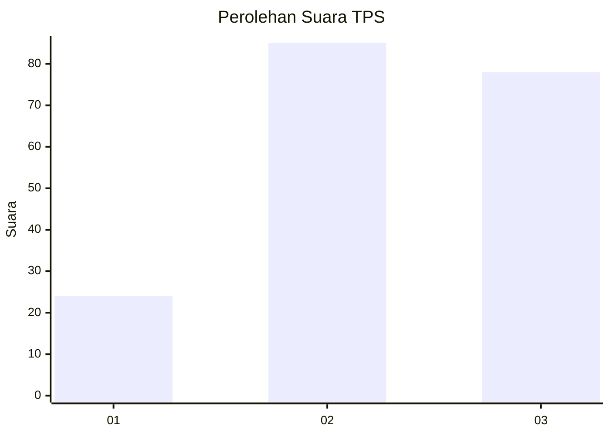
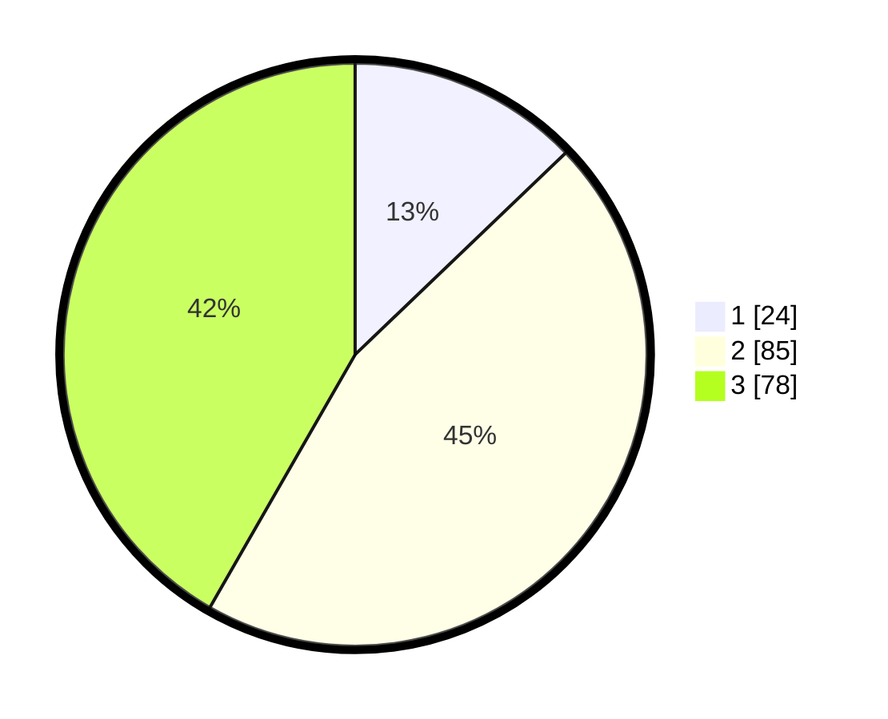

# Hasil

## Grafik

## Tabel

| No. | Nama Paslon    | Suara | Suara (raw) | Persentase |
|:--- |:-------------- | -----:| -----------:| ----------:|
| 1   | ANIES MUHAIMIN | 24    | [24][p-1]   | 12,83      |
| 2   | PRABOWO GIBRAN | 85    | [85][p-2]   | 45,45      |
| 3   | GANJAR MAHFUD  | 78    | [78][p-3]   | 41,71      |

[p-1]: https://github.com/gigit-pemilu/pemilu-2024-51-bali/blob/main/pilpres/hitung-suara/sub/51-bali/sub/01-jembrana/sub/04-melaya/sub/2002-melaya/sub/015-tps/sub/paslon-1.txt
[p-2]: https://github.com/gigit-pemilu/pemilu-2024-51-bali/blob/main/pilpres/hitung-suara/sub/51-bali/sub/01-jembrana/sub/04-melaya/sub/2002-melaya/sub/015-tps/sub/paslon-2.txt
[p-3]: https://github.com/gigit-pemilu/pemilu-2024-51-bali/blob/main/pilpres/hitung-suara/sub/51-bali/sub/01-jembrana/sub/04-melaya/sub/2002-melaya/sub/015-tps/sub/paslon-3.txt

## Foto C Plano

https://sirekap-obj-formc.kpu.go.id/7cef/pemilu/ppwp/51/01/04/20/02/5101042002015-20240216-033022--4544d327-e592-411b-9fc1-2da5f296019f.jpg

https://sirekap-obj-formc.kpu.go.id/7cef/pemilu/ppwp/51/01/04/20/02/5101042002015-20240216-033023--1652beb1-c7e8-44a5-867f-12c0c785dc99.jpg

https://sirekap-obj-formc.kpu.go.id/7cef/pemilu/ppwp/51/01/04/20/02/5101042002015-20240216-005154--ae187fb1-176b-4e63-b756-2584fdffd1da.jpg

## Metadata

| Key        | Value               |
| ---------- | ------------------- |
| Time Stamp | 2024-02-16 08:00:28 |

## DATA PEMILIH TETAP

Jumlah pemilih dalam DPT: **245**.
 * L: **122**.
 * P: **123**.

## DATA PENGGUNA HAK PILIH

Jumlah pengguna hak pilih dalam DPT: **190**.
 * L: **88**.
 * P: **102**.

Jumlah pengguna hak pilih dalam DPTb: **1**.
 * L: **0**.
 * P: **1**.

Jumlah pengguna hak pilih dalam DPK: **0**.
 * L: **0**.
 * P: **0**.

Jumlah pengguna hak pilih: **191**.
 * L: **88**.
 * P: **103**.

## JUMLAH SUARA SAH DAN TIDAK SAH

JUMLAH SELURUH SUARA SAH: **187**.

JUMLAH SUARA TIDAK SAH: **3**.

JUMLAH SELURUH SUARA SAH DAN SUARA TIDAK SAH: **190**.

