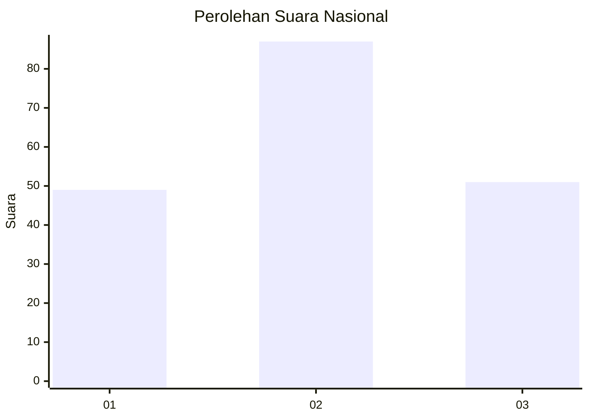
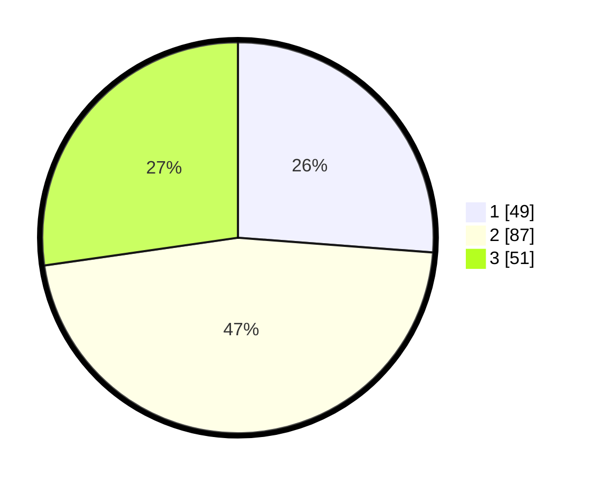

# Hasil

## Grafik

## Tabel

| No. | Nama Paslon    | Suara | Suara (raw) | Persentase |
|:--- |:-------------- | -----:| -----------:| ----------:|
| 1   | ANIES MUHAIMIN | 49    | [49][p-1]   | 26,20      |
| 2   | PRABOWO GIBRAN | 87    | [87][p-2]   | 46,52      |
| 3   | GANJAR MAHFUD  | 51    | [51][p-3]   | 27,27      |

[p-1]: https://github.com/gigit-pemilu/pemilu-2024/blob/main/pilpres/hitung-suara/sub/51-bali/sub/01-jembrana/sub/04-melaya/sub/2002-melaya/sub/020-tps/sub/paslon-1.txt
[p-2]: https://github.com/gigit-pemilu/pemilu-2024/blob/main/pilpres/hitung-suara/sub/51-bali/sub/01-jembrana/sub/04-melaya/sub/2002-melaya/sub/020-tps/sub/paslon-2.txt
[p-3]: https://github.com/gigit-pemilu/pemilu-2024/blob/main/pilpres/hitung-suara/sub/51-bali/sub/01-jembrana/sub/04-melaya/sub/2002-melaya/sub/020-tps/sub/paslon-3.txt

## Foto C Plano

https://sirekap-obj-formc.kpu.go.id/bc95/pemilu/ppwp/51/01/04/20/02/5101042002020-20240214-141111--7f008248-3c64-47dd-8ae9-a66d80b0bcfe.jpg

https://sirekap-obj-formc.kpu.go.id/bc95/pemilu/ppwp/51/01/04/20/02/5101042002020-20240215-011552--007ae124-3774-49fc-9434-250271999e55.jpg

https://sirekap-obj-formc.kpu.go.id/bc95/pemilu/ppwp/51/01/04/20/02/5101042002020-20240214-141022--95c98208-9c2f-4669-bafb-1d687f970c01.jpg

## Metadata

| Key        | Value               |
| ---------- | ------------------- |
| Time Stamp | 2024-02-15 12:00:28 |

## DATA PEMILIH TETAP

Jumlah pemilih dalam DPT: **257**.
 * L: **128**.
 * P: **129**.

## DATA PENGGUNA HAK PILIH

Jumlah pengguna hak pilih dalam DPT: **186**.
 * L: **92**.
 * P: **94**.

Jumlah pengguna hak pilih dalam DPTb: **0**.
 * L: **0**.
 * P: **0**.

Jumlah pengguna hak pilih dalam DPK: **3**.
 * L: **0**.
 * P: **3**.

Jumlah pengguna hak pilih: **189**.
 * L: **92**.
 * P: **97**.

## JUMLAH SUARA SAH DAN TIDAK SAH

JUMLAH SELURUH SUARA SAH: **187**.

JUMLAH SUARA TIDAK SAH: **2**.

JUMLAH SELURUH SUARA SAH DAN SUARA TIDAK SAH: **189**.

