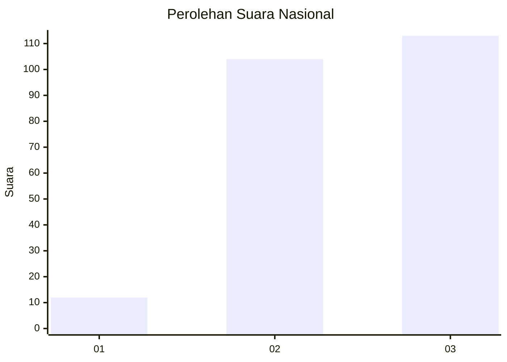
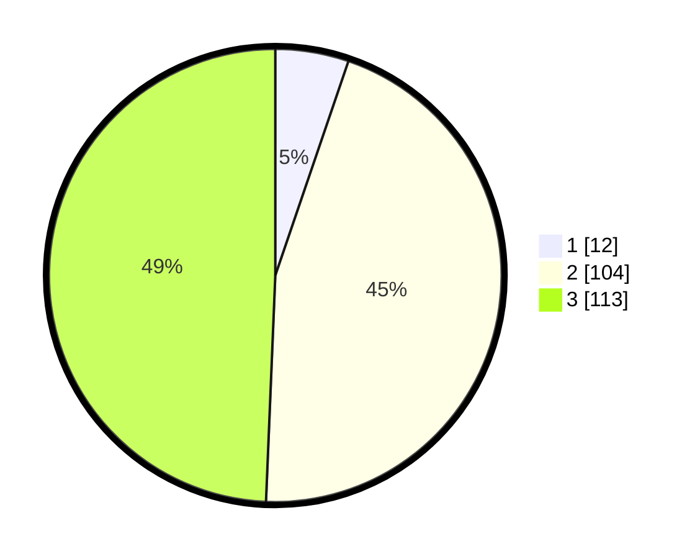

# Hasil

## Grafik

## Tabel

| No. | Nama Paslon    | Suara | Suara (raw) | Persentase |
|:--- |:-------------- | -----:| -----------:| ----------:|
| 1   | ANIES MUHAIMIN | 12    | [12][p-1]   | 5,24       |
| 2   | PRABOWO GIBRAN | 104   | [104][p-2]  | 45,41      |
| 3   | GANJAR MAHFUD  | 113   | [113][p-3]  | 49,34      |

[p-1]: https://github.com/gigit-pemilu/pemilu-2024/blob/main/pilpres/hitung-suara/sub/51-bali/sub/01-jembrana/sub/04-melaya/sub/2002-melaya/sub/021-tps/sub/paslon-1.txt
[p-2]: https://github.com/gigit-pemilu/pemilu-2024/blob/main/pilpres/hitung-suara/sub/51-bali/sub/01-jembrana/sub/04-melaya/sub/2002-melaya/sub/021-tps/sub/paslon-2.txt
[p-3]: https://github.com/gigit-pemilu/pemilu-2024/blob/main/pilpres/hitung-suara/sub/51-bali/sub/01-jembrana/sub/04-melaya/sub/2002-melaya/sub/021-tps/sub/paslon-3.txt

## Foto C Plano

https://sirekap-obj-formc.kpu.go.id/33c3/pemilu/ppwp/51/01/04/20/02/5101042002021-20240214-191249--e82d9ee2-4b62-4f1a-bc64-a36505517ada.jpg

https://sirekap-obj-formc.kpu.go.id/33c3/pemilu/ppwp/51/01/04/20/02/5101042002021-20240214-191632--3d188634-255c-4e73-8c20-1e1019843a58.jpg

https://sirekap-obj-formc.kpu.go.id/33c3/pemilu/ppwp/51/01/04/20/02/5101042002021-20240214-191906--bdde78c5-53aa-4bb9-89c9-407074ec3ccd.jpg

## Metadata

| Key        | Value               |
| ---------- | ------------------- |
| Time Stamp | 2024-02-15 00:41:44 |

## DATA PEMILIH TETAP

Jumlah pemilih dalam DPT: **291**.
 * L: **146**.
 * P: **145**.

## DATA PENGGUNA HAK PILIH

Jumlah pengguna hak pilih dalam DPT: **230**.
 * L: **107**.
 * P: **123**.

Jumlah pengguna hak pilih dalam DPTb: **0**.
 * L: **0**.
 * P: **0**.

Jumlah pengguna hak pilih dalam DPK: **0**.
 * L: **0**.
 * P: **0**.

Jumlah pengguna hak pilih: **230**.
 * L: **107**.
 * P: **123**.

## JUMLAH SUARA SAH DAN TIDAK SAH

JUMLAH SELURUH SUARA SAH: **229**.

JUMLAH SUARA TIDAK SAH: **1**.

JUMLAH SELURUH SUARA SAH DAN SUARA TIDAK SAH: **230**.

