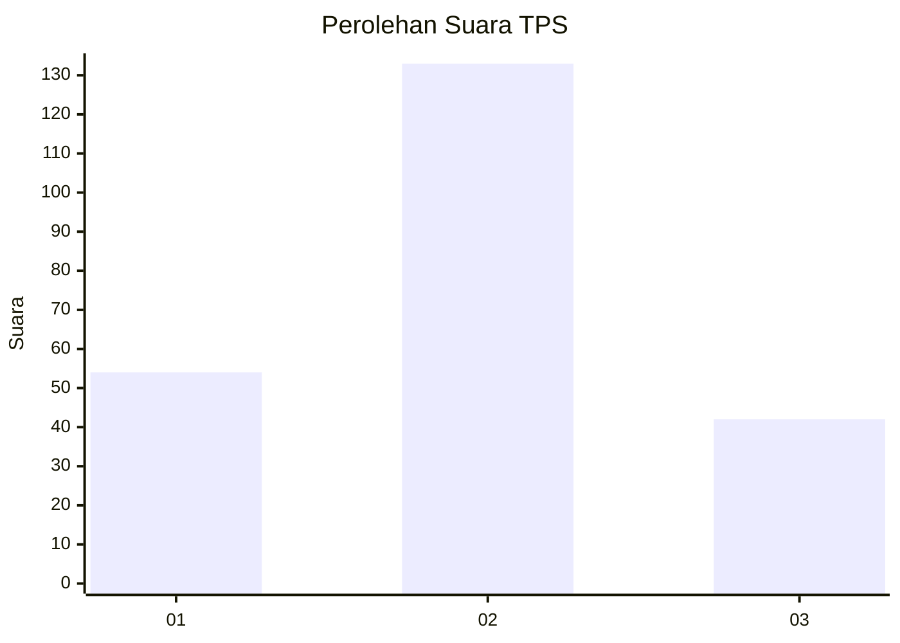
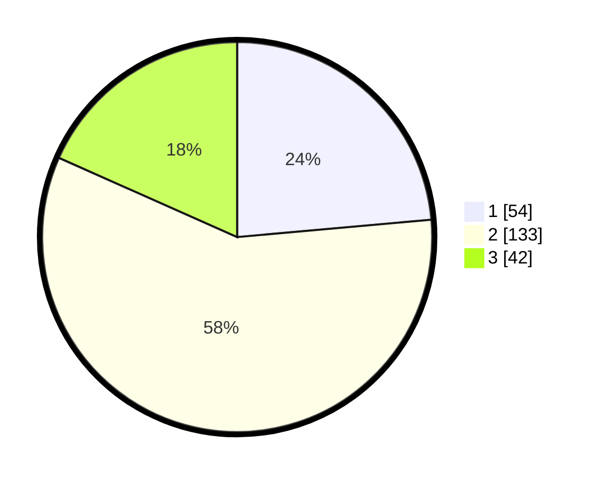

# Hasil

## Grafik

## Tabel

| No. | Nama Paslon    | Suara | Suara (raw) | Persentase |
|:--- |:-------------- | -----:| -----------:| ----------:|
| 1   | ANIES MUHAIMIN | 54    | [54][p-1]   | 23,58      |
| 2   | PRABOWO GIBRAN | 133   | [133][p-2]  | 58,08      |
| 3   | GANJAR MAHFUD  | 42    | [42][p-3]   | 18,34      |

[p-1]: https://github.com/gigit-pemilu/pemilu-2024-51-bali/blob/main/pilpres/hitung-suara/sub/51-bali/sub/01-jembrana/sub/04-melaya/sub/2002-melaya/sub/026-tps/sub/paslon-1.txt
[p-2]: https://github.com/gigit-pemilu/pemilu-2024-51-bali/blob/main/pilpres/hitung-suara/sub/51-bali/sub/01-jembrana/sub/04-melaya/sub/2002-melaya/sub/026-tps/sub/paslon-2.txt
[p-3]: https://github.com/gigit-pemilu/pemilu-2024-51-bali/blob/main/pilpres/hitung-suara/sub/51-bali/sub/01-jembrana/sub/04-melaya/sub/2002-melaya/sub/026-tps/sub/paslon-3.txt

## Foto C Plano

https://sirekap-obj-formc.kpu.go.id/fb9d/pemilu/ppwp/51/01/04/20/02/5101042002026-20240214-234008--26bc8209-8b8b-482a-81b7-6823e8fde8ea.jpg

https://sirekap-obj-formc.kpu.go.id/fb9d/pemilu/ppwp/51/01/04/20/02/5101042002026-20240214-234030--d1a2adac-b1ed-4242-b0a7-7af665bbee08.jpg

https://sirekap-obj-formc.kpu.go.id/fb9d/pemilu/ppwp/51/01/04/20/02/5101042002026-20240214-234036--48443acb-b914-4349-b9b4-f3763c3c5b99.jpg

## Metadata

| Key        | Value               |
| ---------- | ------------------- |
| Time Stamp | 2024-02-16 06:00:27 |

## DATA PEMILIH TETAP

Jumlah pemilih dalam DPT: **286**.
 * L: **138**.
 * P: **148**.

## DATA PENGGUNA HAK PILIH

Jumlah pengguna hak pilih dalam DPT: **222**.
 * L: **102**.
 * P: **120**.

Jumlah pengguna hak pilih dalam DPTb: **0**.
 * L: **0**.
 * P: **0**.

Jumlah pengguna hak pilih dalam DPK: **12**.
 * L: **3**.
 * P: **9**.

Jumlah pengguna hak pilih: **234**.
 * L: **105**.
 * P: **129**.

## JUMLAH SUARA SAH DAN TIDAK SAH

JUMLAH SELURUH SUARA SAH: **229**.

JUMLAH SUARA TIDAK SAH: **5**.

JUMLAH SELURUH SUARA SAH DAN SUARA TIDAK SAH: **234**.

