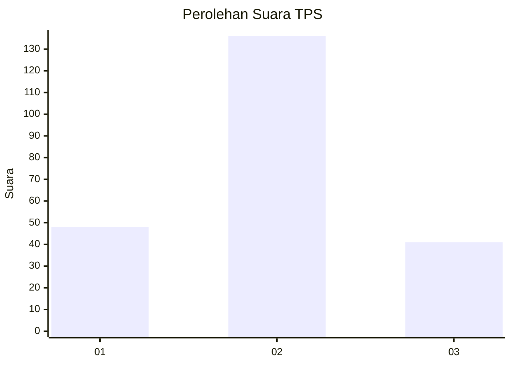
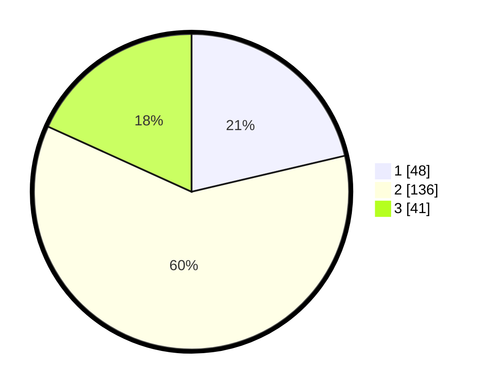

# Hasil

## Grafik

## Tabel

| No. | Nama Paslon    | Suara | Suara (raw) | Persentase |
|:--- |:-------------- | -----:| -----------:| ----------:|
| 1   | ANIES MUHAIMIN | 48    | [48][p-1]   | 21,33      |
| 2   | PRABOWO GIBRAN | 136   | [136][p-2]  | 60,44      |
| 3   | GANJAR MAHFUD  | 41    | [41][p-3]   | 18,22      |

[p-1]: https://github.com/gigit-pemilu/pemilu-2024-51-bali/blob/main/pilpres/hitung-suara/sub/51-bali/sub/01-jembrana/sub/04-melaya/sub/2002-melaya/sub/027-tps/sub/paslon-1.txt
[p-2]: https://github.com/gigit-pemilu/pemilu-2024-51-bali/blob/main/pilpres/hitung-suara/sub/51-bali/sub/01-jembrana/sub/04-melaya/sub/2002-melaya/sub/027-tps/sub/paslon-2.txt
[p-3]: https://github.com/gigit-pemilu/pemilu-2024-51-bali/blob/main/pilpres/hitung-suara/sub/51-bali/sub/01-jembrana/sub/04-melaya/sub/2002-melaya/sub/027-tps/sub/paslon-3.txt

## Foto C Plano

https://sirekap-obj-formc.kpu.go.id/3860/pemilu/ppwp/51/01/04/20/02/5101042002027-20240214-184955--2aedfda1-b076-48cf-b58d-be1abb793ab8.jpg

https://sirekap-obj-formc.kpu.go.id/3860/pemilu/ppwp/51/01/04/20/02/5101042002027-20240214-185000--f96f6bce-15d8-4a6b-a9bf-473e5707d539.jpg

https://sirekap-obj-formc.kpu.go.id/3860/pemilu/ppwp/51/01/04/20/02/5101042002027-20240214-185003--93bf421a-f705-41e9-aeb9-9daaa58d8294.jpg

## Metadata

| Key        | Value               |
| ---------- | ------------------- |
| Time Stamp | 2024-02-16 08:00:28 |

## DATA PEMILIH TETAP

Jumlah pemilih dalam DPT: **286**.
 * L: **145**.
 * P: **141**.

## DATA PENGGUNA HAK PILIH

Jumlah pengguna hak pilih dalam DPT: **224**.
 * L: **112**.
 * P: **112**.

Jumlah pengguna hak pilih dalam DPTb: **0**.
 * L: **0**.
 * P: **0**.

Jumlah pengguna hak pilih dalam DPK: **3**.
 * L: **2**.
 * P: **1**.

Jumlah pengguna hak pilih: **227**.
 * L: **114**.
 * P: **113**.

## JUMLAH SUARA SAH DAN TIDAK SAH

JUMLAH SELURUH SUARA SAH: **225**.

JUMLAH SUARA TIDAK SAH: **2**.

JUMLAH SELURUH SUARA SAH DAN SUARA TIDAK SAH: **227**.

