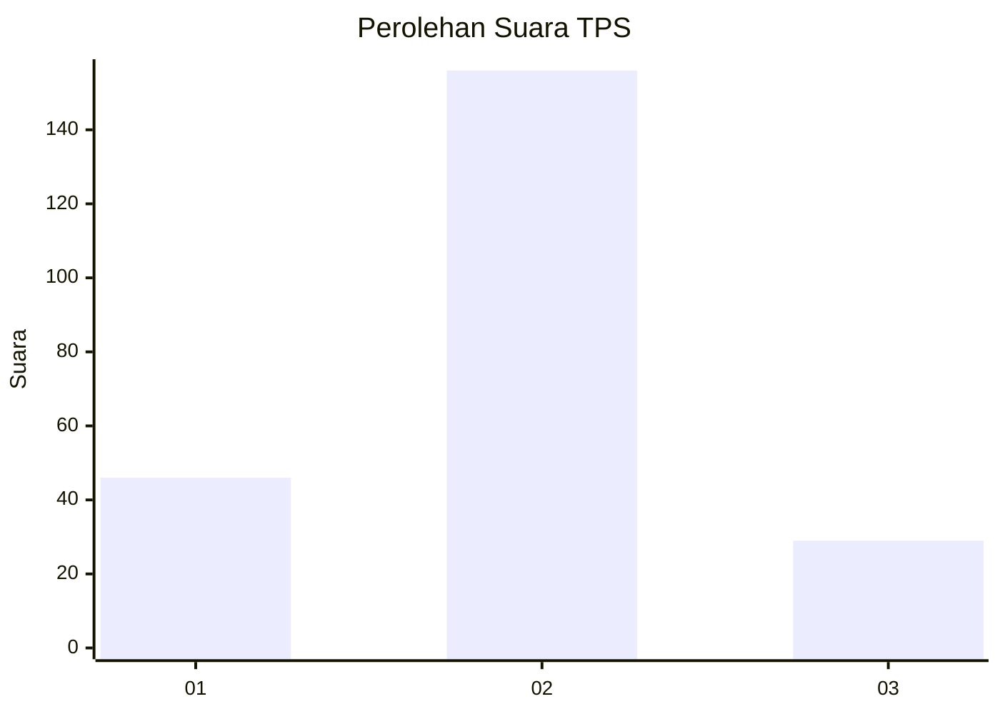
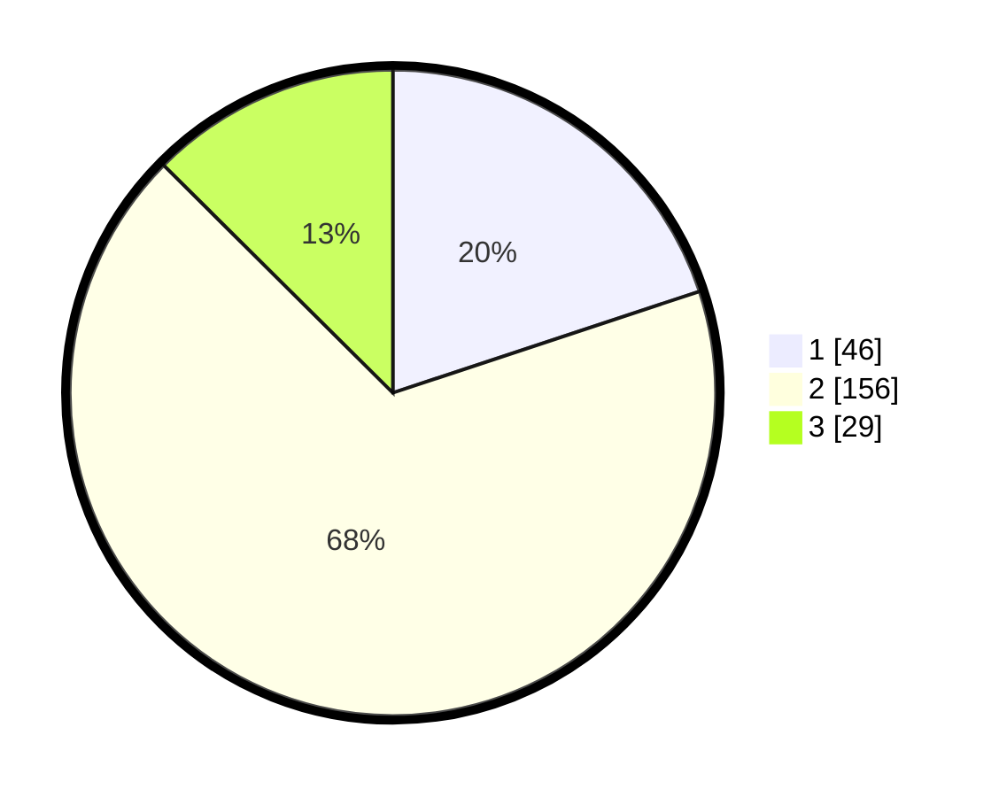

# Hasil

## Grafik

## Tabel

| No. | Nama Paslon    | Suara | Suara (raw) | Persentase |
|:--- |:-------------- | -----:| -----------:| ----------:|
| 1   | ANIES MUHAIMIN | 46    | [46][p-1]   | 19,91      |
| 2   | PRABOWO GIBRAN | 156   | [156][p-2]  | 67,53      |
| 3   | GANJAR MAHFUD  | 29    | [29][p-3]   | 12,55      |

[p-1]: https://github.com/gigit-pemilu/pemilu-2024-51-bali/blob/main/pilpres/hitung-suara/sub/51-bali/sub/01-jembrana/sub/04-melaya/sub/2002-melaya/sub/028-tps/sub/paslon-1.txt
[p-2]: https://github.com/gigit-pemilu/pemilu-2024-51-bali/blob/main/pilpres/hitung-suara/sub/51-bali/sub/01-jembrana/sub/04-melaya/sub/2002-melaya/sub/028-tps/sub/paslon-2.txt
[p-3]: https://github.com/gigit-pemilu/pemilu-2024-51-bali/blob/main/pilpres/hitung-suara/sub/51-bali/sub/01-jembrana/sub/04-melaya/sub/2002-melaya/sub/028-tps/sub/paslon-3.txt

## Foto C Plano

https://sirekap-obj-formc.kpu.go.id/2693/pemilu/ppwp/51/01/04/20/02/5101042002028-20240214-141041--a5fa7177-abb9-4b60-bbd0-1196b139647a.jpg

https://sirekap-obj-formc.kpu.go.id/2693/pemilu/ppwp/51/01/04/20/02/5101042002028-20240214-141425--280feb63-de20-484e-9a70-4a934100b1c8.jpg

https://sirekap-obj-formc.kpu.go.id/2693/pemilu/ppwp/51/01/04/20/02/5101042002028-20240214-141713--d2dc45c6-ca8f-4784-b65a-9ee2e691382c.jpg

## Metadata

| Key        | Value               |
| ---------- | ------------------- |
| Time Stamp | 2024-02-20 12:00:00 |

## DATA PEMILIH TETAP

Jumlah pemilih dalam DPT: **585**.
 * L: **193**.
 * P: **142**.

## DATA PENGGUNA HAK PILIH

Jumlah pengguna hak pilih dalam DPT: **734**.
 * L: **117**.
 * P: **717**.

Jumlah pengguna hak pilih dalam DPTb: **885**.
 * L: **33**.
 * P: **883**.

Jumlah pengguna hak pilih dalam DPK: **800**.
 * L: **880**.
 * P: **888**.

Jumlah pengguna hak pilih: **239**.
 * L: **130**.
 * P: **159**.

## JUMLAH SUARA SAH DAN TIDAK SAH

JUMLAH SELURUH SUARA SAH: **231**.

JUMLAH SUARA TIDAK SAH: **8**.

JUMLAH SELURUH SUARA SAH DAN SUARA TIDAK SAH: **239**.

