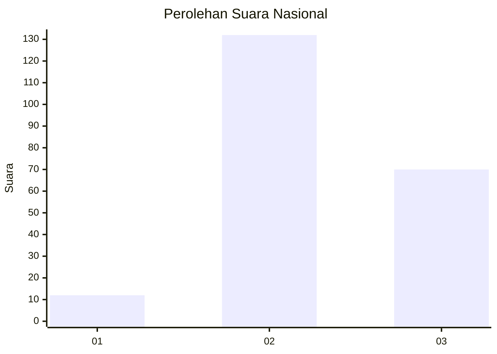
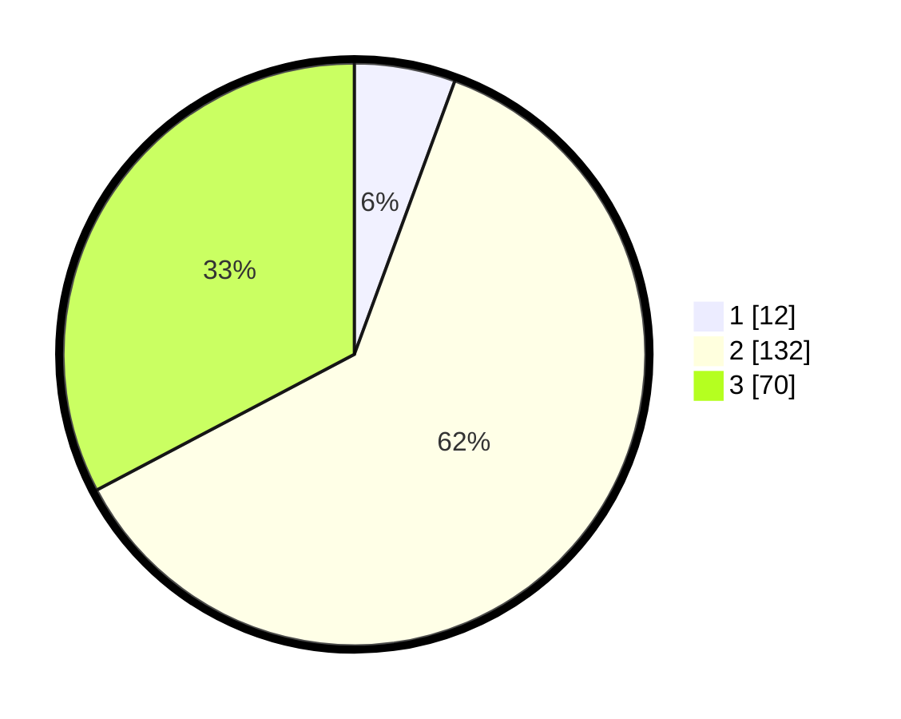

# Hasil

## Grafik

## Tabel

| No. | Nama Paslon    | Suara | Suara (raw) | Persentase |
|:--- |:-------------- | -----:| -----------:| ----------:|
| 1   | ANIES MUHAIMIN | 12    | [12][p-1]   | 5,61       |
| 2   | PRABOWO GIBRAN | 132   | [132][p-2]  | 61,68      |
| 3   | GANJAR MAHFUD  | 70    | [70][p-3]   | 32,71      |

[p-1]: https://github.com/gigit-pemilu/pemilu-2024/blob/main/pilpres/hitung-suara/sub/51-bali/sub/01-jembrana/sub/04-melaya/sub/2002-melaya/sub/031-tps/sub/paslon-1.txt
[p-2]: https://github.com/gigit-pemilu/pemilu-2024/blob/main/pilpres/hitung-suara/sub/51-bali/sub/01-jembrana/sub/04-melaya/sub/2002-melaya/sub/031-tps/sub/paslon-2.txt
[p-3]: https://github.com/gigit-pemilu/pemilu-2024/blob/main/pilpres/hitung-suara/sub/51-bali/sub/01-jembrana/sub/04-melaya/sub/2002-melaya/sub/031-tps/sub/paslon-3.txt

## Foto C Plano

https://sirekap-obj-formc.kpu.go.id/d0f7/pemilu/ppwp/51/01/04/20/02/5101042002031-20240214-193708--1e483b38-707d-4b28-bb7e-6b2c159e6d8c.jpg

https://sirekap-obj-formc.kpu.go.id/d0f7/pemilu/ppwp/51/01/04/20/02/5101042002031-20240214-194238--5b5e24a1-977b-4ee2-af08-7f957477e3c8.jpg

## Metadata

| Key        | Value               |
| ---------- | ------------------- |
| Time Stamp | 2024-02-24 22:31:28 |

