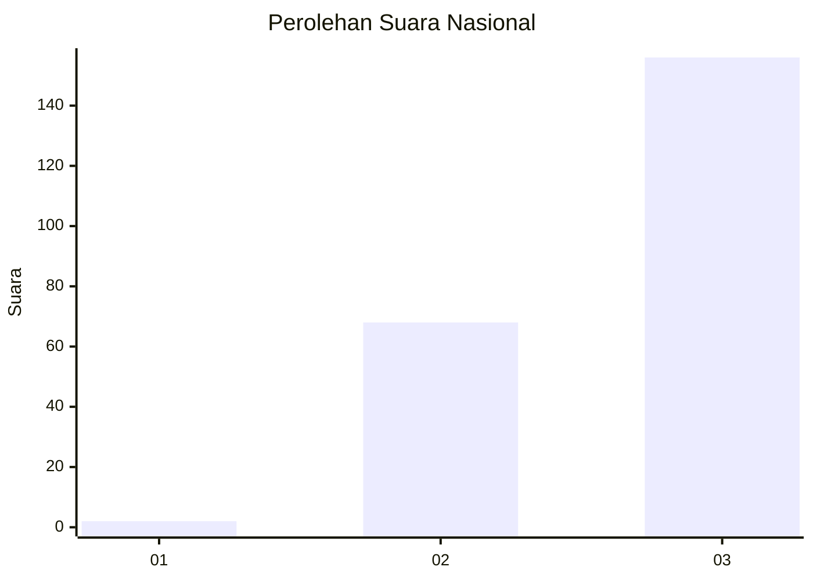
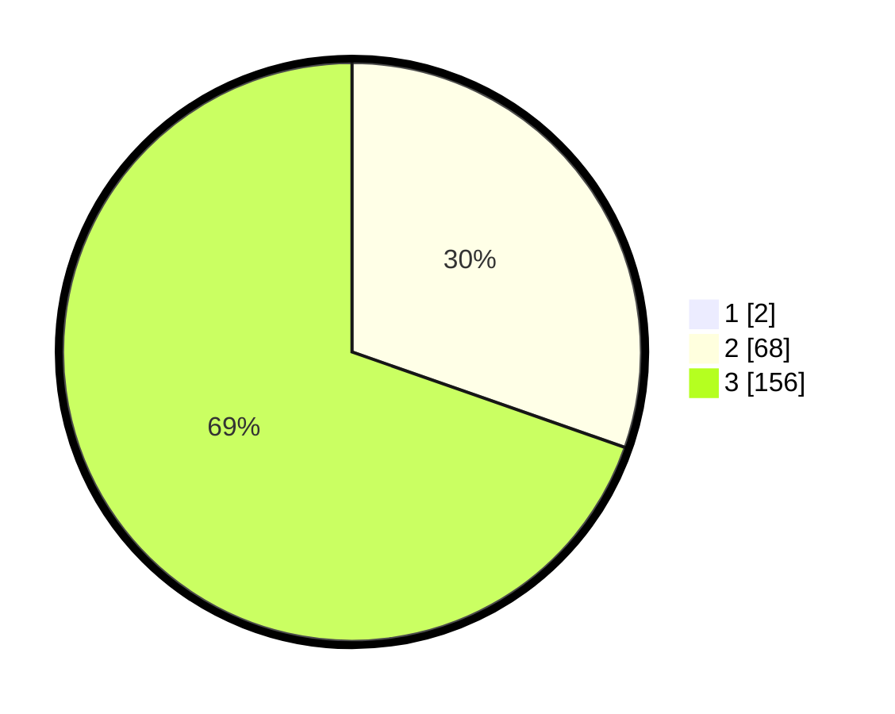

# Hasil

## Grafik

## Tabel

| No. | Nama Paslon    | Suara | Suara (raw) | Persentase |
|:--- |:-------------- | -----:| -----------:| ----------:|
| 1   | ANIES MUHAIMIN | 2     | [2][p-1]    | 0,88       |
| 2   | PRABOWO GIBRAN | 68    | [68][p-2]   | 30,09      |
| 3   | GANJAR MAHFUD  | 156   | [156][p-3]  | 69,03      |

[p-1]: https://github.com/gigit-pemilu/pemilu-2024/blob/main/pilpres/hitung-suara/sub/51-bali/sub/01-jembrana/sub/04-melaya/sub/2002-melaya/sub/033-tps/sub/paslon-1.txt
[p-2]: https://github.com/gigit-pemilu/pemilu-2024/blob/main/pilpres/hitung-suara/sub/51-bali/sub/01-jembrana/sub/04-melaya/sub/2002-melaya/sub/033-tps/sub/paslon-2.txt
[p-3]: https://github.com/gigit-pemilu/pemilu-2024/blob/main/pilpres/hitung-suara/sub/51-bali/sub/01-jembrana/sub/04-melaya/sub/2002-melaya/sub/033-tps/sub/paslon-3.txt

## Foto C Plano

https://sirekap-obj-formc.kpu.go.id/daf6/pemilu/ppwp/51/01/04/20/02/5101042002033-20240214-200725--c1eccccd-e7da-4985-adba-78916101d0a8.jpg

https://sirekap-obj-formc.kpu.go.id/daf6/pemilu/ppwp/51/01/04/20/02/5101042002033-20240214-201302--9e78474a-1801-45db-9e08-8d4cefa3b561.jpg

https://sirekap-obj-formc.kpu.go.id/daf6/pemilu/ppwp/51/01/04/20/02/5101042002033-20240214-210344--9b650c95-9195-4c50-8fa2-548c9b37435b.jpg

## Metadata

| Key        | Value               |
| ---------- | ------------------- |
| Time Stamp | 2024-02-15 02:10:27 |

