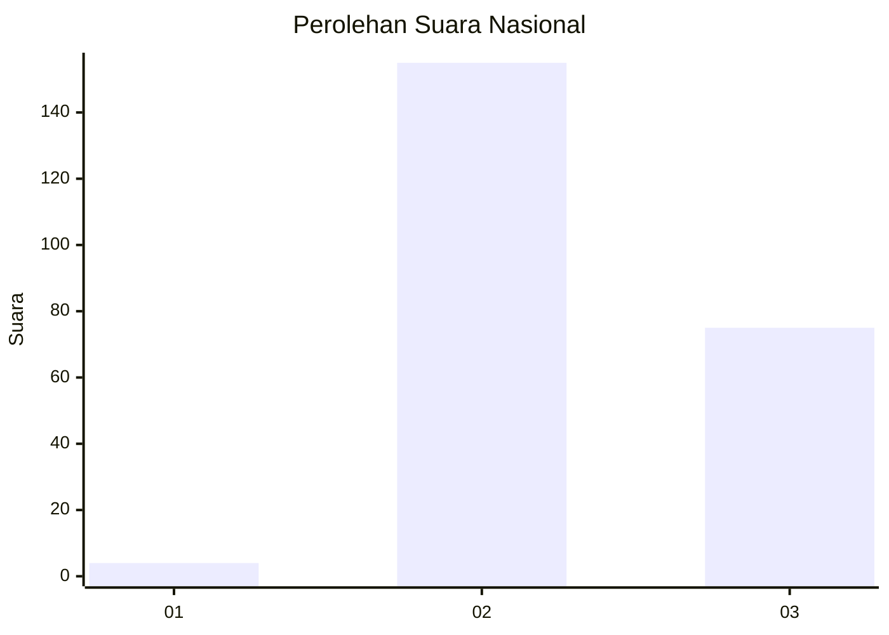
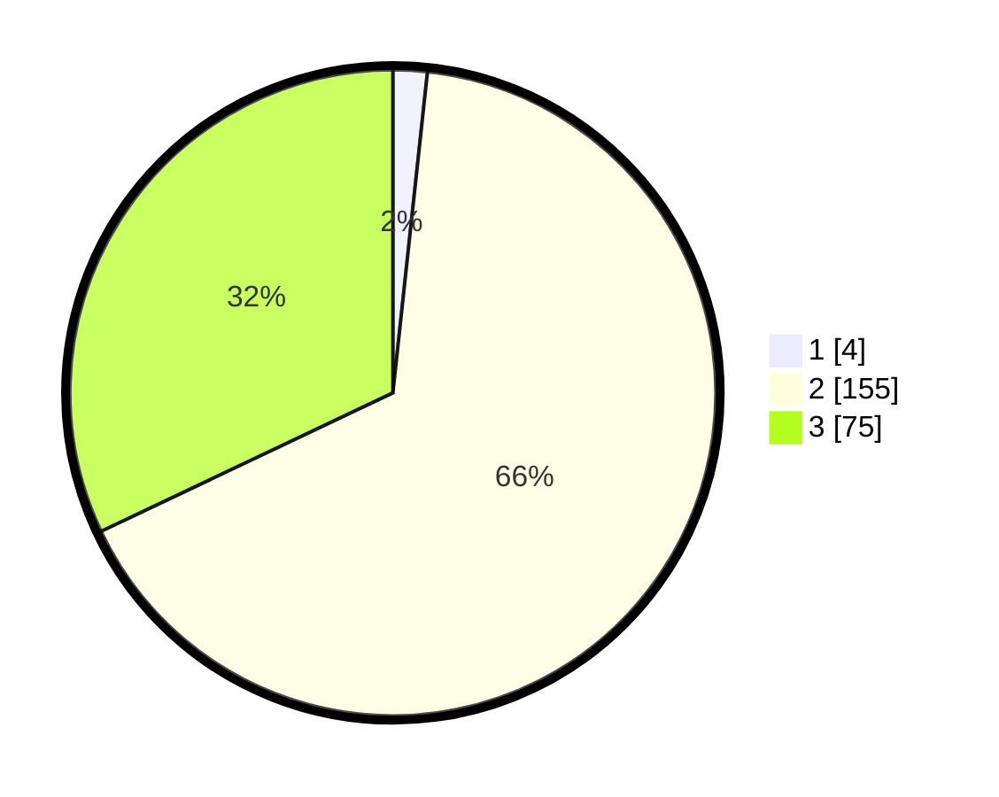

# Hasil

## Grafik

## Tabel

| No. | Nama Paslon    | Suara | Suara (raw) | Persentase |
|:--- |:-------------- | -----:| -----------:| ----------:|
| 1   | ANIES MUHAIMIN | 4     | [4][p-1]    | 1,71       |
| 2   | PRABOWO GIBRAN | 155   | [155][p-2]  | 66,24      |
| 3   | GANJAR MAHFUD  | 75    | [75][p-3]   | 32,05      |

[p-1]: https://github.com/gigit-pemilu/pemilu-2024/blob/main/pilpres/hitung-suara/sub/51-bali/sub/01-jembrana/sub/04-melaya/sub/2002-melaya/sub/034-tps/sub/paslon-1.txt
[p-2]: https://github.com/gigit-pemilu/pemilu-2024/blob/main/pilpres/hitung-suara/sub/51-bali/sub/01-jembrana/sub/04-melaya/sub/2002-melaya/sub/034-tps/sub/paslon-2.txt
[p-3]: https://github.com/gigit-pemilu/pemilu-2024/blob/main/pilpres/hitung-suara/sub/51-bali/sub/01-jembrana/sub/04-melaya/sub/2002-melaya/sub/034-tps/sub/paslon-3.txt

## Foto C Plano

https://sirekap-obj-formc.kpu.go.id/8071/pemilu/ppwp/51/01/04/20/02/5101042002034-20240214-232856--2b1d09e1-d157-4bce-8562-9dc75aa6cf88.jpg

https://sirekap-obj-formc.kpu.go.id/8071/pemilu/ppwp/51/01/04/20/02/5101042002034-20240214-233212--3a53263a-1def-41d7-80df-4e788c137b1f.jpg

https://sirekap-obj-formc.kpu.go.id/8071/pemilu/ppwp/51/01/04/20/02/5101042002034-20240214-233419--651efe2d-a87a-48b6-b713-a845eb742a2e.jpg

## Metadata

| Key        | Value               |
| ---------- | ------------------- |
| Time Stamp | 2024-02-16 06:30:27 |

## DATA PEMILIH TETAP

Jumlah pemilih dalam DPT: **283**.
 * L: **140**.
 * P: **143**.

## DATA PENGGUNA HAK PILIH

Jumlah pengguna hak pilih dalam DPT: **229**.
 * L: **117**.
 * P: **112**.

Jumlah pengguna hak pilih dalam DPTb: **0**.
 * L: **0**.
 * P: **0**.

Jumlah pengguna hak pilih dalam DPK: **6**.
 * L: **3**.
 * P: **3**.

Jumlah pengguna hak pilih: **235**.
 * L: **120**.
 * P: **115**.

## JUMLAH SUARA SAH DAN TIDAK SAH

JUMLAH SELURUH SUARA SAH: **234**.

JUMLAH SUARA TIDAK SAH: **1**.

JUMLAH SELURUH SUARA SAH DAN SUARA TIDAK SAH: **235**.

