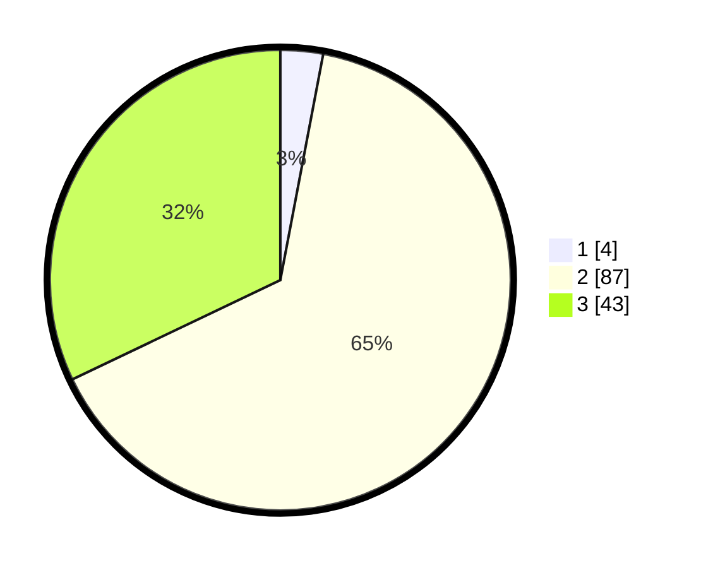

# Hasil

## Grafik

## Tabel

| No. | Nama Paslon    | Suara | Suara (raw) | Persentase |
|:--- |:-------------- | -----:| -----------:| ----------:|
| 1   | ANIES MUHAIMIN | 4     | [4][p-1]    | 2,99       |
| 2   | PRABOWO GIBRAN | 87    | [87][p-2]   | 64,93      |
| 3   | GANJAR MAHFUD  | 43    | [43][p-3]   | 32,09      |

[p-1]: https://github.com/gigit-pemilu/pemilu-2024-51-bali/blob/main/pilpres/hitung-suara/sub/51-bali/sub/01-jembrana/sub/04-melaya/sub/2002-melaya/sub/036-tps/sub/paslon-1.txt
[p-2]: https://github.com/gigit-pemilu/pemilu-2024-51-bali/blob/main/pilpres/hitung-suara/sub/51-bali/sub/01-jembrana/sub/04-melaya/sub/2002-melaya/sub/036-tps/sub/paslon-2.txt
[p-3]: https://github.com/gigit-pemilu/pemilu-2024-51-bali/blob/main/pilpres/hitung-suara/sub/51-bali/sub/01-jembrana/sub/04-melaya/sub/2002-melaya/sub/036-tps/sub/paslon-3.txt

## Foto C Plano

https://sirekap-obj-formc.kpu.go.id/d849/pemilu/ppwp/51/01/04/20/02/5101042002036-20240214-155219--43e1f154-9dfa-44b6-bc4b-7cf74d0303f5.jpg

https://sirekap-obj-formc.kpu.go.id/d849/pemilu/ppwp/51/01/04/20/02/5101042002036-20240214-155046--93fa9379-cb32-49a1-ae8d-5932cbd7d72d.jpg

https://sirekap-obj-formc.kpu.go.id/d849/pemilu/ppwp/51/01/04/20/02/5101042002036-20240214-155321--2825a655-43d6-483b-9e06-4a6a0a7e0d6e.jpg

## Metadata

| Key        | Value               |
| ---------- | ------------------- |
| Time Stamp | 2024-02-14 21:46:01 |

## DATA PEMILIH TETAP

Jumlah pemilih dalam DPT: **173**.
 * L: **87**.
 * P: **86**.

## DATA PENGGUNA HAK PILIH

Jumlah pengguna hak pilih dalam DPT: **134**.
 * L: **67**.
 * P: **67**.

Jumlah pengguna hak pilih dalam DPTb: **0**.
 * L: **0**.
 * P: **0**.

Jumlah pengguna hak pilih dalam DPK: **0**.
 * L: **0**.
 * P: **0**.

Jumlah pengguna hak pilih: **134**.
 * L: **67**.
 * P: **67**.

## JUMLAH SUARA SAH DAN TIDAK SAH

JUMLAH SELURUH SUARA SAH: **134**.

JUMLAH SUARA TIDAK SAH: **0**.

JUMLAH SELURUH SUARA SAH DAN SUARA TIDAK SAH: **134**.

