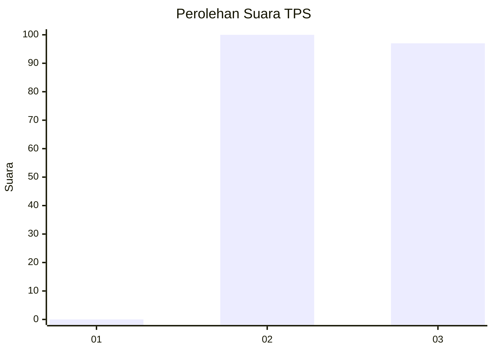
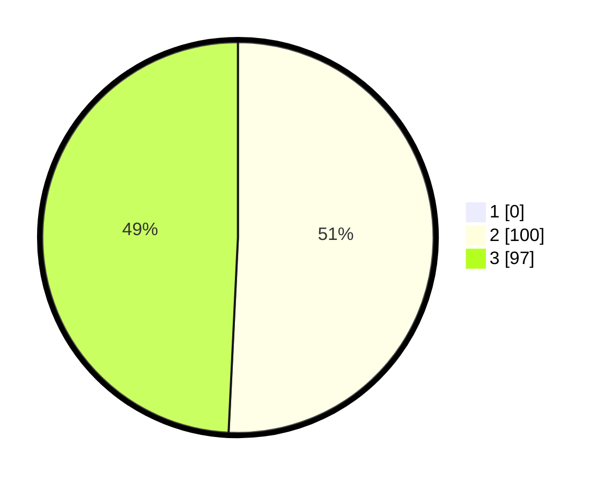

# Hasil

## Grafik

## Tabel

| No. | Nama Paslon    | Suara | Suara (raw) | Persentase |
|:--- |:-------------- | -----:| -----------:| ----------:|
| 1   | ANIES MUHAIMIN | 0     | [0][p-1]    | 0,00       |
| 2   | PRABOWO GIBRAN | 100   | [100][p-2]  | 50,76      |
| 3   | GANJAR MAHFUD  | 97    | [97][p-3]   | 49,24      |

[p-1]: https://github.com/gigit-pemilu/pemilu-2024-51-bali/blob/main/pilpres/hitung-suara/sub/51-bali/sub/01-jembrana/sub/04-melaya/sub/2003-belimbingsari/sub/001-tps/sub/paslon-1.txt
[p-2]: https://github.com/gigit-pemilu/pemilu-2024-51-bali/blob/main/pilpres/hitung-suara/sub/51-bali/sub/01-jembrana/sub/04-melaya/sub/2003-belimbingsari/sub/001-tps/sub/paslon-2.txt
[p-3]: https://github.com/gigit-pemilu/pemilu-2024-51-bali/blob/main/pilpres/hitung-suara/sub/51-bali/sub/01-jembrana/sub/04-melaya/sub/2003-belimbingsari/sub/001-tps/sub/paslon-3.txt

## Foto C Plano

https://sirekap-obj-formc.kpu.go.id/11aa/pemilu/ppwp/51/01/04/20/03/5101042003001-20240216-145730--d4b71093-7d95-4ce7-b2e3-a5fe4b98486e.jpg

https://sirekap-obj-formc.kpu.go.id/11aa/pemilu/ppwp/51/01/04/20/03/5101042003001-20240216-145846--6621d218-28bb-48e1-b58a-49ffbcde09a8.jpg

https://sirekap-obj-formc.kpu.go.id/11aa/pemilu/ppwp/51/01/04/20/03/5101042003001-20240216-145920--8a3e3b15-ca9e-4c94-8f7e-b027ea13a22e.jpg

## Metadata

| Key        | Value               |
| ---------- | ------------------- |
| Time Stamp | 2024-02-16 16:25:10 |

## DATA PEMILIH TETAP

Jumlah pemilih dalam DPT: **270**.
 * L: **127**.
 * P: **143**.

## DATA PENGGUNA HAK PILIH

Jumlah pengguna hak pilih dalam DPT: **195**.
 * L: **95**.
 * P: **100**.

Jumlah pengguna hak pilih dalam DPTb: **2**.
 * L: **1**.
 * P: **1**.

Jumlah pengguna hak pilih dalam DPK: **0**.
 * L: **0**.
 * P: **0**.

Jumlah pengguna hak pilih: **197**.
 * L: **96**.
 * P: **101**.

## JUMLAH SUARA SAH DAN TIDAK SAH

JUMLAH SELURUH SUARA SAH: **197**.

JUMLAH SUARA TIDAK SAH: **0**.

JUMLAH SELURUH SUARA SAH DAN SUARA TIDAK SAH: **197**.

