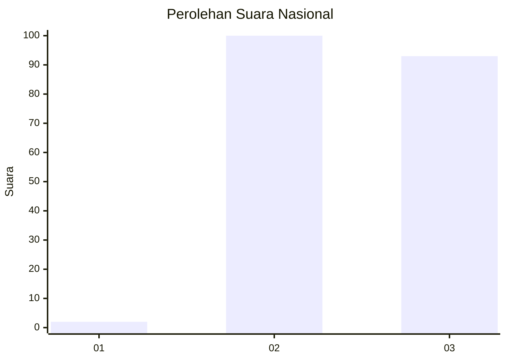
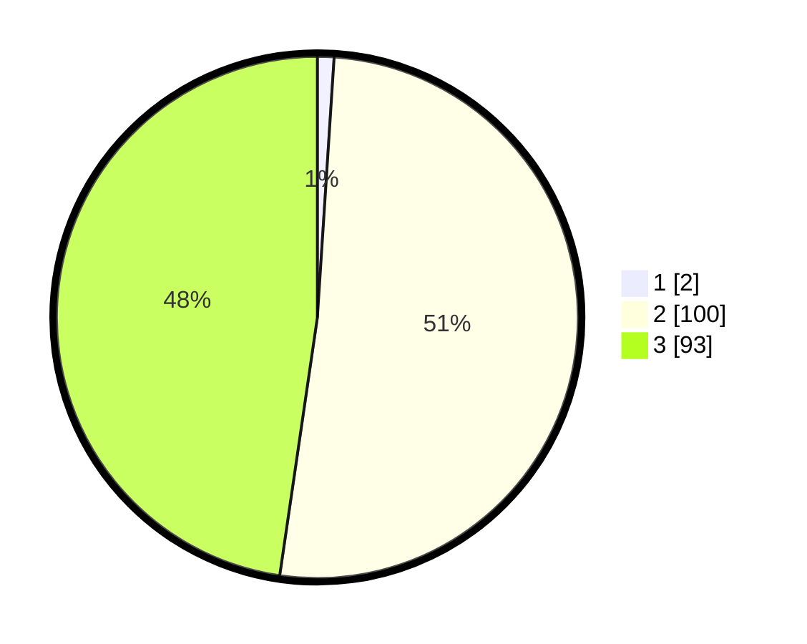

# Hasil

## Grafik

## Tabel

| No. | Nama Paslon    | Suara | Suara (raw) | Persentase |
|:--- |:-------------- | -----:| -----------:| ----------:|
| 1   | ANIES MUHAIMIN | 2     | [2][p-1]    | 1,03       |
| 2   | PRABOWO GIBRAN | 100   | [100][p-2]  | 51,28      |
| 3   | GANJAR MAHFUD  | 93    | [93][p-3]   | 47,69      |

[p-1]: https://github.com/gigit-pemilu/pemilu-2024/blob/main/pilpres/hitung-suara/sub/51-bali/sub/01-jembrana/sub/04-melaya/sub/2003-belimbingsari/sub/002-tps/sub/paslon-1.txt
[p-2]: https://github.com/gigit-pemilu/pemilu-2024/blob/main/pilpres/hitung-suara/sub/51-bali/sub/01-jembrana/sub/04-melaya/sub/2003-belimbingsari/sub/002-tps/sub/paslon-2.txt
[p-3]: https://github.com/gigit-pemilu/pemilu-2024/blob/main/pilpres/hitung-suara/sub/51-bali/sub/01-jembrana/sub/04-melaya/sub/2003-belimbingsari/sub/002-tps/sub/paslon-3.txt

## Foto C Plano

https://sirekap-obj-formc.kpu.go.id/2c8d/pemilu/ppwp/51/01/04/20/03/5101042003002-20240216-152714--eb8460fa-381b-4adc-8086-c167feeadbf6.jpg

https://sirekap-obj-formc.kpu.go.id/2c8d/pemilu/ppwp/51/01/04/20/03/5101042003002-20240216-152840--866a9325-82b7-4544-b7ca-3f3b957a5552.jpg

https://sirekap-obj-formc.kpu.go.id/2c8d/pemilu/ppwp/51/01/04/20/03/5101042003002-20240216-152909--3fe9b045-ecca-4228-998d-f3536acdfabc.jpg

## Metadata

| Key        | Value               |
| ---------- | ------------------- |
| Time Stamp | 2024-02-16 16:25:10 |

## DATA PEMILIH TETAP

Jumlah pemilih dalam DPT: **271**.
 * L: **134**.
 * P: **137**.

## DATA PENGGUNA HAK PILIH

Jumlah pengguna hak pilih dalam DPT: **191**.
 * L: **91**.
 * P: **100**.

Jumlah pengguna hak pilih dalam DPTb: **5**.
 * L: **3**.
 * P: **2**.

Jumlah pengguna hak pilih dalam DPK: **3**.
 * L: **1**.
 * P: **2**.

Jumlah pengguna hak pilih: **199**.
 * L: **95**.
 * P: **104**.

## JUMLAH SUARA SAH DAN TIDAK SAH

JUMLAH SELURUH SUARA SAH: **195**.

JUMLAH SUARA TIDAK SAH: **4**.

JUMLAH SELURUH SUARA SAH DAN SUARA TIDAK SAH: **199**.

