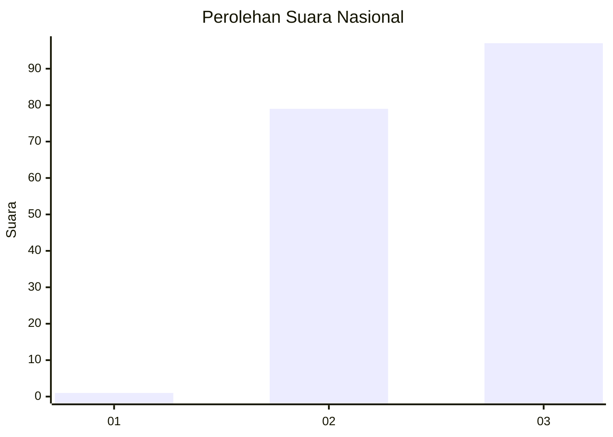
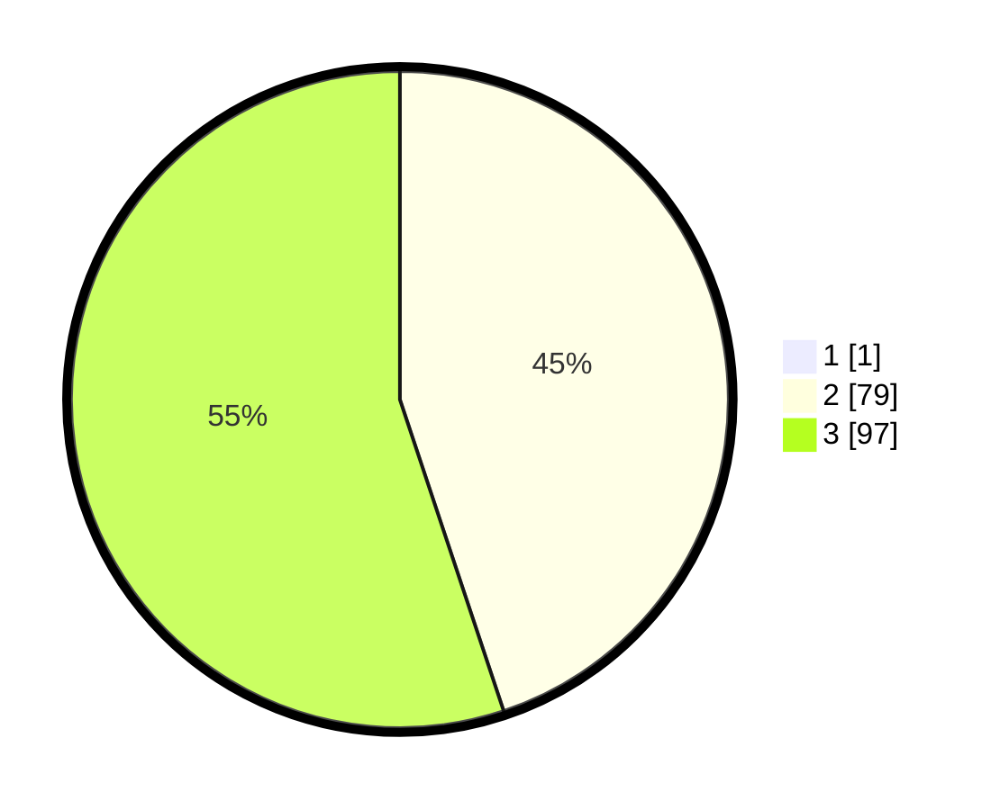

# Hasil

## Grafik

## Tabel

| No. | Nama Paslon    | Suara | Suara (raw) | Persentase |
|:--- |:-------------- | -----:| -----------:| ----------:|
| 1   | ANIES MUHAIMIN | 1     | [1][p-1]    | 0,56       |
| 2   | PRABOWO GIBRAN | 79    | [79][p-2]   | 44,63      |
| 3   | GANJAR MAHFUD  | 97    | [97][p-3]   | 54,80      |

[p-1]: https://github.com/gigit-pemilu/pemilu-2024/blob/main/pilpres/hitung-suara/sub/51-bali/sub/01-jembrana/sub/04-melaya/sub/2004-ekasari/sub/002-tps/sub/paslon-1.txt
[p-2]: https://github.com/gigit-pemilu/pemilu-2024/blob/main/pilpres/hitung-suara/sub/51-bali/sub/01-jembrana/sub/04-melaya/sub/2004-ekasari/sub/002-tps/sub/paslon-2.txt
[p-3]: https://github.com/gigit-pemilu/pemilu-2024/blob/main/pilpres/hitung-suara/sub/51-bali/sub/01-jembrana/sub/04-melaya/sub/2004-ekasari/sub/002-tps/sub/paslon-3.txt

## Foto C Plano

https://sirekap-obj-formc.kpu.go.id/9dda/pemilu/ppwp/51/01/04/20/04/5101042004002-20240214-193407--94d9dec9-d5ea-421c-97f8-21101be31d42.jpg

https://sirekap-obj-formc.kpu.go.id/9dda/pemilu/ppwp/51/01/04/20/04/5101042004002-20240215-004038--3168cda9-54ff-4286-a644-4549fbf137db.jpg

https://sirekap-obj-formc.kpu.go.id/9dda/pemilu/ppwp/51/01/04/20/04/5101042004002-20240215-004222--65e2d4f2-a2b5-462c-b952-7cbb4ae2c625.jpg

## Metadata

| Key        | Value               |
| ---------- | ------------------- |
| Time Stamp | 2024-02-15 12:00:28 |

