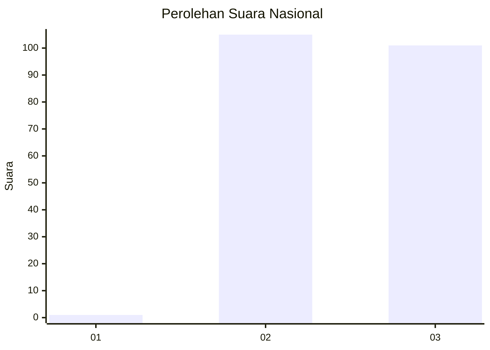
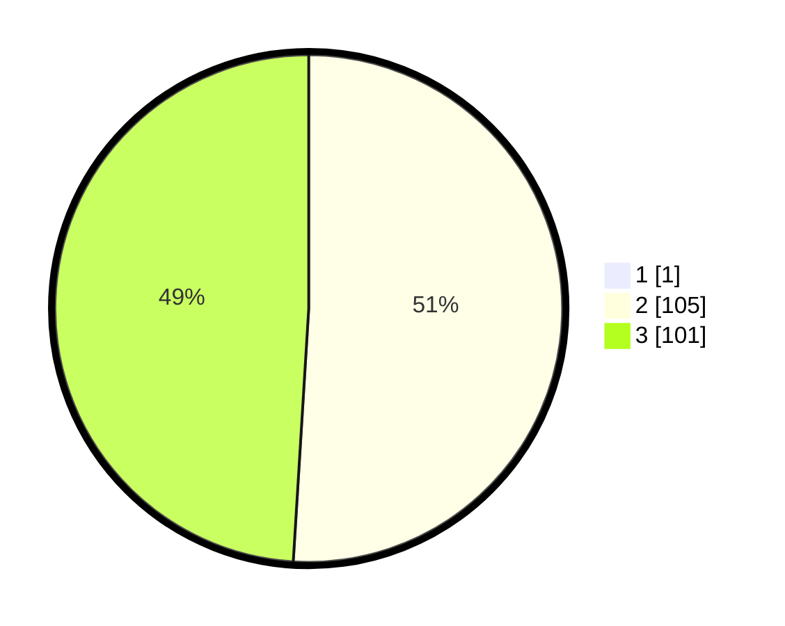

# Hasil

## Grafik

## Tabel

| No. | Nama Paslon    | Suara | Suara (raw) | Persentase |
|:--- |:-------------- | -----:| -----------:| ----------:|
| 1   | ANIES MUHAIMIN | 1     | [1][p-1]    | 0,48       |
| 2   | PRABOWO GIBRAN | 105   | [105][p-2]  | 50,72      |
| 3   | GANJAR MAHFUD  | 101   | [101][p-3]  | 48,79      |

[p-1]: https://github.com/gigit-pemilu/pemilu-2024/blob/main/pilpres/hitung-suara/sub/51-bali/sub/01-jembrana/sub/04-melaya/sub/2004-ekasari/sub/004-tps/sub/paslon-1.txt
[p-2]: https://github.com/gigit-pemilu/pemilu-2024/blob/main/pilpres/hitung-suara/sub/51-bali/sub/01-jembrana/sub/04-melaya/sub/2004-ekasari/sub/004-tps/sub/paslon-2.txt
[p-3]: https://github.com/gigit-pemilu/pemilu-2024/blob/main/pilpres/hitung-suara/sub/51-bali/sub/01-jembrana/sub/04-melaya/sub/2004-ekasari/sub/004-tps/sub/paslon-3.txt

## Foto C Plano

https://sirekap-obj-formc.kpu.go.id/c78c/pemilu/ppwp/51/01/04/20/04/5101042004004-20240214-222257--959e8398-8198-4fae-b69a-100fff99423b.jpg

https://sirekap-obj-formc.kpu.go.id/c78c/pemilu/ppwp/51/01/04/20/04/5101042004004-20240214-222232--ee720fe1-4664-48c7-b953-6d4e6391446b.jpg

https://sirekap-obj-formc.kpu.go.id/c78c/pemilu/ppwp/51/01/04/20/04/5101042004004-20240214-222249--dd86c27e-800b-4dea-b185-48339408716e.jpg

## Metadata

| Key        | Value               |
| ---------- | ------------------- |
| Time Stamp | 2024-02-15 16:00:26 |

## DATA PEMILIH TETAP

Jumlah pemilih dalam DPT: **292**.
 * L: **152**.
 * P: **140**.

## DATA PENGGUNA HAK PILIH

Jumlah pengguna hak pilih dalam DPT: **209**.
 * L: **109**.
 * P: **100**.

Jumlah pengguna hak pilih dalam DPTb: **0**.
 * L: **0**.
 * P: **0**.

Jumlah pengguna hak pilih dalam DPK: **1**.
 * L: **1**.
 * P: **0**.

Jumlah pengguna hak pilih: **210**.
 * L: **110**.
 * P: **100**.

## JUMLAH SUARA SAH DAN TIDAK SAH

JUMLAH SELURUH SUARA SAH: **207**.

JUMLAH SUARA TIDAK SAH: **3**.

JUMLAH SELURUH SUARA SAH DAN SUARA TIDAK SAH: **210**.

