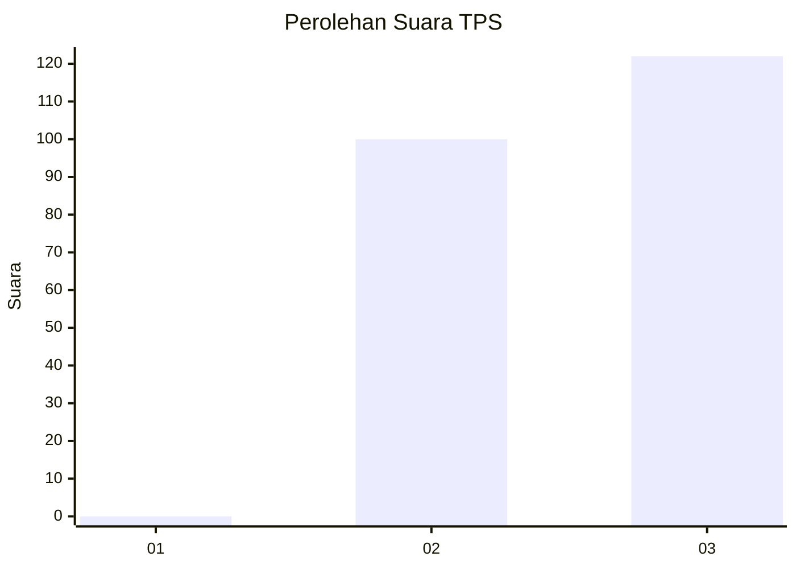
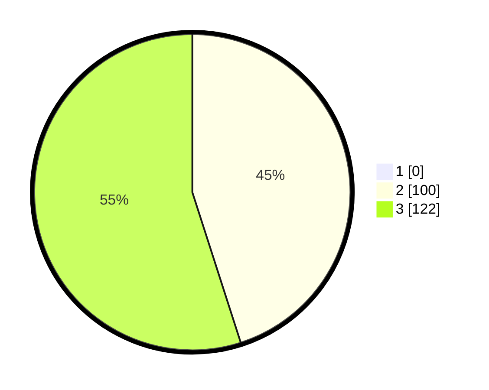

# Hasil

## Grafik

## Tabel

| No. | Nama Paslon    | Suara | Suara (raw) | Persentase |
|:--- |:-------------- | -----:| -----------:| ----------:|
| 1   | ANIES MUHAIMIN | 0     | [0][p-1]    | 0,00       |
| 2   | PRABOWO GIBRAN | 100   | [100][p-2]  | 45,05      |
| 3   | GANJAR MAHFUD  | 122   | [122][p-3]  | 54,95      |

[p-1]: https://github.com/gigit-pemilu/pemilu-2024-51-bali/blob/main/pilpres/hitung-suara/sub/51-bali/sub/01-jembrana/sub/04-melaya/sub/2004-ekasari/sub/007-tps/sub/paslon-1.txt
[p-2]: https://github.com/gigit-pemilu/pemilu-2024-51-bali/blob/main/pilpres/hitung-suara/sub/51-bali/sub/01-jembrana/sub/04-melaya/sub/2004-ekasari/sub/007-tps/sub/paslon-2.txt
[p-3]: https://github.com/gigit-pemilu/pemilu-2024-51-bali/blob/main/pilpres/hitung-suara/sub/51-bali/sub/01-jembrana/sub/04-melaya/sub/2004-ekasari/sub/007-tps/sub/paslon-3.txt

## Foto C Plano

https://sirekap-obj-formc.kpu.go.id/2a10/pemilu/ppwp/51/01/04/20/04/5101042004007-20240214-204847--dd3dc9e1-869c-4a81-8f76-6a7b40f8fb4e.jpg

https://sirekap-obj-formc.kpu.go.id/2a10/pemilu/ppwp/51/01/04/20/04/5101042004007-20240214-204709--5440b910-da16-4268-a6d6-7956824bd322.jpg

https://sirekap-obj-formc.kpu.go.id/2a10/pemilu/ppwp/51/01/04/20/04/5101042004007-20240214-205001--2061c0b7-47ee-40ef-99ac-c53128d4113b.jpg

## Metadata

| Key        | Value               |
| ---------- | ------------------- |
| Time Stamp | 2024-02-15 00:41:44 |

