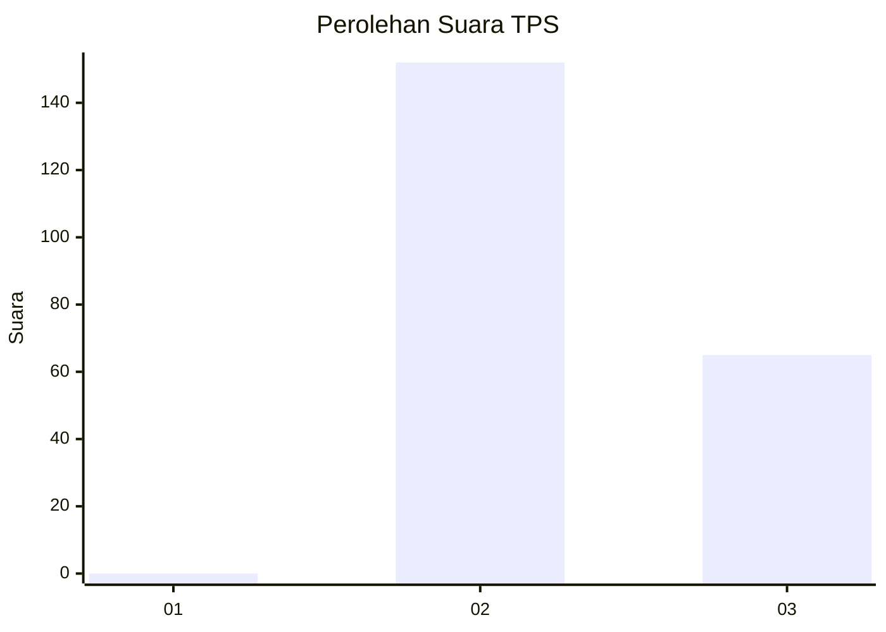
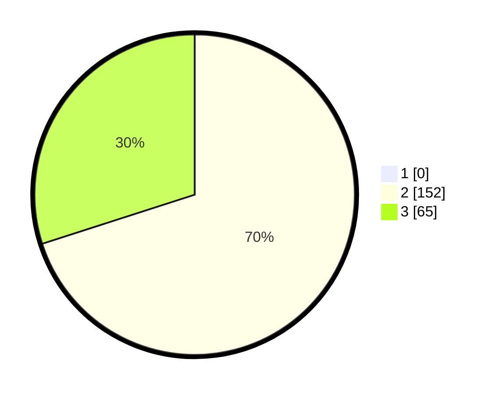

# Hasil

## Grafik

## Tabel

| No. | Nama Paslon    | Suara | Suara (raw) | Persentase |
|:--- |:-------------- | -----:| -----------:| ----------:|
| 1   | ANIES MUHAIMIN | 0     | [0][p-1]    | 0,00       |
| 2   | PRABOWO GIBRAN | 152   | [152][p-2]  | 70,05      |
| 3   | GANJAR MAHFUD  | 65    | [65][p-3]   | 29,95      |

[p-1]: https://github.com/gigit-pemilu/pemilu-2024-51-bali/blob/main/pilpres/hitung-suara/sub/51-bali/sub/01-jembrana/sub/04-melaya/sub/2004-ekasari/sub/009-tps/sub/paslon-1.txt
[p-2]: https://github.com/gigit-pemilu/pemilu-2024-51-bali/blob/main/pilpres/hitung-suara/sub/51-bali/sub/01-jembrana/sub/04-melaya/sub/2004-ekasari/sub/009-tps/sub/paslon-2.txt
[p-3]: https://github.com/gigit-pemilu/pemilu-2024-51-bali/blob/main/pilpres/hitung-suara/sub/51-bali/sub/01-jembrana/sub/04-melaya/sub/2004-ekasari/sub/009-tps/sub/paslon-3.txt

## Foto C Plano

https://sirekap-obj-formc.kpu.go.id/28f1/pemilu/ppwp/51/01/04/20/04/5101042004009-20240214-195724--3e27bce0-45b6-4a2b-81f8-b0d6f31e15c8.jpg

https://sirekap-obj-formc.kpu.go.id/28f1/pemilu/ppwp/51/01/04/20/04/5101042004009-20240214-233007--24a16cde-0041-40d9-9da0-635f5193e6bb.jpg

https://sirekap-obj-formc.kpu.go.id/28f1/pemilu/ppwp/51/01/04/20/04/5101042004009-20240214-211947--3812d563-18de-4bfd-b1e2-7b795a2e8aa0.jpg

## Metadata

| Key        | Value               |
| ---------- | ------------------- |
| Time Stamp | 2024-02-15 12:00:28 |

## DATA PEMILIH TETAP

Jumlah pemilih dalam DPT: **286**.
 * L: **135**.
 * P: **151**.

## DATA PENGGUNA HAK PILIH

Jumlah pengguna hak pilih dalam DPT: **219**.
 * L: **103**.
 * P: **116**.

Jumlah pengguna hak pilih dalam DPTb: **0**.
 * L: **0**.
 * P: **0**.

Jumlah pengguna hak pilih dalam DPK: **0**.
 * L: **0**.
 * P: **0**.

Jumlah pengguna hak pilih: **219**.
 * L: **103**.
 * P: **116**.

## JUMLAH SUARA SAH DAN TIDAK SAH

JUMLAH SELURUH SUARA SAH: **217**.

JUMLAH SUARA TIDAK SAH: **2**.

JUMLAH SELURUH SUARA SAH DAN SUARA TIDAK SAH: **219**.

