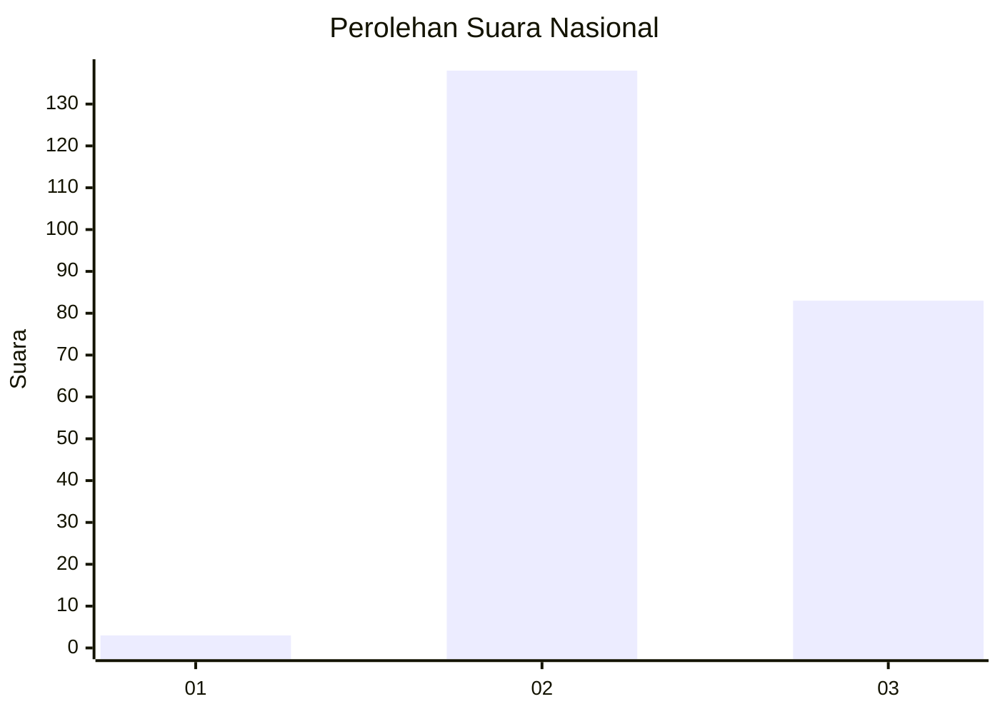
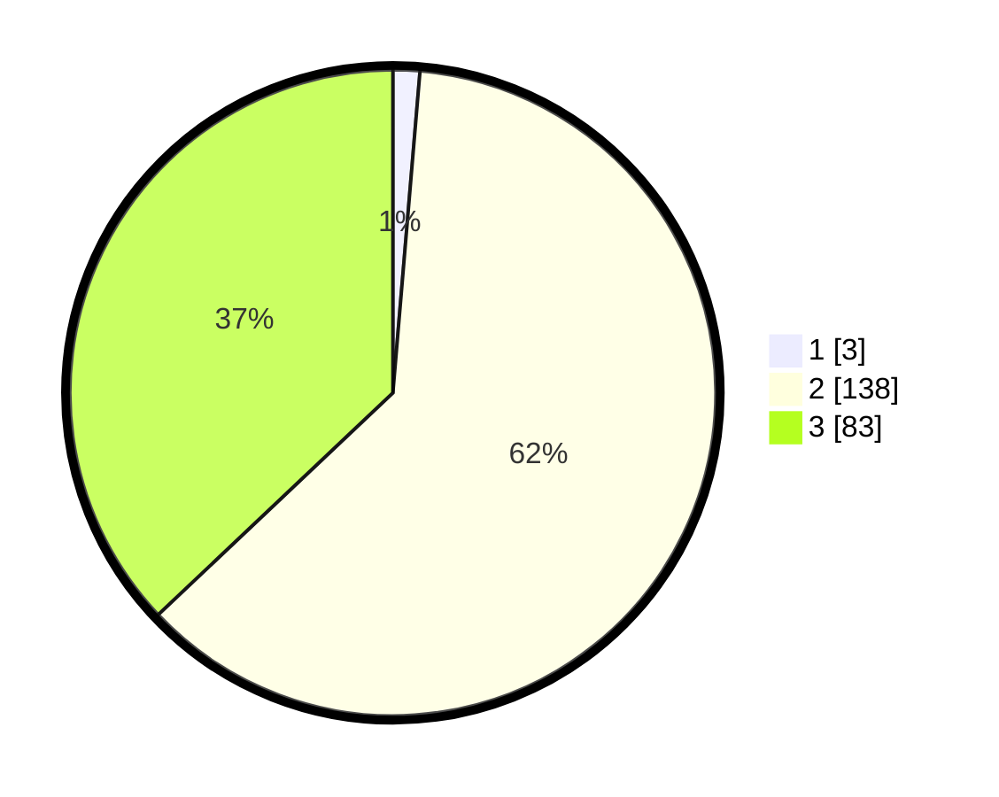

# Hasil

## Grafik

## Tabel

| No. | Nama Paslon    | Suara | Suara (raw) | Persentase |
|:--- |:-------------- | -----:| -----------:| ----------:|
| 1   | ANIES MUHAIMIN | 3     | [3][p-1]    | 1,34       |
| 2   | PRABOWO GIBRAN | 138   | [138][p-2]  | 61,61      |
| 3   | GANJAR MAHFUD  | 83    | [83][p-3]   | 37,05      |

[p-1]: https://github.com/gigit-pemilu/pemilu-2024/blob/main/pilpres/hitung-suara/sub/51-bali/sub/01-jembrana/sub/04-melaya/sub/2004-ekasari/sub/011-tps/sub/paslon-1.txt
[p-2]: https://github.com/gigit-pemilu/pemilu-2024/blob/main/pilpres/hitung-suara/sub/51-bali/sub/01-jembrana/sub/04-melaya/sub/2004-ekasari/sub/011-tps/sub/paslon-2.txt
[p-3]: https://github.com/gigit-pemilu/pemilu-2024/blob/main/pilpres/hitung-suara/sub/51-bali/sub/01-jembrana/sub/04-melaya/sub/2004-ekasari/sub/011-tps/sub/paslon-3.txt

## Foto C Plano

https://sirekap-obj-formc.kpu.go.id/899d/pemilu/ppwp/51/01/04/20/04/5101042004011-20240214-184508--4e41183c-91d0-4654-97d8-7b836dfa33bc.jpg

https://sirekap-obj-formc.kpu.go.id/899d/pemilu/ppwp/51/01/04/20/04/5101042004011-20240214-184547--4d88534b-06ec-42b6-844d-8115357cd31f.jpg

https://sirekap-obj-formc.kpu.go.id/899d/pemilu/ppwp/51/01/04/20/04/5101042004011-20240214-184617--a666372f-b50d-4ed0-983c-9d17dc47e2b6.jpg

## Metadata

| Key        | Value               |
| ---------- | ------------------- |
| Time Stamp | 2024-02-14 21:46:01 |

## DATA PEMILIH TETAP

Jumlah pemilih dalam DPT: **292**.
 * L: **136**.
 * P: **156**.

## DATA PENGGUNA HAK PILIH

Jumlah pengguna hak pilih dalam DPT: **231**.
 * L: **112**.
 * P: **119**.

Jumlah pengguna hak pilih dalam DPTb: **0**.
 * L: **0**.
 * P: **0**.

Jumlah pengguna hak pilih dalam DPK: **0**.
 * L: **0**.
 * P: **0**.

Jumlah pengguna hak pilih: **231**.
 * L: **112**.
 * P: **119**.

## JUMLAH SUARA SAH DAN TIDAK SAH

JUMLAH SELURUH SUARA SAH: **224**.

JUMLAH SUARA TIDAK SAH: **7**.

JUMLAH SELURUH SUARA SAH DAN SUARA TIDAK SAH: **231**.

