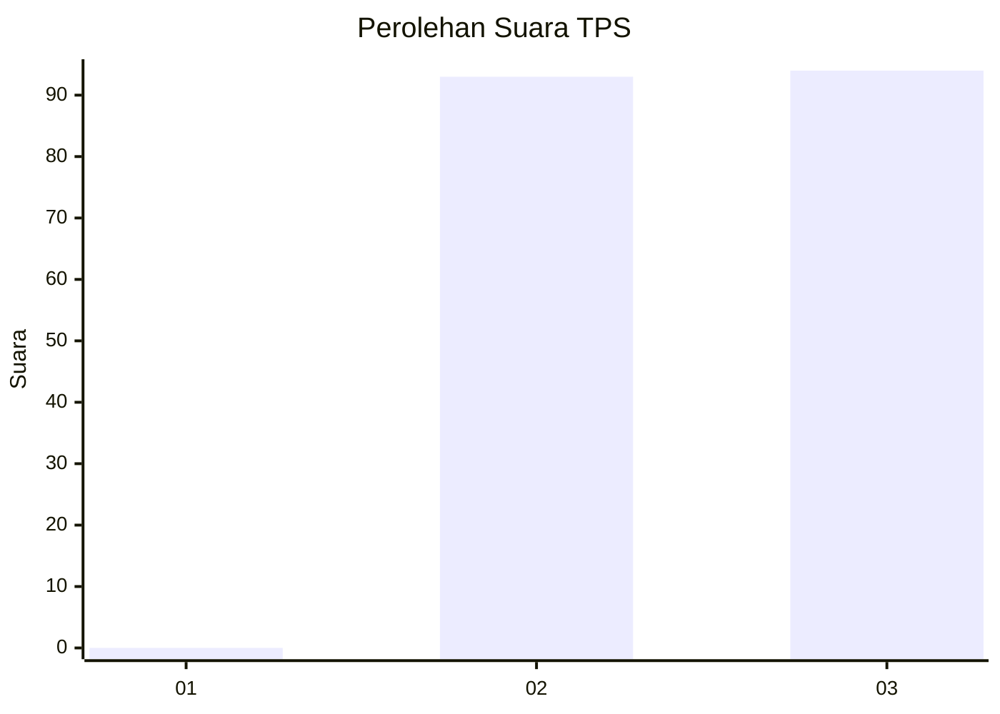
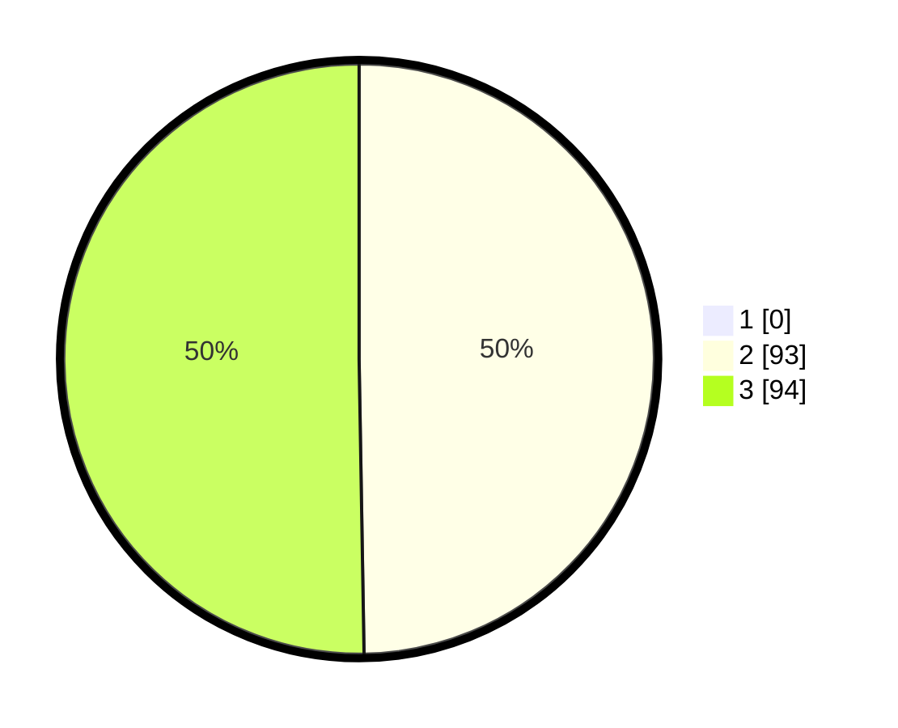

# Hasil

## Grafik

## Tabel

| No. | Nama Paslon    | Suara | Suara (raw) | Persentase |
|:--- |:-------------- | -----:| -----------:| ----------:|
| 1   | ANIES MUHAIMIN | 0     | [0][p-1]    | 0,00       |
| 2   | PRABOWO GIBRAN | 93    | [93][p-2]   | 49,73      |
| 3   | GANJAR MAHFUD  | 94    | [94][p-3]   | 50,27      |

[p-1]: https://github.com/gigit-pemilu/pemilu-2024-51-bali/blob/main/pilpres/hitung-suara/sub/51-bali/sub/01-jembrana/sub/04-melaya/sub/2004-ekasari/sub/013-tps/sub/paslon-1.txt
[p-2]: https://github.com/gigit-pemilu/pemilu-2024-51-bali/blob/main/pilpres/hitung-suara/sub/51-bali/sub/01-jembrana/sub/04-melaya/sub/2004-ekasari/sub/013-tps/sub/paslon-2.txt
[p-3]: https://github.com/gigit-pemilu/pemilu-2024-51-bali/blob/main/pilpres/hitung-suara/sub/51-bali/sub/01-jembrana/sub/04-melaya/sub/2004-ekasari/sub/013-tps/sub/paslon-3.txt

## Foto C Plano

https://sirekap-obj-formc.kpu.go.id/e080/pemilu/ppwp/51/01/04/20/04/5101042004013-20240214-132623--0c4caf6b-98ba-434e-a73d-416c46ca06c2.jpg

https://sirekap-obj-formc.kpu.go.id/e080/pemilu/ppwp/51/01/04/20/04/5101042004013-20240214-132749--841c2cb0-a10e-4e24-9ce5-4b19ed62e381.jpg

https://sirekap-obj-formc.kpu.go.id/e080/pemilu/ppwp/51/01/04/20/04/5101042004013-20240214-132825--1d98b63a-7708-4146-9a32-6d2052978a19.jpg

## Metadata

| Key        | Value               |
| ---------- | ------------------- |
| Time Stamp | 2024-02-15 00:41:44 |

