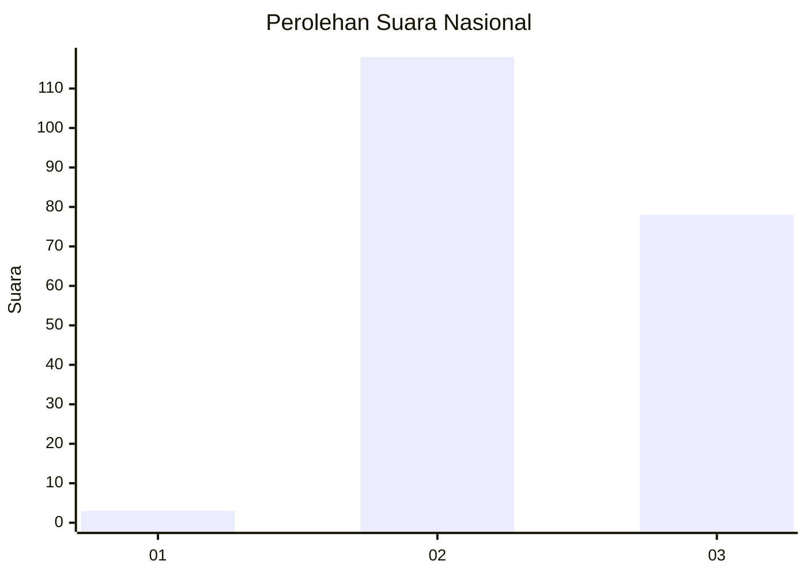
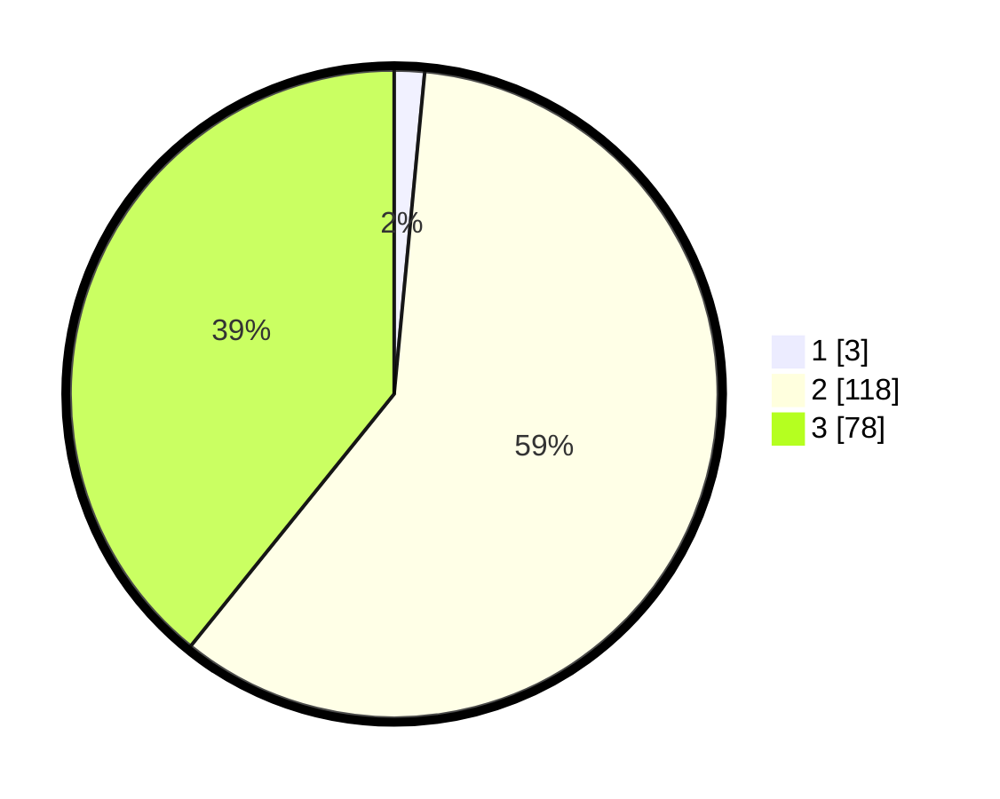

# Hasil

## Grafik

## Tabel

| No. | Nama Paslon    | Suara | Suara (raw) | Persentase |
|:--- |:-------------- | -----:| -----------:| ----------:|
| 1   | ANIES MUHAIMIN | 3     | [3][p-1]    | 1,51       |
| 2   | PRABOWO GIBRAN | 118   | [118][p-2]  | 59,30      |
| 3   | GANJAR MAHFUD  | 78    | [78][p-3]   | 39,20      |

[p-1]: https://github.com/gigit-pemilu/pemilu-2024/blob/main/pilpres/hitung-suara/sub/51-bali/sub/01-jembrana/sub/04-melaya/sub/2005-nusasari/sub/004-tps/sub/paslon-1.txt
[p-2]: https://github.com/gigit-pemilu/pemilu-2024/blob/main/pilpres/hitung-suara/sub/51-bali/sub/01-jembrana/sub/04-melaya/sub/2005-nusasari/sub/004-tps/sub/paslon-2.txt
[p-3]: https://github.com/gigit-pemilu/pemilu-2024/blob/main/pilpres/hitung-suara/sub/51-bali/sub/01-jembrana/sub/04-melaya/sub/2005-nusasari/sub/004-tps/sub/paslon-3.txt

## Foto C Plano

https://sirekap-obj-formc.kpu.go.id/c162/pemilu/ppwp/51/01/04/20/05/5101042005004-20240215-213913--59d850df-2ef6-42da-aba7-96d37c4d4642.jpg

https://sirekap-obj-formc.kpu.go.id/c162/pemilu/ppwp/51/01/04/20/05/5101042005004-20240215-213914--c9cf71c8-2dca-410c-af8a-f77f4ba316e5.jpg

https://sirekap-obj-formc.kpu.go.id/c162/pemilu/ppwp/51/01/04/20/05/5101042005004-20240215-213914--03d84d08-6d19-4b6d-990b-a1d7977f0a60.jpg

## Metadata

| Key        | Value               |
| ---------- | ------------------- |
| Time Stamp | 2024-02-16 08:00:28 |

## DATA PEMILIH TETAP

Jumlah pemilih dalam DPT: **274**.
 * L: **139**.
 * P: **135**.

## DATA PENGGUNA HAK PILIH

Jumlah pengguna hak pilih dalam DPT: **200**.
 * L: **101**.
 * P: **99**.

Jumlah pengguna hak pilih dalam DPTb: **0**.
 * L: **0**.
 * P: **0**.

Jumlah pengguna hak pilih dalam DPK: **0**.
 * L: **0**.
 * P: **0**.

Jumlah pengguna hak pilih: **200**.
 * L: **101**.
 * P: **99**.

## JUMLAH SUARA SAH DAN TIDAK SAH

JUMLAH SELURUH SUARA SAH: **199**.

JUMLAH SUARA TIDAK SAH: **1**.

JUMLAH SELURUH SUARA SAH DAN SUARA TIDAK SAH: **200**.

