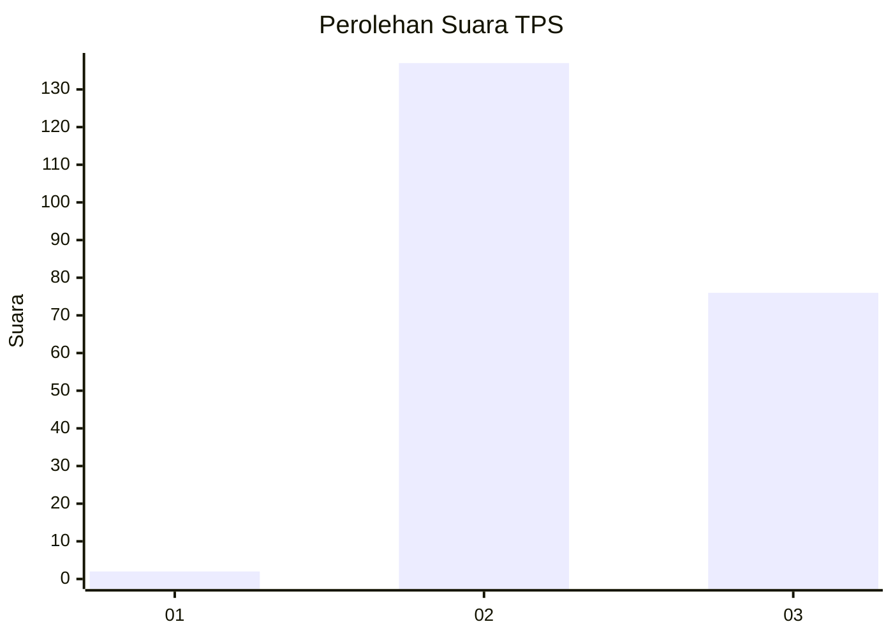
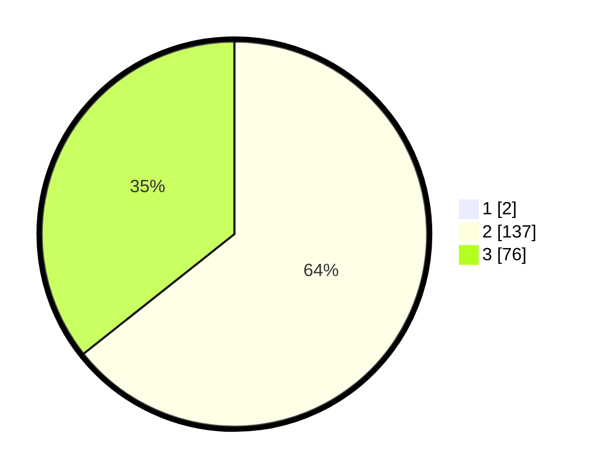

# Hasil

## Grafik

## Tabel

| No. | Nama Paslon    | Suara | Suara (raw) | Persentase |
|:--- |:-------------- | -----:| -----------:| ----------:|
| 1   | ANIES MUHAIMIN | 2     | [2][p-1]    | 0,93       |
| 2   | PRABOWO GIBRAN | 137   | [137][p-2]  | 63,72      |
| 3   | GANJAR MAHFUD  | 76    | [76][p-3]   | 35,35      |

[p-1]: https://github.com/gigit-pemilu/pemilu-2024-51-bali/blob/main/pilpres/hitung-suara/sub/51-bali/sub/01-jembrana/sub/04-melaya/sub/2005-nusasari/sub/005-tps/sub/paslon-1.txt
[p-2]: https://github.com/gigit-pemilu/pemilu-2024-51-bali/blob/main/pilpres/hitung-suara/sub/51-bali/sub/01-jembrana/sub/04-melaya/sub/2005-nusasari/sub/005-tps/sub/paslon-2.txt
[p-3]: https://github.com/gigit-pemilu/pemilu-2024-51-bali/blob/main/pilpres/hitung-suara/sub/51-bali/sub/01-jembrana/sub/04-melaya/sub/2005-nusasari/sub/005-tps/sub/paslon-3.txt

## Foto C Plano

https://sirekap-obj-formc.kpu.go.id/bcc8/pemilu/ppwp/51/01/04/20/05/5101042005005-20240214-131733--d010ab95-0dd8-4413-aa9d-0a538f70cf47.jpg

https://sirekap-obj-formc.kpu.go.id/bcc8/pemilu/ppwp/51/01/04/20/05/5101042005005-20240214-131841--b059cc9e-97e7-4a80-a99f-6e7f9b662238.jpg

https://sirekap-obj-formc.kpu.go.id/bcc8/pemilu/ppwp/51/01/04/20/05/5101042005005-20240214-131934--998b55e6-769e-476c-a85c-e164b351f0db.jpg

## Metadata

| Key        | Value               |
| ---------- | ------------------- |
| Time Stamp | 2024-02-14 21:46:01 |

## DATA PEMILIH TETAP

Jumlah pemilih dalam DPT: **276**.
 * L: **141**.
 * P: **135**.

## DATA PENGGUNA HAK PILIH

Jumlah pengguna hak pilih dalam DPT: **209**.
 * L: **104**.
 * P: **105**.

Jumlah pengguna hak pilih dalam DPTb: **0**.
 * L: **0**.
 * P: **0**.

Jumlah pengguna hak pilih dalam DPK: **6**.
 * L: **2**.
 * P: **4**.

Jumlah pengguna hak pilih: **215**.
 * L: **106**.
 * P: **109**.

## JUMLAH SUARA SAH DAN TIDAK SAH

JUMLAH SELURUH SUARA SAH: **215**.

JUMLAH SUARA TIDAK SAH: **0**.

JUMLAH SELURUH SUARA SAH DAN SUARA TIDAK SAH: **215**.

