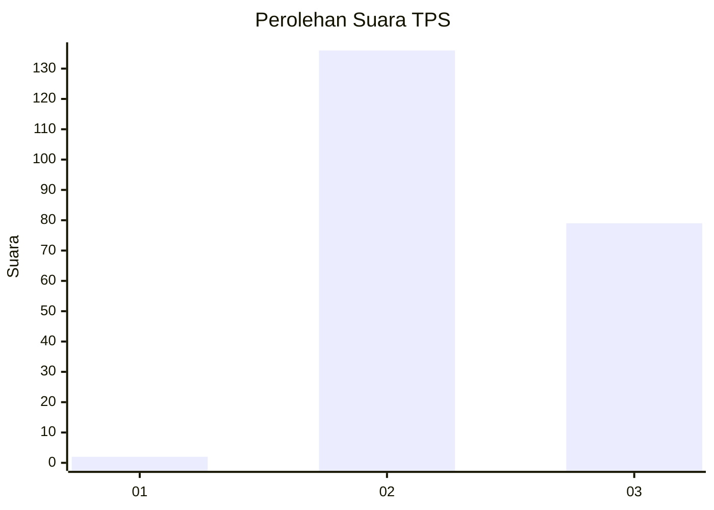
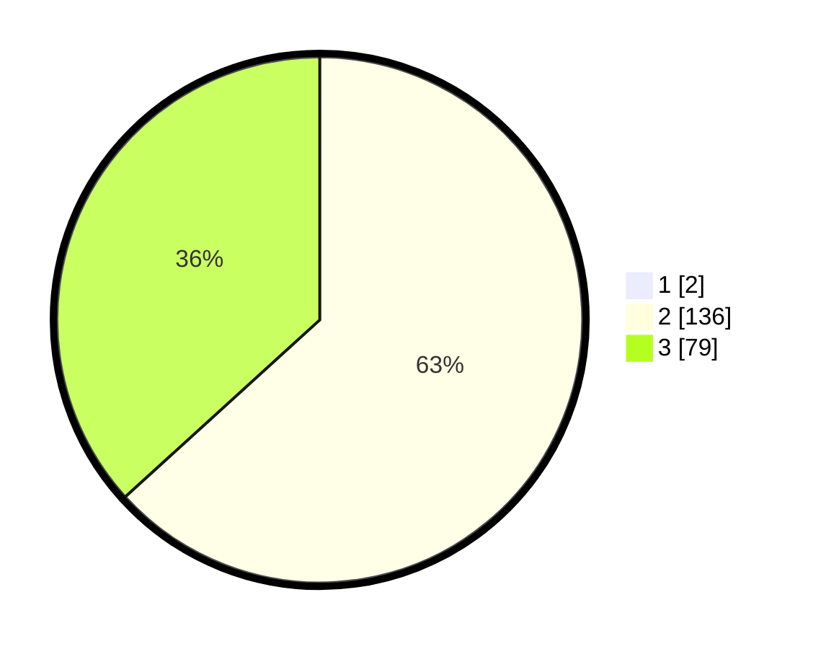

# Hasil

## Grafik

## Tabel

| No. | Nama Paslon    | Suara | Suara (raw) | Persentase |
|:--- |:-------------- | -----:| -----------:| ----------:|
| 1   | ANIES MUHAIMIN | 2     | [2][p-1]    | 0,92       |
| 2   | PRABOWO GIBRAN | 136   | [136][p-2]  | 62,67      |
| 3   | GANJAR MAHFUD  | 79    | [79][p-3]   | 36,41      |

[p-1]: https://github.com/gigit-pemilu/pemilu-2024-51-bali/blob/main/pilpres/hitung-suara/sub/51-bali/sub/01-jembrana/sub/04-melaya/sub/2005-nusasari/sub/007-tps/sub/paslon-1.txt
[p-2]: https://github.com/gigit-pemilu/pemilu-2024-51-bali/blob/main/pilpres/hitung-suara/sub/51-bali/sub/01-jembrana/sub/04-melaya/sub/2005-nusasari/sub/007-tps/sub/paslon-2.txt
[p-3]: https://github.com/gigit-pemilu/pemilu-2024-51-bali/blob/main/pilpres/hitung-suara/sub/51-bali/sub/01-jembrana/sub/04-melaya/sub/2005-nusasari/sub/007-tps/sub/paslon-3.txt

## Foto C Plano

https://sirekap-obj-formc.kpu.go.id/2f11/pemilu/ppwp/51/01/04/20/05/5101042005007-20240214-132646--7563cf61-7f56-49aa-8950-85e3f8bc4cd6.jpg

https://sirekap-obj-formc.kpu.go.id/2f11/pemilu/ppwp/51/01/04/20/05/5101042005007-20240214-131727--851b1e4a-f4e7-477c-909b-4a5b4012ea39.jpg

https://sirekap-obj-formc.kpu.go.id/2f11/pemilu/ppwp/51/01/04/20/05/5101042005007-20240214-131854--d91af932-c5fb-4168-85a6-5d2e217fe920.jpg

## Metadata

| Key        | Value               |
| ---------- | ------------------- |
| Time Stamp | 2024-02-15 00:41:44 |

