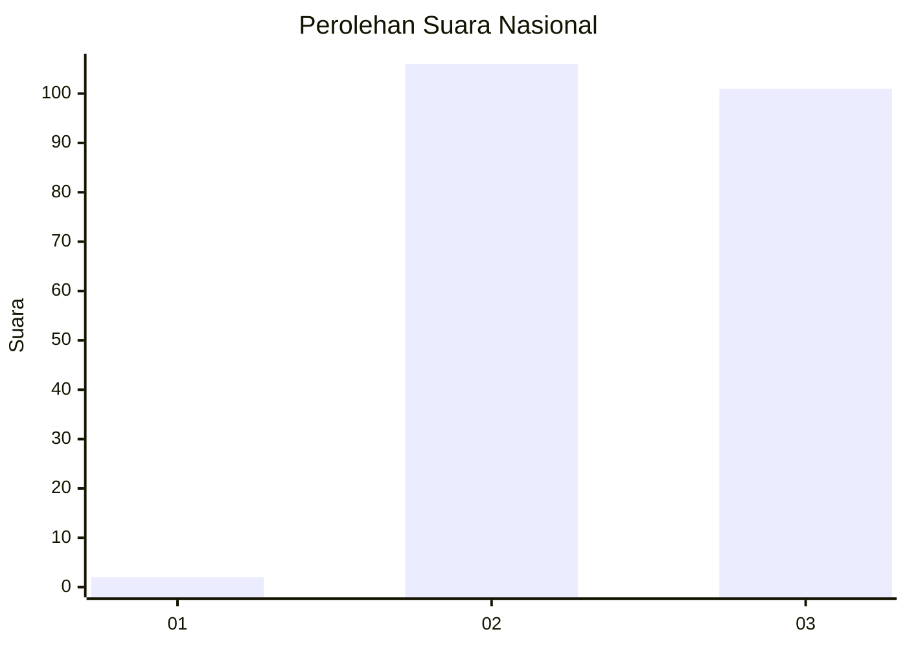
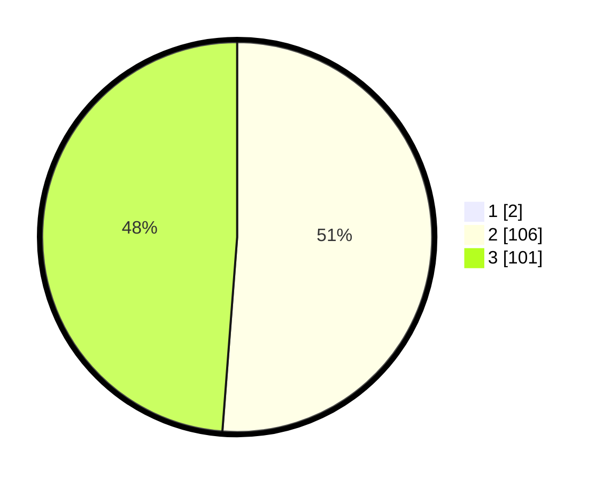

# Hasil

## Grafik

## Tabel

| No. | Nama Paslon    | Suara | Suara (raw) | Persentase |
|:--- |:-------------- | -----:| -----------:| ----------:|
| 1   | ANIES MUHAIMIN | 2     | [2][p-1]    | 0,96       |
| 2   | PRABOWO GIBRAN | 106   | [106][p-2]  | 50,72      |
| 3   | GANJAR MAHFUD  | 101   | [101][p-3]  | 48,33      |

[p-1]: https://github.com/gigit-pemilu/pemilu-2024/blob/main/pilpres/hitung-suara/sub/51-bali/sub/01-jembrana/sub/04-melaya/sub/2005-nusasari/sub/011-tps/sub/paslon-1.txt
[p-2]: https://github.com/gigit-pemilu/pemilu-2024/blob/main/pilpres/hitung-suara/sub/51-bali/sub/01-jembrana/sub/04-melaya/sub/2005-nusasari/sub/011-tps/sub/paslon-2.txt
[p-3]: https://github.com/gigit-pemilu/pemilu-2024/blob/main/pilpres/hitung-suara/sub/51-bali/sub/01-jembrana/sub/04-melaya/sub/2005-nusasari/sub/011-tps/sub/paslon-3.txt

## Foto C Plano

https://sirekap-obj-formc.kpu.go.id/087a/pemilu/ppwp/51/01/04/20/05/5101042005011-20240214-133407--6c530c0d-a773-4b74-9dd9-ebfc1d567ecc.jpg

https://sirekap-obj-formc.kpu.go.id/087a/pemilu/ppwp/51/01/04/20/05/5101042005011-20240214-132433--88d361cf-dd4b-40cf-bf04-4e6940b845a0.jpg

## Metadata

| Key        | Value               |
| ---------- | ------------------- |
| Time Stamp | 2024-02-24 22:31:28 |

