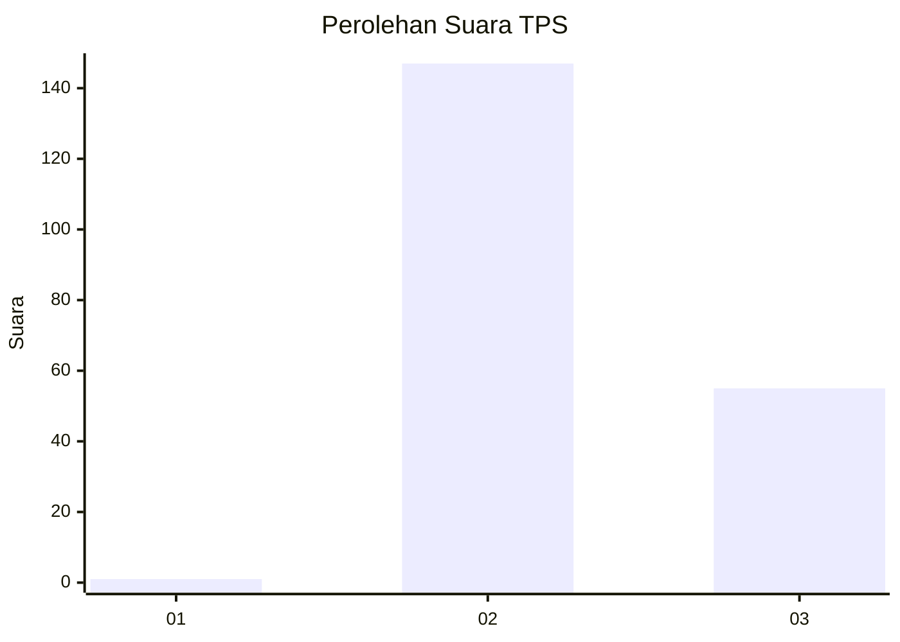
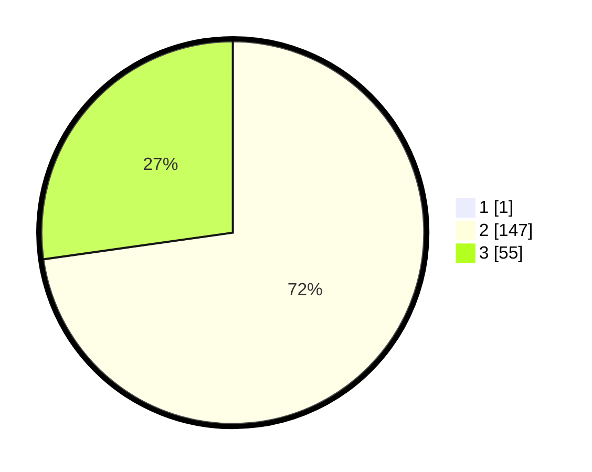

# Hasil

## Grafik

## Tabel

| No. | Nama Paslon    | Suara | Suara (raw) | Persentase |
|:--- |:-------------- | -----:| -----------:| ----------:|
| 1   | ANIES MUHAIMIN | 1     | [1][p-1]    | 0,49       |
| 2   | PRABOWO GIBRAN | 147   | [147][p-2]  | 72,41      |
| 3   | GANJAR MAHFUD  | 55    | [55][p-3]   | 27,09      |

[p-1]: https://github.com/gigit-pemilu/pemilu-2024-51-bali/blob/main/pilpres/hitung-suara/sub/51-bali/sub/01-jembrana/sub/04-melaya/sub/2006-warnasari/sub/005-tps/sub/paslon-1.txt
[p-2]: https://github.com/gigit-pemilu/pemilu-2024-51-bali/blob/main/pilpres/hitung-suara/sub/51-bali/sub/01-jembrana/sub/04-melaya/sub/2006-warnasari/sub/005-tps/sub/paslon-2.txt
[p-3]: https://github.com/gigit-pemilu/pemilu-2024-51-bali/blob/main/pilpres/hitung-suara/sub/51-bali/sub/01-jembrana/sub/04-melaya/sub/2006-warnasari/sub/005-tps/sub/paslon-3.txt

## Foto C Plano

https://sirekap-obj-formc.kpu.go.id/a1a0/pemilu/ppwp/51/01/04/20/06/5101042006005-20240214-192114--91286fdf-d306-4aa1-bbc7-b7dc51edfd1f.jpg

https://sirekap-obj-formc.kpu.go.id/a1a0/pemilu/ppwp/51/01/04/20/06/5101042006005-20240214-192147--d1a0cac5-034a-47df-9a1d-5f7b0da8bb70.jpg

https://sirekap-obj-formc.kpu.go.id/a1a0/pemilu/ppwp/51/01/04/20/06/5101042006005-20240214-234042--9ddf3db8-8170-40fb-a0ab-1b6d5fb45d47.jpg

## Metadata

| Key        | Value               |
| ---------- | ------------------- |
| Time Stamp | 2024-02-15 12:00:28 |

