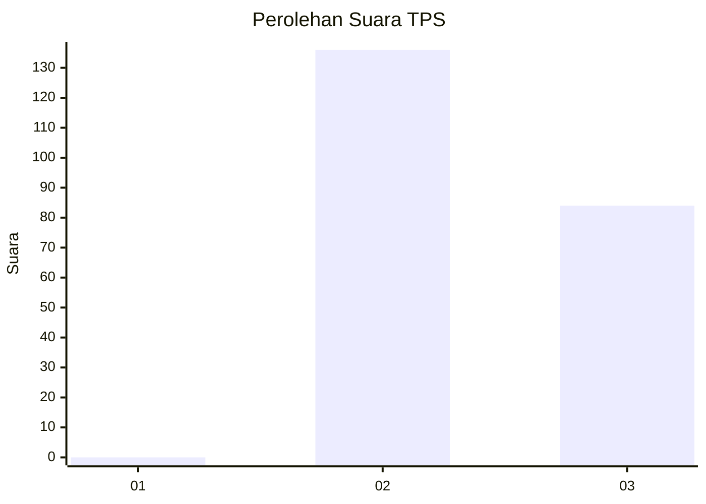
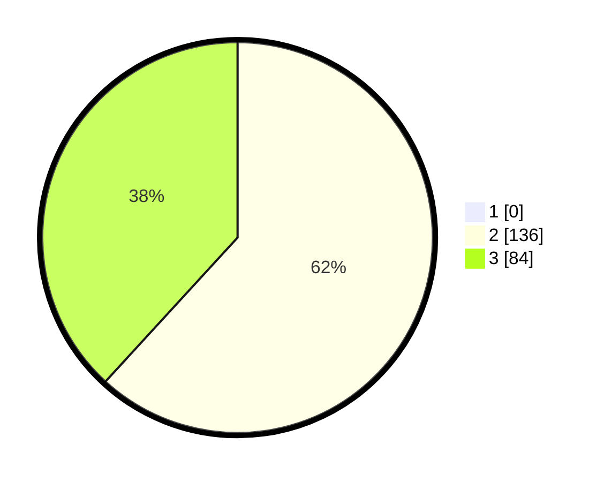

# Hasil

## Grafik

## Tabel

| No. | Nama Paslon    | Suara | Suara (raw) | Persentase |
|:--- |:-------------- | -----:| -----------:| ----------:|
| 1   | ANIES MUHAIMIN | 0     | [0][p-1]    | 0,00       |
| 2   | PRABOWO GIBRAN | 136   | [136][p-2]  | 61,82      |
| 3   | GANJAR MAHFUD  | 84    | [84][p-3]   | 38,18      |

[p-1]: https://github.com/gigit-pemilu/pemilu-2024-51-bali/blob/main/pilpres/hitung-suara/sub/51-bali/sub/01-jembrana/sub/04-melaya/sub/2006-warnasari/sub/007-tps/sub/paslon-1.txt
[p-2]: https://github.com/gigit-pemilu/pemilu-2024-51-bali/blob/main/pilpres/hitung-suara/sub/51-bali/sub/01-jembrana/sub/04-melaya/sub/2006-warnasari/sub/007-tps/sub/paslon-2.txt
[p-3]: https://github.com/gigit-pemilu/pemilu-2024-51-bali/blob/main/pilpres/hitung-suara/sub/51-bali/sub/01-jembrana/sub/04-melaya/sub/2006-warnasari/sub/007-tps/sub/paslon-3.txt

## Foto C Plano

https://sirekap-obj-formc.kpu.go.id/f8da/pemilu/ppwp/51/01/04/20/06/5101042006007-20240214-141040--04511a98-471b-470a-b8c5-e2e3da8c048f.jpg

https://sirekap-obj-formc.kpu.go.id/f8da/pemilu/ppwp/51/01/04/20/06/5101042006007-20240214-141120--3045558d-8e96-45f4-bcc7-c1759614a638.jpg

https://sirekap-obj-formc.kpu.go.id/f8da/pemilu/ppwp/51/01/04/20/06/5101042006007-20240214-141154--9cd0486c-c7e3-4386-8612-da90788466cb.jpg

## Metadata

| Key        | Value               |
| ---------- | ------------------- |
| Time Stamp | 2024-02-15 00:41:44 |

