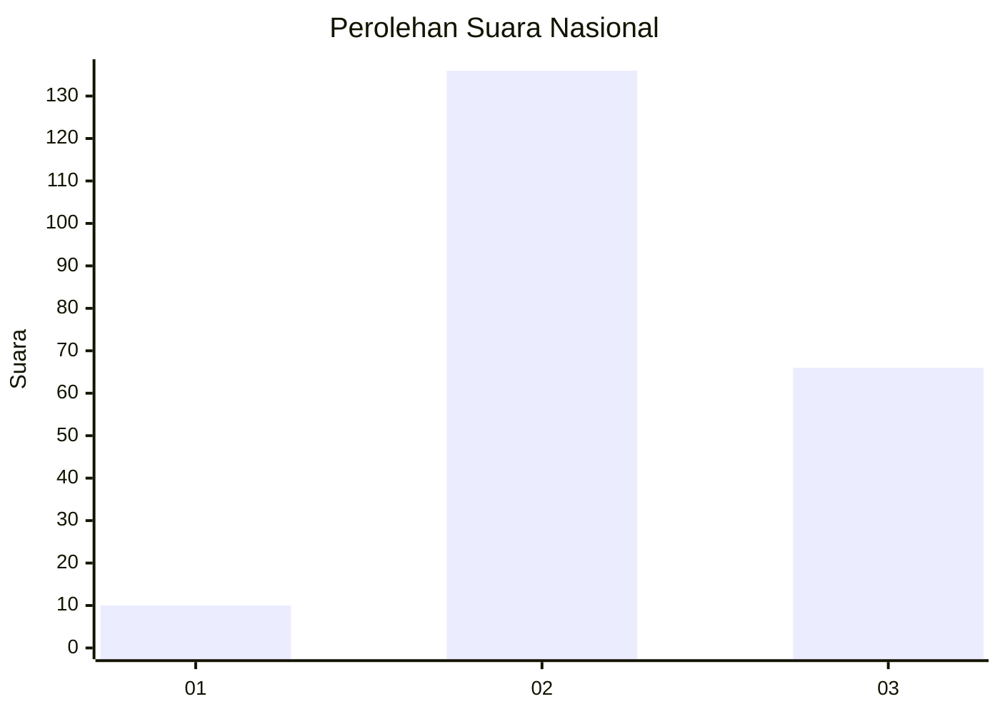
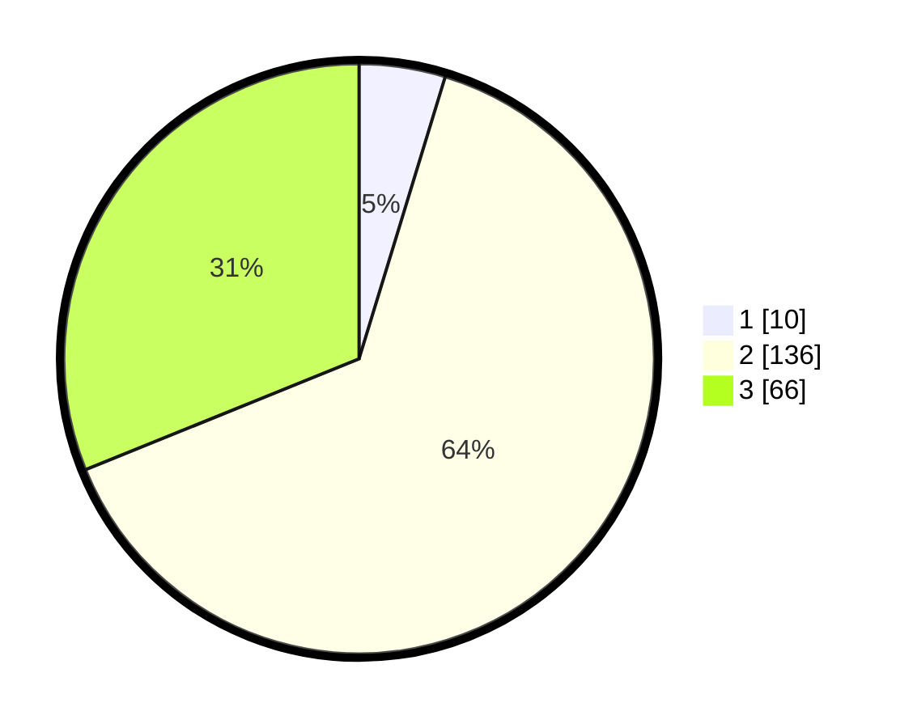

# Hasil

## Grafik

## Tabel

| No. | Nama Paslon    | Suara | Suara (raw) | Persentase |
|:--- |:-------------- | -----:| -----------:| ----------:|
| 1   | ANIES MUHAIMIN | 10    | [10][p-1]   | 4,72       |
| 2   | PRABOWO GIBRAN | 136   | [136][p-2]  | 64,15      |
| 3   | GANJAR MAHFUD  | 66    | [66][p-3]   | 31,13      |

[p-1]: https://github.com/gigit-pemilu/pemilu-2024/blob/main/pilpres/hitung-suara/sub/51-bali/sub/01-jembrana/sub/04-melaya/sub/2007-candikusuma/sub/014-tps/sub/paslon-1.txt
[p-2]: https://github.com/gigit-pemilu/pemilu-2024/blob/main/pilpres/hitung-suara/sub/51-bali/sub/01-jembrana/sub/04-melaya/sub/2007-candikusuma/sub/014-tps/sub/paslon-2.txt
[p-3]: https://github.com/gigit-pemilu/pemilu-2024/blob/main/pilpres/hitung-suara/sub/51-bali/sub/01-jembrana/sub/04-melaya/sub/2007-candikusuma/sub/014-tps/sub/paslon-3.txt

## Foto C Plano

https://sirekap-obj-formc.kpu.go.id/7e57/pemilu/ppwp/51/01/04/20/07/5101042007014-20240214-225022--b552d366-b857-4ae2-8311-d9b2f55a861f.jpg

https://sirekap-obj-formc.kpu.go.id/7e57/pemilu/ppwp/51/01/04/20/07/5101042007014-20240214-225500--292e1d34-5379-4b12-bfe9-1fc8d55359dc.jpg

https://sirekap-obj-formc.kpu.go.id/7e57/pemilu/ppwp/51/01/04/20/07/5101042007014-20240214-225735--a9123887-3f93-403a-9272-5b0c9c5b228b.jpg

## Metadata

| Key        | Value               |
| ---------- | ------------------- |
| Time Stamp | 2024-02-16 06:30:27 |

## DATA PEMILIH TETAP

Jumlah pemilih dalam DPT: **272**.
 * L: **131**.
 * P: **141**.

## DATA PENGGUNA HAK PILIH

Jumlah pengguna hak pilih dalam DPT: **215**.
 * L: **105**.
 * P: **110**.

Jumlah pengguna hak pilih dalam DPTb: **0**.
 * L: **0**.
 * P: **0**.

Jumlah pengguna hak pilih dalam DPK: **0**.
 * L: **0**.
 * P: **0**.

Jumlah pengguna hak pilih: **215**.
 * L: **105**.
 * P: **110**.

## JUMLAH SUARA SAH DAN TIDAK SAH

JUMLAH SELURUH SUARA SAH: **212**.

JUMLAH SUARA TIDAK SAH: **3**.

JUMLAH SELURUH SUARA SAH DAN SUARA TIDAK SAH: **215**.

