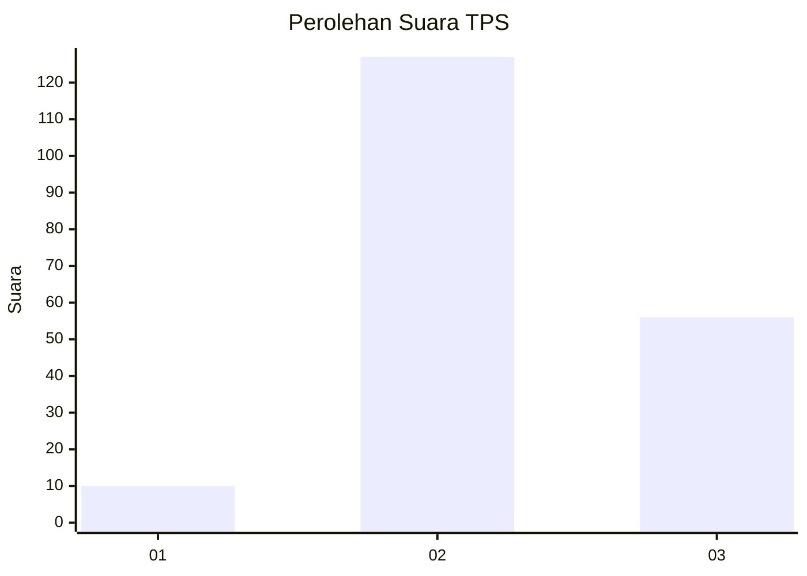
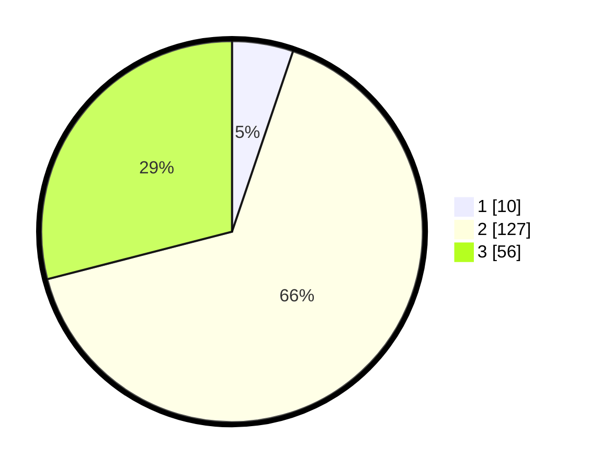

# Hasil

## Grafik

## Tabel

| No. | Nama Paslon    | Suara | Suara (raw) | Persentase |
|:--- |:-------------- | -----:| -----------:| ----------:|
| 1   | ANIES MUHAIMIN | 10    | [10][p-1]   | 5,18       |
| 2   | PRABOWO GIBRAN | 127   | [127][p-2]  | 65,80      |
| 3   | GANJAR MAHFUD  | 56    | [56][p-3]   | 29,02      |

[p-1]: https://github.com/gigit-pemilu/pemilu-2024-51-bali/blob/main/pilpres/hitung-suara/sub/51-bali/sub/01-jembrana/sub/04-melaya/sub/2007-candikusuma/sub/015-tps/sub/paslon-1.txt
[p-2]: https://github.com/gigit-pemilu/pemilu-2024-51-bali/blob/main/pilpres/hitung-suara/sub/51-bali/sub/01-jembrana/sub/04-melaya/sub/2007-candikusuma/sub/015-tps/sub/paslon-2.txt
[p-3]: https://github.com/gigit-pemilu/pemilu-2024-51-bali/blob/main/pilpres/hitung-suara/sub/51-bali/sub/01-jembrana/sub/04-melaya/sub/2007-candikusuma/sub/015-tps/sub/paslon-3.txt

## Foto C Plano

https://sirekap-obj-formc.kpu.go.id/47ba/pemilu/ppwp/51/01/04/20/07/5101042007015-20240214-185304--c7be1b32-5350-4999-bb04-1054adfe3d5c.jpg

https://sirekap-obj-formc.kpu.go.id/47ba/pemilu/ppwp/51/01/04/20/07/5101042007015-20240214-185520--40fd89ff-c017-47d5-9d18-5dcdcfa52c4c.jpg

## Metadata

| Key        | Value               |
| ---------- | ------------------- |
| Time Stamp | 2024-02-15 12:00:28 |

