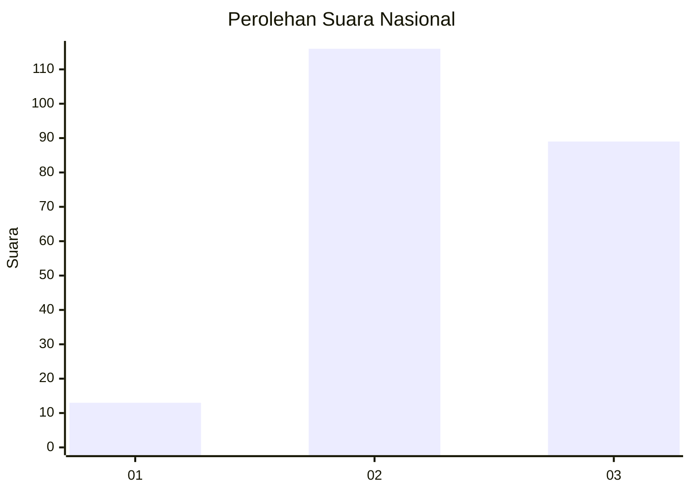
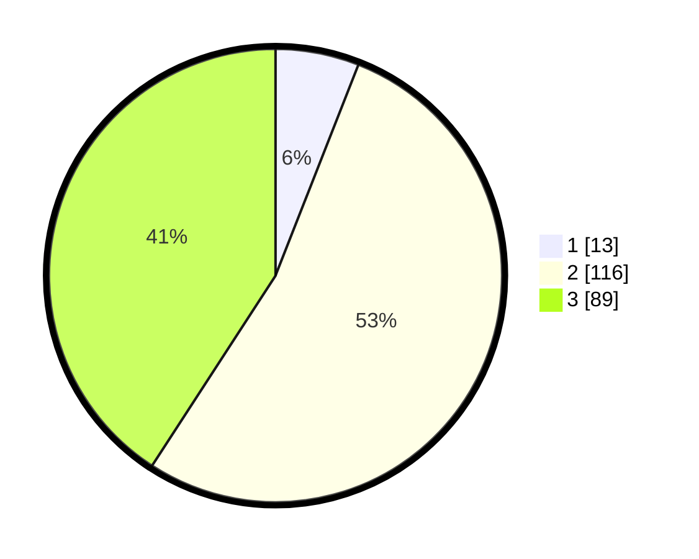

# Hasil

## Grafik

## Tabel

| No. | Nama Paslon    | Suara | Suara (raw) | Persentase |
|:--- |:-------------- | -----:| -----------:| ----------:|
| 1   | ANIES MUHAIMIN | 13    | [13][p-1]   | 5,96       |
| 2   | PRABOWO GIBRAN | 116   | [116][p-2]  | 53,21      |
| 3   | GANJAR MAHFUD  | 89    | [89][p-3]   | 40,83      |

[p-1]: https://github.com/gigit-pemilu/pemilu-2024/blob/main/pilpres/hitung-suara/sub/51-bali/sub/01-jembrana/sub/04-melaya/sub/2008-tuwed/sub/005-tps/sub/paslon-1.txt
[p-2]: https://github.com/gigit-pemilu/pemilu-2024/blob/main/pilpres/hitung-suara/sub/51-bali/sub/01-jembrana/sub/04-melaya/sub/2008-tuwed/sub/005-tps/sub/paslon-2.txt
[p-3]: https://github.com/gigit-pemilu/pemilu-2024/blob/main/pilpres/hitung-suara/sub/51-bali/sub/01-jembrana/sub/04-melaya/sub/2008-tuwed/sub/005-tps/sub/paslon-3.txt

## Foto C Plano

https://sirekap-obj-formc.kpu.go.id/32b5/pemilu/ppwp/51/01/04/20/08/5101042008005-20240214-141544--2faad26a-528d-4f65-988d-a0ea3a71a4ad.jpg

https://sirekap-obj-formc.kpu.go.id/32b5/pemilu/ppwp/51/01/04/20/08/5101042008005-20240214-222409--f4718a44-ad55-4bb4-abbb-0fb42221d1a9.jpg

https://sirekap-obj-formc.kpu.go.id/32b5/pemilu/ppwp/51/01/04/20/08/5101042008005-20240214-141510--51eb6f8a-89fe-4cef-aad4-93dfb42b1b3e.jpg

## Metadata

| Key        | Value               |
| ---------- | ------------------- |
| Time Stamp | 2024-02-15 12:00:28 |

## DATA PEMILIH TETAP

Jumlah pemilih dalam DPT: **288**.
 * L: **141**.
 * P: **147**.

## DATA PENGGUNA HAK PILIH

Jumlah pengguna hak pilih dalam DPT: **219**.
 * L: **105**.
 * P: **114**.

Jumlah pengguna hak pilih dalam DPTb: **0**.
 * L: **0**.
 * P: **0**.

Jumlah pengguna hak pilih dalam DPK: **2**.
 * L: **1**.
 * P: **1**.

Jumlah pengguna hak pilih: **221**.
 * L: **106**.
 * P: **115**.

## JUMLAH SUARA SAH DAN TIDAK SAH

JUMLAH SELURUH SUARA SAH: **218**.

JUMLAH SUARA TIDAK SAH: **3**.

JUMLAH SELURUH SUARA SAH DAN SUARA TIDAK SAH: **221**.

