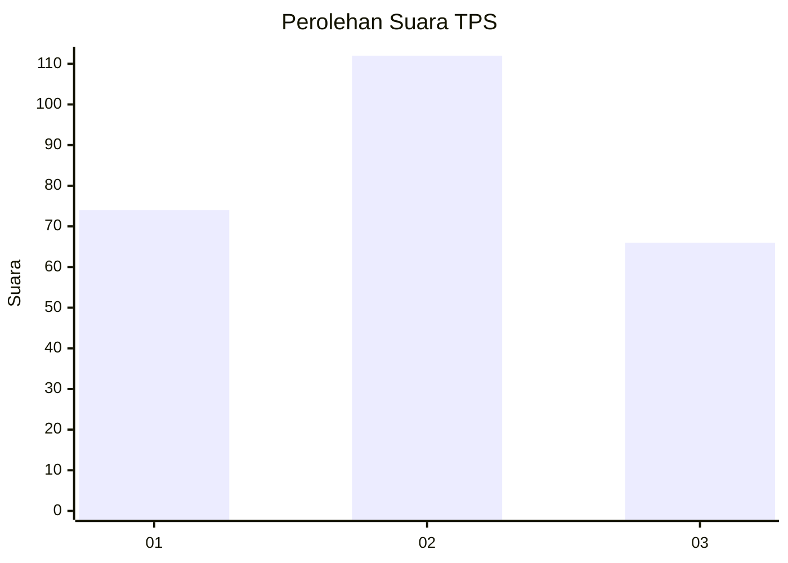
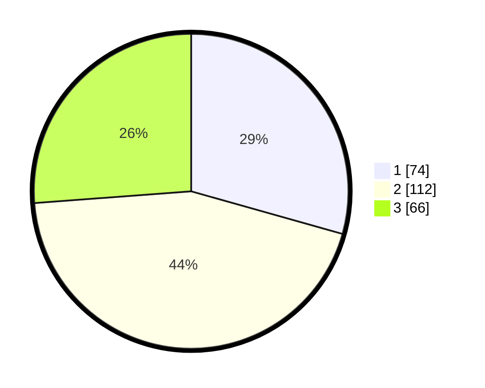

# Hasil

## Grafik

## Tabel

| No. | Nama Paslon    | Suara | Suara (raw) | Persentase |
|:--- |:-------------- | -----:| -----------:| ----------:|
| 1   | ANIES MUHAIMIN | 74    | [74][p-1]   | 29,37      |
| 2   | PRABOWO GIBRAN | 112   | [112][p-2]  | 44,44      |
| 3   | GANJAR MAHFUD  | 66    | [66][p-3]   | 26,19      |

[p-1]: https://github.com/gigit-pemilu/pemilu-2024-51-bali/blob/main/pilpres/hitung-suara/sub/51-bali/sub/01-jembrana/sub/04-melaya/sub/2008-tuwed/sub/009-tps/sub/paslon-1.txt
[p-2]: https://github.com/gigit-pemilu/pemilu-2024-51-bali/blob/main/pilpres/hitung-suara/sub/51-bali/sub/01-jembrana/sub/04-melaya/sub/2008-tuwed/sub/009-tps/sub/paslon-2.txt
[p-3]: https://github.com/gigit-pemilu/pemilu-2024-51-bali/blob/main/pilpres/hitung-suara/sub/51-bali/sub/01-jembrana/sub/04-melaya/sub/2008-tuwed/sub/009-tps/sub/paslon-3.txt

## Foto C Plano

https://sirekap-obj-formc.kpu.go.id/27b8/pemilu/ppwp/51/01/04/20/08/5101042008009-20240214-141223--029bda06-5393-4c00-8010-495a41308912.jpg

https://sirekap-obj-formc.kpu.go.id/27b8/pemilu/ppwp/51/01/04/20/08/5101042008009-20240214-141321--825df96f-3662-4cc7-b95e-6c9cca9f8af3.jpg

https://sirekap-obj-formc.kpu.go.id/27b8/pemilu/ppwp/51/01/04/20/08/5101042008009-20240214-141817--48cb6319-5c4c-4767-a2ca-20837094019d.jpg

## Metadata

| Key        | Value               |
| ---------- | ------------------- |
| Time Stamp | 2024-02-14 21:46:01 |

