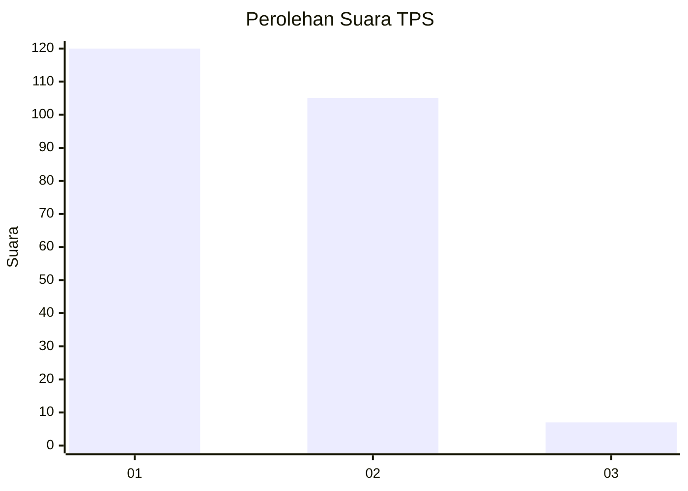
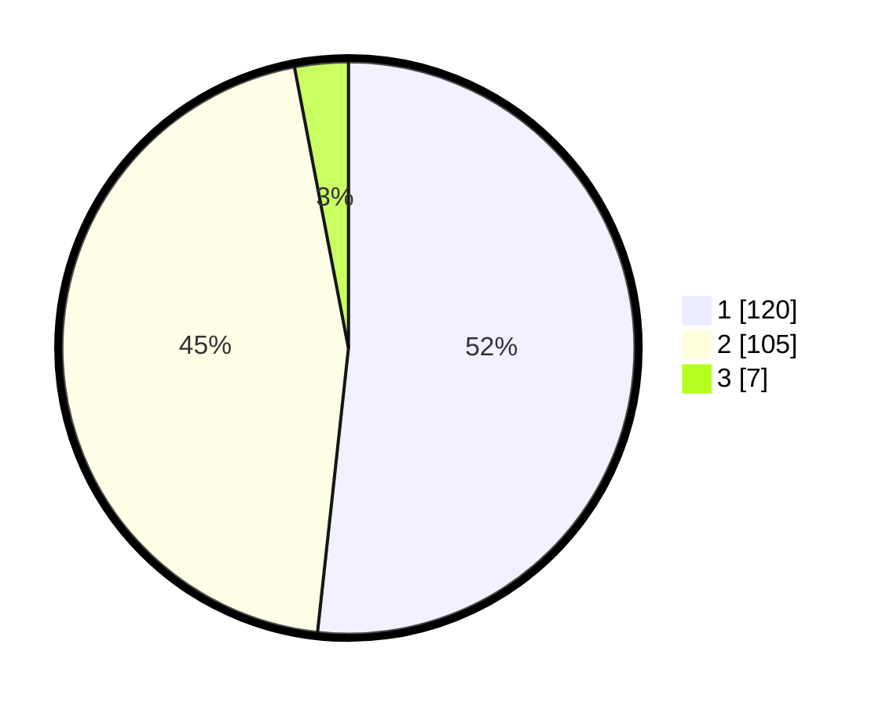

# Hasil

## Grafik

## Tabel

| No. | Nama Paslon    | Suara | Suara (raw) | Persentase |
|:--- |:-------------- | -----:| -----------:| ----------:|
| 1   | ANIES MUHAIMIN | 120   | [120][p-1]  | 51,72      |
| 2   | PRABOWO GIBRAN | 105   | [105][p-2]  | 45,26      |
| 3   | GANJAR MAHFUD  | 7     | [7][p-3]    | 3,02       |

[p-1]: https://github.com/gigit-pemilu/pemilu-2024-51-bali/blob/main/pilpres/hitung-suara/sub/51-bali/sub/01-jembrana/sub/04-melaya/sub/2008-tuwed/sub/013-tps/sub/paslon-1.txt
[p-2]: https://github.com/gigit-pemilu/pemilu-2024-51-bali/blob/main/pilpres/hitung-suara/sub/51-bali/sub/01-jembrana/sub/04-melaya/sub/2008-tuwed/sub/013-tps/sub/paslon-2.txt
[p-3]: https://github.com/gigit-pemilu/pemilu-2024-51-bali/blob/main/pilpres/hitung-suara/sub/51-bali/sub/01-jembrana/sub/04-melaya/sub/2008-tuwed/sub/013-tps/sub/paslon-3.txt

## Foto C Plano

https://sirekap-obj-formc.kpu.go.id/3400/pemilu/ppwp/51/01/04/20/08/5101042008013-20240215-023239--f5fbde86-d8e1-4377-a90f-ae6cd46b88d0.jpg

https://sirekap-obj-formc.kpu.go.id/3400/pemilu/ppwp/51/01/04/20/08/5101042008013-20240215-023335--46e33196-e3d8-4d8e-90eb-10da1f378649.jpg

https://sirekap-obj-formc.kpu.go.id/3400/pemilu/ppwp/51/01/04/20/08/5101042008013-20240215-023421--411fbd7e-6263-4111-944a-ea6f3ad08022.jpg

## Metadata

| Key        | Value               |
| ---------- | ------------------- |
| Time Stamp | 2024-02-15 16:00:26 |

## DATA PEMILIH TETAP

Jumlah pemilih dalam DPT: **232**.
 * L: **117**.
 * P: **115**.

## DATA PENGGUNA HAK PILIH

Jumlah pengguna hak pilih dalam DPT: **232**.
 * L: **117**.
 * P: **115**.

Jumlah pengguna hak pilih dalam DPTb: **2**.
 * L: **1**.
 * P: **1**.

Jumlah pengguna hak pilih dalam DPK: **5**.
 * L: **2**.
 * P: **3**.

Jumlah pengguna hak pilih: **239**.
 * L: **120**.
 * P: **119**.

## JUMLAH SUARA SAH DAN TIDAK SAH

JUMLAH SELURUH SUARA SAH: **232**.

JUMLAH SUARA TIDAK SAH: **7**.

JUMLAH SELURUH SUARA SAH DAN SUARA TIDAK SAH: **239**.

