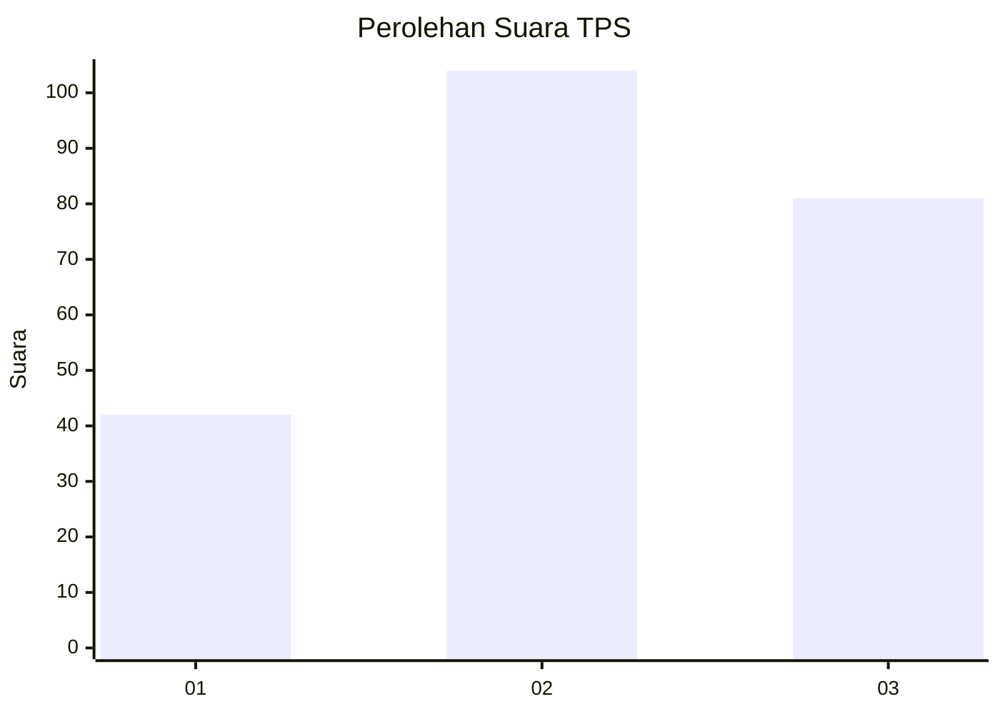
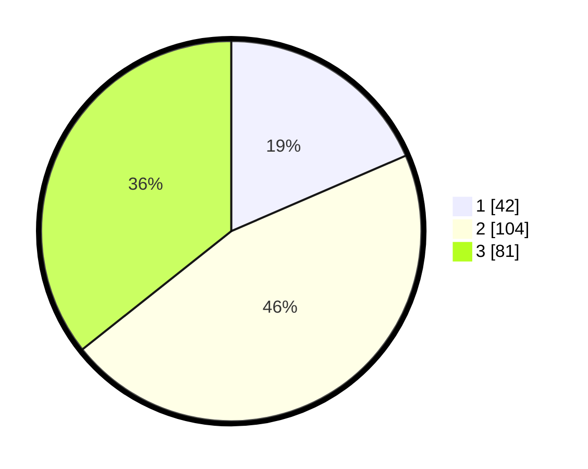

# Hasil

## Grafik

## Tabel

| No. | Nama Paslon    | Suara | Suara (raw) | Persentase |
|:--- |:-------------- | -----:| -----------:| ----------:|
| 1   | ANIES MUHAIMIN | 42    | [42][p-1]   | 18,50      |
| 2   | PRABOWO GIBRAN | 104   | [104][p-2]  | 45,81      |
| 3   | GANJAR MAHFUD  | 81    | [81][p-3]   | 35,68      |

[p-1]: https://github.com/gigit-pemilu/pemilu-2024-51-bali/blob/main/pilpres/hitung-suara/sub/51-bali/sub/01-jembrana/sub/04-melaya/sub/2009-tukadaya/sub/002-tps/sub/paslon-1.txt
[p-2]: https://github.com/gigit-pemilu/pemilu-2024-51-bali/blob/main/pilpres/hitung-suara/sub/51-bali/sub/01-jembrana/sub/04-melaya/sub/2009-tukadaya/sub/002-tps/sub/paslon-2.txt
[p-3]: https://github.com/gigit-pemilu/pemilu-2024-51-bali/blob/main/pilpres/hitung-suara/sub/51-bali/sub/01-jembrana/sub/04-melaya/sub/2009-tukadaya/sub/002-tps/sub/paslon-3.txt

## Foto C Plano

https://sirekap-obj-formc.kpu.go.id/7202/pemilu/ppwp/51/01/04/20/09/5101042009002-20240214-234731--b98863df-cebb-4e55-ad6d-441cd21c600f.jpg

https://sirekap-obj-formc.kpu.go.id/7202/pemilu/ppwp/51/01/04/20/09/5101042009002-20240214-141542--ebc1e98e-d710-4bce-88b2-6b4814db6caa.jpg

https://sirekap-obj-formc.kpu.go.id/7202/pemilu/ppwp/51/01/04/20/09/5101042009002-20240214-234840--a384ab11-397f-4912-9c97-815beca4c7e4.jpg

## Metadata

| Key        | Value               |
| ---------- | ------------------- |
| Time Stamp | 2024-02-15 16:00:26 |

